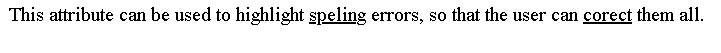
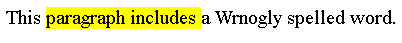

# HTML <u>标签</u>

> 原文：<https://www.tutorialandexample.com/html-u-tag>

## 给元素/标签加下划线:

html 中的 **u** 标签用于通过下划线指定重要的文本或短语。在早期的 HTML 版本中，这个元素被称为“下划线”元素，现在仍然偶尔会被无意中以这种方式使用。

您还可以对基础文本使用带有 CSS 文本装饰属性的样式。

u 元素可用于各种注释，包括纠正拼写错误、突出显示中文文本中的专有名称等等。

你不应该使用 u 字符来给文本加下划线或者表示书名。

它是一个结束标签，意味着需要结束标签来结束这个标签。这个标签在 html 文档中被表示为<u>标签</u>

**语法:**

```
<body>
<p>
……………….
<u>……………. </u>
……………… 
</p>
</body> 
```

**举例:**

### Html:

```
<!DOCTYPE html>
<html>
<head>
<title> html u tag </title>
</head>
<body>
<p>
This attribute can be used to highlight <u>speling</u>errors, so that the user can <u>corect</u> them all.
</p>
</body>
</html>
```

### Css:

```
p {
font: 1rem 'Fira Sans', sans-serif;
}
u {
text-decoration: #f00 wavy underline;
}
```

**输出:**



## 属性

只有全局属性与该标签一起使用。

该标签支持全局属性。这个标签也支持 HTML 中的所有事件属性。

## 其他元素与 U 标记相同:

 *该属性用于表示重音。

```
<!DOCTYPE html>
<html>
<head>
<title> html u tag </title>
</head>
<body>
<p>
This <em>paragraph includes </em> a Wrnogly spelled word.
</p>
</body>
</html> 
```

**输出:**

 **此属性用于引起对文本的注意。

```
<!DOCTYPE html>
<html>
<head>
<title> html u tag </title>
</head>
<body>
<p>
This <b>paragraph includes </b> a Wrnogly spelled word.
</p>
</body>
</html>
```

**输出:**


### <mark></mark>

此属性用于标记关键词或短语。

```
<!DOCTYPE html>
<html>
<head>
<title> html u tag </title>
</head>
<body>
<p>
This <mark>paragraph includes </mark> a Wrnogly spelled word.
</p>
</body>
</html>
```

**输出:**

 **这一特征用于表示文本的相关性。

```
<!DOCTYPE html>
<html>
<head>
<title> html u tag </title>
</head>
<body>
<p>
This <strong>paragraph includes </strong> a Wrnogly spelled word.
</p>
</body>
</html> 
```

**输出:**


如果你想表示书籍或其他出版物的标题，那么你可以在 HTML 文档中使用这个标签。

```
<!DOCTYPE html>
<html>
<head>
<title> html u tag </title>
</head>
<body>
<p>
This <cite>paragraph includes </cite> a Wrnogly spelled word.
</p>
</body>
</html>
```

**输出:**

 *在西方著作中，这种标签基本上用于表示技术术语、音译、观点或船名。

```
<!DOCTYPE html>
<html>
<head>
<title> html u tag </title>
</head>
<body>
<p>
This <i>paragraph includes </i> a Wrnogly spelled word.
</p>
</body>
</html> 
```

**输出:**


您可以借助 HTML 文档中的 ruby 标签添加文本注释。

利用 text-decoration 属性的下划线值来添加不带任何语义意义的下划线外观。

```
<!DOCTYPE html>
<html>
<head>
<title> html u tag </title>
</head>
<body>
<p>
This <ruby>paragraph includes </ruby> a Wrnogly spelled word.
</p>
</body>
</html>
```

**输出:**


## U 标记的示例:

### 例 1:表示拼写错误:

这个例子使用了<u>元素和 css 代码来显示一个有拼写问题的句子。</u>

### HTML:

```
<!DOCTYPE html>
<html>
<head>
<title> html u tag </title>
</head>
<body>
<p>
This paragraph includes a 
<u class="spelling">
Wrnogly
</u>
spelled word.
</p>
</body>
</html>
```

当单词“错误地”拼写不正确时，HTML 使用带有拼写类的 u 元素。

### CSS:

```
u.spelling 
{
text-decoration: red wavy underline;
} 
```

这个 CSS 指定当类 spelling 被用来设置 u 元素的样式时，它的文本用红色下划线显示。这是印刷问题的典型风格。红色虚线下划线可用于说明另一种典型设计。

**上述代码的输出:**


## 避免 u 标签

大多数情况下，如果你想避免使用 u 标签，那么你可以使用几个实例来演示不同的情况来指定一些东西。

### 非语义下划线

您可以使用文本装饰属性设置为“下划线”的标签来突出显示文本:

### HTML:

```
<!DOCTYPE html>
<html>
<head>
<tile> html u tag </title>
</head>
<body>

Today's Episode

<br>
Almighty gamer as an ultra-instinct guy
</body>
</html> 
```

### CSS:

```
.underline 
{
text-decoration: underline;
} 
```

**输出:**


### 展示书名

你可以用引用标签代替 u 标签来表示标题。

**使用引用元素**

```
<!DOCTYPE html>
<html>
<head>
<title> html u tag </title>
</head>
<body>
<p>
The class read 
<cite>
Moby Dick
</cite>
in the first term.
</p>
</body>
</html>
```

结果:


**对引用元素进行样式化:**

文本以斜体显示，默认样式为 cite 元素。

### HTML:

```
<!DOCTYPE html>
<html>
<head>
<title> html u tag </title>
</head>
<body>
<p>
The first book is
<cite>
The secret
</cite>
in the early ages.
</p>
</body>
</html>
```

### CSS:

```
cite {
font-style: normal;
text-decoration: underline;
} 
```

**输出:**


## 浏览器支持:

支持 html u 标签的浏览器列表如下:

铬:是

微软 Edge: 是的，需要第 12 版

是的，需要第一版

狩猎旅行:是的

歌剧:是的******