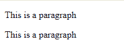
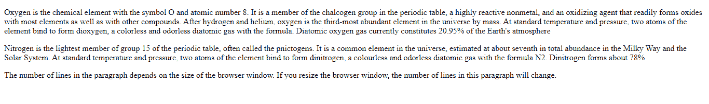
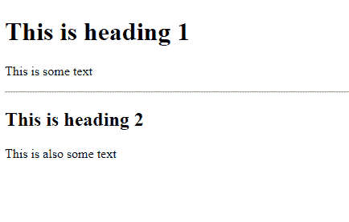
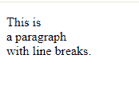
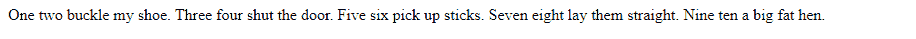
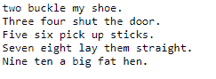

# HTML 段落

> 原文：<https://www.tutorialandexample.com/html-paragraphs>

在 html 中，有一些以新行开始的元素，其中之一是段落。也就是所谓的文本块。在 html 中

标签定义了一个段落。在 html 中，浏览器会自动添加一些空白，或者我们可以说是段落前后的空白，以区别于网页上的其他内容。如何在 html 中写一个段落的例子，

这是一个段落

。

**例如:**

```
<html>
<body>
<p>This is a paragraph</p>
<p>This is a paragraph</p>
</body>
</html>
```

输出:



### HTML 显示

人们不能确定 html 将如何显示段落，因为它因浏览器而异。另一方面，除了浏览器之外，还有很多东西会给显示段落带来麻烦，它们是大的或小的屏幕尺寸，然后我们调整了窗口的大小，所有这些都会产生不同的结果。使用 html 时，您不能通过在 html 代码中添加额外的空格或额外的行来更改显示。它的浏览器负责在页面显示时自动删除所有多余的空格和行。

**例如:**

```
<html>
<body>
<p>Oxygen is the chemical element with the symbol O and atomic number 8\. It is a member of the chalcogen group in the periodic table, a highly reactive nonmetal, and an oxidizing agent that readily forms oxides with most elements as well as with other compounds. After hydrogen and helium, oxygen is the third-most abundant element in the universe by mass. At standard temperature and pressure, two atoms of the element bind to form dioxygen, a colorless and odorless diatomic gas with the formula. Diatomic oxygen gas currently constitutes 20.95% of the Earth's atmosphere</p>
<p>Nitrogen is the lightest member of group 15 of the periodic table, often called the pnictogens. It is a common element in the universe, estimated at about seventh in total abundance in the Milky Way and the Solar System. At standard temperature and pressure, two atoms of the element bind to form dinitrogen, a colourless and odorless diatomic gas with the formula N2\. Dinitrogen forms about 78%</p>
<p>The number of lines in the paragraph depends on the size of the browser window. If you resize the browser window, the number of lines in this paragraph will change.</p>
</body>
</html>

```

**输出:**



### HTML 水平标尺

在 html 中，

* * *

标签定义了 html 页面中的主题分隔符，它通常显示为水平标尺。标签用于分隔内容，或者我们可以说它用于定义一个 html 页面的变化。

**例如:**

```
<html>
<body>
<h1>This is heading 1</h1>
<p>This is some text</p>
<hr>
<h2>This is heading 2</h2>
<p>This is also some text</p>
</body>
</html>

```

**输出:**



**注:**

* * *

标签是空标签，这意味着它没有结束标签，或者我们可以说没有必要在

* * *

标签后加上结束标签。

### HTML 换行

我们在 html 中有一个定义换行符的
标签。这个标签用来断行，或者我们可以说开始一个新的行而不开始一个新的段落。

**例如:**

这是
一个断行的段落

标签也是一个空标签，这意味着不需要给它添加结束标签。它没有结束标签。

**例如:**

```
<html>
<body>
<p>This is<br>a paragraph<br>with line breaks.</p>
</body>
</html>

```

**输出:**



**诗题:**

html 段落有问题如果你想写一首诗，问题是我们的诗会显示在单行中。

**例如:**

```
<html>
<body>
<p>In html, spaces and new lines are ignored:</p>
<p>
One two buckle my shoe.
Three four shut the door.
Five six pick up sticks.
Seven eight lay them straight.
Nine ten a big fat hen.
</p>
</body>
</html>

```

**输出:**



我们将要得到的输出是同一首诗，但是是一行一行的。但是我们有一个解决这个问题的方法，那就是 html

```
元素。
```

### HTML

```
元素
```

html

```
元素用于定义预先格式化的文本。在

```
标签中预定义了几个属性，比如元素以固定的宽度显示，它们有一个 courier 字体，通常意味着它们必须有 courier 字体，它们保留空格和换行符。你可以用我们在问题段落中看到的例子来试试，用

```
标签代替标签，然后看看输出的变化。
```

```

```

**例如:**

```
<html>
<body>
<p>In html, spaces and new lines are ignored:</p>
<pre>
One two buckle my shoe.
Three four shut the door.
Five six pick up sticks.
Seven eight lay them straight.
Nine ten a big fat hen.
</pre>
</body>
</html>

```

**输出:**

