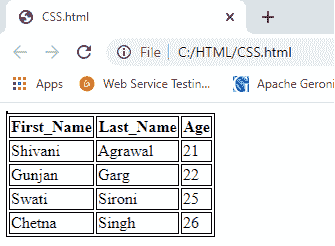
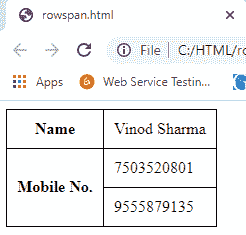

# HTML 表格标签

> 原文：<https://www.tutorialandexample.com/html-tables/>

**HTML 表格标签**以表格形式(行*列)用于显示数据。一行可以包含许多列。

借助< **t** >、< **td** >和< **th** >元素，可以创建一个表格，以表格的形式显示数据。

在每个表格中，表格的行由< t >标签定义，表格的头由< th >定义，表格的数据由< td >标签定义。

HTML 表格用于页面布局管理，如**页眉部分、导航栏、正文、页脚部分**等。

但是推荐使用表格上的 div 标签来管理页面布局。

**HTML 表格标签**

| **标签** | **描述** |
| **<表>** | 它定义了一个表。 |
| **<tr>T1】** | 定义表格中的一行。 |
| **< th >** | 定义表格中的标题单元格。 |
| **< td >** | 定义表格中的单元格。 |
| **<字幕>** | 定义表格的标题。 |
| **<山口>** | 使用< colgroup >元素为每个列指定列的属性。 |
| **<列组>** | 在格式表中，指定一列或多列的组。 |
| **<tbody>T1】** | 它用于将正文内容分组到一个表格中。 |
| **< thead >** | 它用于对表格中标题的内容进行分组。 |
| **< tfooter >** | 它用于将标题内容分组到一个表中。 |

**HTML 表格示例**

让我们看看 HTML 中的表标签示例。输出显示在上面。

```
<table>  
<tr><th>First_Name</th><th>Last_Name</th><th>Age</th></tr>  
<tr><td>Shivani</td><td>Agrawal</td><td>21</td></tr>  
<tr><td>Gunjan</td><td>Garg</td><td>22</td></tr>  
<tr><td>Swati</td><td>Sironi</td><td>25</td></tr>  
<tr><td>Chetna</td><td>Singh</td><td>26</td></tr>  
</table> 
```

**代码**

```
<!DOCTYPE>
<html>     
<body>     
<table>     
<table>       
<tr><th>First_Name</th><th>Last_Name</th><th>Age</th></tr>       
<tr><td>Shivani</td><td>Agrawal</td><td>21</td></tr>       
<tr><td>Gunjan</td><td>Garg</td><td>22</td></tr>       
<tr><td>Swati</td><td>Sironi</td><td>25</td></tr>       
<tr><td>Chetna</td><td>Singh</td><td>26</td></tr>       
</table>     
</body>     
</html>  
```

**输出**


上面的 html 表格给出了 5 行 3 列= 5 * 3 = 15 个值。

### 带边框的 HTML 表格

设置 HTML 表格边框有两种方法。

 **1.  **按 HTML 中表格的边框姿态**
2.  **通过 CSS 中的边框属性**

**HMTL 边界属性**

在 HTML 中，您可以使用表格标签 border 属性来指定边界。但是，现在不推荐。

```
<!DOCTYPE>
<html>
<body>
<table>
<table>
<table border ="1"><tr><th>First_Name</th><th>Last_Name</th><th>Age</th></tr>     <tr><td>Shivani</td><td>Agrawal</td><td>21</td></tr>     
<tr><td>Gunjan</td><td>Garg</td><td>22</td></tr>     
<tr><td>Swati</td><td>Sironi</td><td>25</td></tr>     
<tr><td>Chetna</td><td>Singh</td><td>26</td></tr>     
</table>     
</body>     
</html> 
```

**输出**


### CSS 边框属性

现在建议您使用 CSS border 属性来指定表格边框。

```
<!DOCTYPE>
<html>
<head>
<style>     table, th, td {       border: 1px solid black;       }   </style>
</head>     
<body>     
<table>     
<table>     
<tr><th>First_Name</th><th>Last_Name</th><th>Age</th></tr>     
<tr><td>Shivani</td><td>Agrawal</td><td>21</td></tr>     
<tr><td>Gunjan</td><td>Garg</td><td>22</td></tr>     
<tr><td>Swati</td><td>Sironi</td><td>25</td></tr>     
<tr><td>Chetna</td><td>Singh</td><td>26</td></tr>     
</table>     
</body>     
</html>         
```

**输出**



在一个边框中，您可以使用边框折叠属性断开所有边框。边界会塌缩成一个。

```
 <!DOCTYPE>
<html>
<head>
<style>     table, th, td {   border: 1px solid black;  border-collapse: collapse;       }  </style>     
</head>     
<body>     
<table>     <table>     <table border ="1">     
<tr><th>First_Name</th><th>Last_Name</th><th>Age</th></tr>     
<tr><td>Shivani</td><td>Agrawal</td><td>21</td></tr>     
<tr><td>Gunjan</td><td>Garg</td><td>22</td></tr>     
<tr><td>Swati</td><td>Sironi</td><td>25</td></tr>     
<tr><td>Chetna</td><td>Singh</td><td>26</td></tr>     
</table>     
</body>     
</html>          
```

**输出**


### 带有单元格填充的 HTML 表格

您可以通过两种方式指定表格标题和表格数据的填充:

1.  **HTML 中表格的 cellpadding 属性**
2.  **通过填充 CSS 中的属性**

HTML 表格标记 cellpadding 属性现已过时。建议您使用 CSS。所以让我们看看 CSS 代码。

```
 <!DOCTYPE>
<html>
<head>     
<style> table, th, td {  border: 1px solid black; border-collapse: collapse;    }   th, td {     padding: 10px;     }     </style>     
</head>     
<body>     
<table>     
<table>     
<table border ="1">     
<tr><th>First_Name</th><th>Last_Name</th><th>Age</th></tr>     
<tr><td>Shivani</td><td>Agrawal</td><td>21</td></tr>     
<tr><td>Gunjan</td><td>Garg</td><td>22</td></tr>     
<tr><td>Swati</td><td>Sironi</td><td>25</td></tr>     
<tr><td>Chetna</td><td>Singh</td><td>26</td></tr>     
</table>     
</body>     
</html>           
```

**输出**


### HTML 表格宽度

您可以使用 CSS width 属性来指定 HTML 表格的宽度。它可以用百分比或像素来定义。

我们可以根据需要调整桌子的宽度。以下示例是要显示宽度的表格。

```
  table{            width: 100%;            } 
```

**例子**

```
 <!DOCTYPE html>
<html>
<head>
<title>table</title>           
<style> table{  border-collapse: collapse;   width: 100%;    }  th,td{               border: 2px solid green;  padding: 15px;          }             
</style>  
</head>  
<body> 
<table>
<tr>  
<th>1 header</th>  <th>1 header</th>   <th>1 header</th>   </tr> <tr>         <td>1data</td>   <td>1data</td>     <td>1data</td>    </tr> 
<tr>   <td>2 data</td>   <td>2 data</td>     <td>2 data</td>   </tr> <tr>               <td>3 data</td>    <td>3 data</td>  <td>3 data</td>     </tr> 
</table>       
</body>       
</html>                
```

**输出**


### 具有列跨度的 HTML 表格

如果您希望在一个单元格区域中包含多列，可以使用 colspan 属性。

它将一个单元格/行分成多个列，列的数量取决于 colspan 属性的值。

让我们看一下横跨示例的两列。

**CSS 代码**

```
 <style>       table, th, td {         border: 1px solid black;         border-collapse: collapse;       }       th, td {         padding: 5px;       }       </style>     
```

**HTML 代码**

```
 <table     style="width:100%">     
<tr>     <th>Name</th>     <th     colspan="2">Mobile No.</th>     </tr>     
<tr>     <td>Vinod Sharma</td>     <td>7656432112</td>     <td>9555879135</td>     </t>     </table>     
```

**例子**

```
<!DOCTYPE>
<html>
<head>
<style>     table, th, td {       border: 1px solid black;       border-collapse: collapse;       }           th, td {       padding: 5px;       text-align: left;           }           </style>
</head>
<body>
<table     style="width:100%">     
<tr>     <th>Name</th>     <th     colspan="2">Mobile No.</th>     </tr>     
<tr>     <td>Vinod Sharma</td>     <td>7656432112</td>     <td>9555879135</td>     </tr>     </table>     
</body>     
</html>  
```

**输出**


具有行跨度的 HTML 表格

如果希望一个单元格跨越多行，可以使用 rowspan 属性。

它将一个细胞分成多个部分。拆分的行数将取决于 rowspan 中的值。

让我们看一下横跨两行的例子。

**CSS 代码**

```
<style>       table, th, td {         border: 1px solid black;         border-collapse: collapse;       }       th, td {         padding: 10px;       }       
</style>                           
```

**HTML 代码**

```
<table>     <tr><th>Name</th><td>Vinod     Sharma</td></tr>     
<tr><th     rowspan="2">Mobile No.</th><td>7503520801</td></tr>     
<tr><td>9555879135</td></tr>     
</table>  
```

**例子**

```
<!DOCTYPE>
 <html>
 <head>
 <style>     table, th, td {       border: 1px solid black;       border-collapse: collapse;       }           th, td {     padding: 10px;     }     </style>
 </head>
 <body>
 <table>
 <tr><th>Name</th><td>Vinod     Sharma</td></tr>     
<tr><th     rowspan="2">Mobile     No.</th><td>7503520801</td></tr>     
<tr><td>9555879135</td></tr>     
</table>     
</body>     
</html>  
```

**输出**



### 带标题的 HTML 表格

HTML 标题显示在表格上方。它只能用在 table 标记之后。

```
<!DOCTYPE>
    <html>
    <head>
    <style>
    table, th, td {  
    border: 1px solid black;  
    border-collapse: collapse;  
    } 

    th, td {
    padding: 10px;
    }
    </style>
    </head>
    <body>
    <table>
    <caption>Student
    Records</caption>
    <tr><th>First_Name</th><th>Last_Name</th><th>Age</th></tr>
    <tr><td>Sonoo</td><td>Jaiswal</td><td>30</td></tr>
    <tr><td>Shivani</td><td>Agrawal</td><td>21</td></tr>
    <tr><td>Gunjan</td><td>Garg</td><td>22</td></tr>
    <tr><td>Jai</td><td>Malhotra</td><td>25</td></tr>
    </table>
    </body>
    </html>
```

**输出**


【HTML 表格奇偶单元格样式

**CSS 代码**

```
<!DOCTYPE> 
<html>
<head>
<style>
table, th, td {       border: 1px solid black;       border-collapse: collapse;       }           th, td {       padding: 10px;       }           table#altertr:nth-child(even)     {       background-color: #eee;       }           table#altertr:nth-child(odd) {       background-color: #fff;       }           table#alter th {       color: white;       background-color: gray;       }           </style>     
</head>     
<body>     
<table id="alter">     
<tr><th>First_Name</th><th>Last_Name</th><th>Age</th></tr>     <tr><td>Sonoo</td><td>Jaiswal</td><td>30</td></tr>     <tr><td>Swati</td><td>Sironi</td><td>25</td></tr>     <tr><td>Shivani</td><td>Agrawal</td><td>21</td></tr>     <tr><td>Aman</td><td>Jain</td><td>23</td></tr>     
</table>     
</body>     
</html>                                
```

**输出**


**支持浏览器**

| **元素** | **铬合金** | **IE** | **火狐** | **歌剧** | **狩猎之旅** |
| **<表>** | **是** | **是** | **是** | **是** | **是** |**