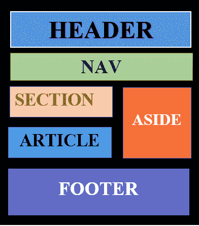
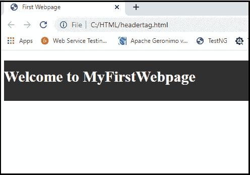
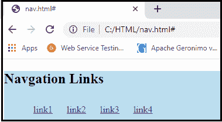
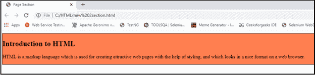
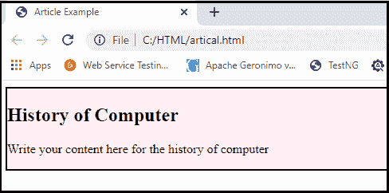
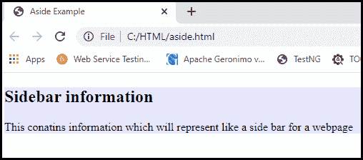
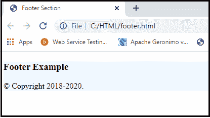
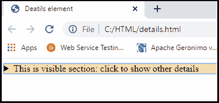
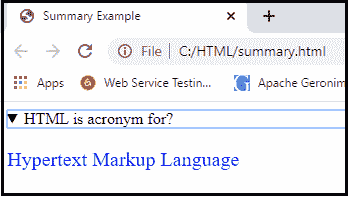

# HTML 布局

> 原文：<https://www.tutorialandexample.com/html-layouts/>

**HTML 布局**

HTML 模板提供了一种方式来组织管理良好、结构良好的响应性网页。我们可以说，HTML 布局规定了如何建立网页。网页体系结构利用被结构化的 HTML 文档的可视元素来操作。

网页布局是设计网站时要记住的最重要的事情，这样我们的网站就会看起来很专业。我们也可以使用基于 CSS 和 JAVASCRIPT 的框架来构建一个响应性和交互性的网站设计模型。



每个网站都有特定的风格，以特定的方式看待内容。

以下是用于描述网页不同部分的 HTML5 的各种元素。

*   <**表头> :** 用于定义单据表头或章节表头。
*   **<导航> :** 用于定义导航链接容器。
*   **<节> :** 用于标识文档的节。
*   <**文章** >:用来定义一个自成一体、独立的文章。
*   <**旁白** >:用来定义内容之外的内容(像侧边栏)。
*   <**页脚** >:用来描述一段文字的页脚或一节。
*   <**明细** >:用于定义附加数据。
*   <**摘要** >:用于定义<细节>元素的标题。

**各种布局元素的描述**

### HTML


**< header >** 元素用于创建一个网页页眉节。标题包含网页介绍性内容、标题部分、徽标或图标以及关于作者的信息。

**举例:**

```
<!DOCTYPE html> 
<html> 
<head>             
<title>First Webpage</title> </head> 
<body> 
             
<h1 style="font-size: 30px; color: white;text-align: center; padding-top: 15px;">Welcome to MyFirstWebpage</h1> 
 
</body> 
</html>
```

**输出:**



### HTML

<nav></nav>

< nav >是主导航链接块的容器。它可能包含指向同一页面或其他页面的链接。

**举例:**

```
<!DOCTYPE html>
<html>
<head>
  <style> li{  display: inline-block;   padding: 10px}  </style> 
</head> 
<body>  <nav style="background-color:#bcdeef;">  
<h1 style="text-align: center;">Navgation Links</h1>  <ul>  
<li><a href="#">link1</a></li>   
<li><a href="#">link2</a></li>  
<li><a href="#">link3</a></li>    
<li><a href="#">link4</a></li>                       
</ul>             
</nav> 
</body>
 </html>
```

**输出:**



### HTML

HTML < section >元素是包含一组相关元素的网页的独立部分。可能包括**文字、照片、表格、视频**等。

**举例:**

```
<!DOCTYPE html>
<html> 
<head>             
<title>Page Section</title> 
</head> 
<body> 
             <h2>Introduction to HTML</h2> 
<p>HTML is a markup language which is used for creating attractive web pages with the help of styling, and which looks in a nice format on a web browser.</p>

</body>
</html>    
```

**输出:**



**HTML <文章>T1】**

HTML 标签用来包含一个独立的文章，比如一个大故事，一篇大文章，等等。

**举例:**

```
<!DOCTYPE html> 
<html> 
<head>             
<title>Article Example</title>
</head> 
<body>              <h2>History of Computer</h2>  
<p>Write your content here for the history of computer</p>

</body> 
</html>    
```

**输出:**



### HTML

HTML < aside >留出与主要内容相关的内容。< aside >的内容必须链接到主要内容。它可以用作网页主要内容的侧边栏。

**举例:**

```
<!DOCTYPE html>
<html>
<head>
<title>Aside Example</title> 
</head> 
<body> <aside style="background-color:#e6e6fa">             
<h2>Sidebar information</h2>            
<p>This contains information which will represent like a side bar for a webpage</p> 
</aside> 
</body> 
</html>    
```

**输出:**



### HTML

HTML < footer >元素定义了这个文档或网页的页脚。主要包括作者信息、版权信息、其他链接等。

**举例:**

```
<!DOCTYPE html> 
<html> 
<head>            
 <title>Footer Section</title>
 </head> 
<body> 
<footer style="background-color:#f0f8ff; width: 100%; text-align: left;">             
<h3>Footer Example</h3>            
 <p>© Copyright 2018-2020\. </p> 
</footer> 
</body> 
</html>    
```

**输出:**



**HTML <详情>T1】**

HTML < details >元素用于向网页添加额外的细节，并且可以根据需要隐藏或显示细节。

**举例:**


|  |


```
<!DOCTYPE html> 
<html> 
<head>            
<title>Deatils element</title>
</head> 
<body> 
<details style="background-color: #f5deb3">            
<summary>This is visible section: click to show other details</summary>        
<p>This section only shows if user want to see it. </p> 
</details> 
</body>
</html>  
```

**输出:**



### HTML<summary></summary>

HTML < summary >元素与网页上的< details >元素一起使用。它被用作< details >元素内容的摘要。

**举例:**

```
<!DOCTYPE html> 
<html> 
<head>       
<title>Summary Example</title> 
</head> 
<body> 
<details>  <summary>HTML is acronym for?</summary>            
<p style="color: blue; font-size: 20px;">Hypertext Markup Language</p> 
</details>
</body> 
</html>    
```

**输出:**

