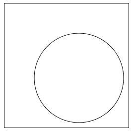
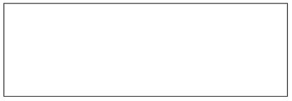
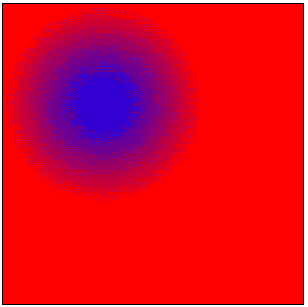
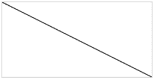
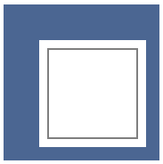
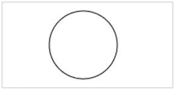

# HTML 画布

> 原文：<https://www.tutorialandexample.com/html-canvas/>

**HTML Canvas** :使用 JavaScript，HTML 中的< **canvas** >标签用于在网页上绘制图形。它可以用来绘制路线、方框、文本、渐变和添加图片。它本质上不包括边界和文本。HTML canvas 特性为 HTML 提供了一个位图表面。这是用来绘制网页图形的。

它是一个更新位图的低级程序模型，没有集成的场景。在画布中绘制路线、线条、圆、文本和插入图片的技巧有很多。

**语法:**

```
<canvas id = "script"> Data..<canvas>
```

**属性:**画布的标签包含下面列出的两个属性:

**高度:** **使用该属性设置画布高度。**

**宽度:** **使用该属性设置画布宽度。**

 ****例如:**

```
<!-- HTML code to illustrate canvas tag -->
<!DOCTYPE html>
<html>
<head>
<title>canvas Tag</title>
</head>
<body>
<canvas id = "Tutorialandexample" height = "250" width = "250"
style = "border:1px solid black">
</canvas>
<script>
var c = document.getElementById("Tutorialandexample");
var cx = c.getContext("2d");
cx.beginPath();
cx.arc(150, 150, 90, 0, 2 * Math.PI);
cx.stroke();
</script >
</body>
</html>
```

**输出:**



例 2 使用 Html 绘制矩形。

```
<!DOCTYPE html> 
<html> 
<head> 
<title>canvas Tag</title> 
</head> 
<body> <!-- canvas Tag starts here --> 
<canvas id = "Tutorialandexample" width = "400" height = "150" style = "border:1px solid black"> </canvas> <!-- canvas Tag ends here --> 
</body> 
</html>
```

**输出:**



**例 3:**

```
<!-- HTML code to illustrate canvas tag --> 
<!DOCTYPE html> 
<html> 
<head> 
<title>canvas Tag</title> 
</head> 
<body> <!-- canvas tag starts here --> 
<canvas id = "Tutorialandexample" width = "300" height = "300" style = "border:1px solid black"> </canvas> <!-- canvas tag ends here --> 
<script> var c=document.getElementById("Tutorialandexample"); 
var cx = c.getContext("2d"); 
vargrd = cx.createRadialGradient(100,                              100, 5, 100, 100, 100); grd.addColorStop(0, "blue"); 
grd.addColorStop(1, "red"); 
cx.fillStyle = grd; 
cx.fillRect(0, 0, 300, 300); </script> 
</body> 
</html>
```

**输出:**



### 在画布上画线

如果你想在画布上画一条直线，你可以使用下面两种方法。

**移动到(x，y):** 决定行的起点。

**LineTo(x，y):** 确定一条线的终点。

使用笔画法，可以画一条起点为(0，0)，终点为(250，150)的线。

**代码:**

```
<canvas id="CanvasLine" width="250" height="150" style="border:1px solid #d3d3d3;">
```

您的浏览器不支持 HTML5 canvas 标签。

```
<script>
var c = document.getElementById("CanvasLine"); 
varcctx = c.getContext("2d"); 
ctx.moveTo(0,0); 
ctx.lineTo(150,50); 
ctx.stroke(); 
</script>
```

**输出:**



**绘制彩色方框边框**

```
<body>
<canvas id="totn_canvas" width="225" height="225"></canvas>
<script>
var canvas = document.getElementById("totn_canvas");
varctx = canvas.getContext("2d");
ctx.fillStyle = "#4B6692";
ctx.fillRect(50, 50, 200, 200);
ctx.clearRect(90, 90, 120, 120);
ctx.strokeRect(100, 100, 100, 100);
</script>
</body>
```

**输出:**



### 在画布上画圆

您可以使用 arc()方法在画布上画一个圆:

弧线(x，y，r，开始，停止)

使用 ink()方法之一，如 **stroke ()** 或 **fill ()** 在 HTML 画布上画圆。

**代码:**

```
<canvas id="myCircle" width="400" height="200" style="border:1px solid #d3d5d3;">
```

您的浏览器不支持 HTML5 canvas 标签。

```
<script>
var c =document.getElementById("myCircle");
varcctx = c.getContext("2d");
ctx.beginPath(); 
ctx.arc(200,70,60,0,1*Math.PI); 
ctx.stroke(); 
</script>
```

**输出:**

**