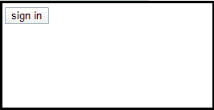

# HTML5 按钮标记

> 原文：<https://www.tutorialandexample.com/html5-button-tag>

**HTML 按钮标签**

在网页上使用< **按钮** >标签在 HTML 中构造一个可点击的按钮。在<按钮内>....< /button >标签，我们可以放置文字或图片之类的内容。

应该始终定义一个< button >标签的类型属性。对于按钮项，不同的浏览器使用不同的默认类型。

你需要在表单内外使用 HTML 按钮标签。如果您在表单中使用它，它的作用就像提交按钮。它也可以用作复位按钮。

当使用外部类型时，您可以在其上调用 JavaScript 特性。

### HTML 按钮标记示例

让我们看看显示按钮的代码。

```
<button name="button" type="button">sign in</button>
```

**输出:**



HTML 按钮示例:提交表单

让我们看看点击按钮提交表单的代码。

```
<form>
Enter First Name:<input type="text" name="name"/><br/>
Enter Second Name:<input type="text" name="name"/><br/>
Gender:<input type="text" name="name"/><br/>
<button>Submit Form</button>
</form>
```

**输出:**


### HTML 按钮示例:调用 JavaScript 函数

让我们看看点击按钮调用 JavaScript 特性的代码。

```
<button name="button" value="OK" type="button" onclick="hello()">Press me</button>
<script>
function hello(){ 
alert("Hii Tutorialandexample"); 
} 
</script>
```

**输出:**


### HTML 按钮示例:重置表单

让我们看看点击按钮重置表单的代码。

```
<form>
Type Your First Name:<input type="text" name="name"/><br/>
Type Your Last Name:<input type="text" name="name"/><br/>
<button type="reset">reset</button>
</form>
```

**输出:**


### HTML 按钮标记的属性

<**按钮** >标签接受所有的全局属性，甚至一些额外的唯一属性。

给出了带有 HTML 按钮标签的属性列表。


| **属性** | **描述** |
| **禁用** | 它定义了一个按钮的去激活。 |
| **形成动作** | 它用于表单提交。它决定了在提交表单时将有关表单的数据发送到哪里。 |
| **自动对焦** | 这指定了当加载页面时，一个按钮将自动引起注意。 |
| **名称** | 它明确说明了按钮名称。 |
| **值** | 它指定按钮值。 |
| **表单目标** | 提交表单后，它决定在哪里显示答案。 |
| **表单类型** | 它定义了如何在表单数据发送到服务器之前对其进行编码。 |
| 成形方法 | 这规定了如何提交表单数据。 |
| **表格** | 它定义了一个或多个属于点击的表单。 |
| **Formnovalidate** | 它决定了表单上的数据在提交后不会被验证。 |
| **类型** | 它明确说明了按钮类型。 |
| **<按钮>** | 它定义了点击键盘快捷键。至于 HTML5，这个属性是全局的，可以用在任何项目上。 |
| **选项卡索引** | 使用 Tab 键确定选择顺序。 |


### 支持浏览器


| 微软公司出品的 web 浏览器 | 铬 | 火狐浏览器 | 歌剧 |

