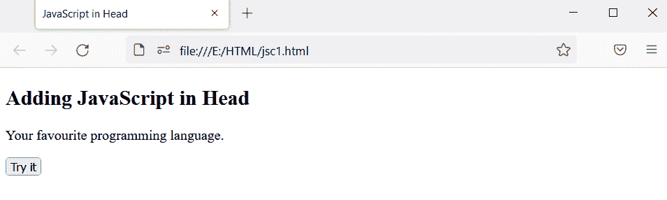
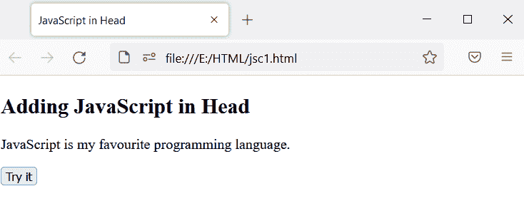
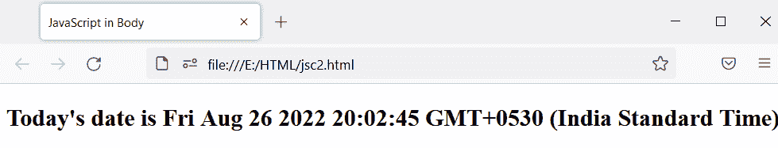
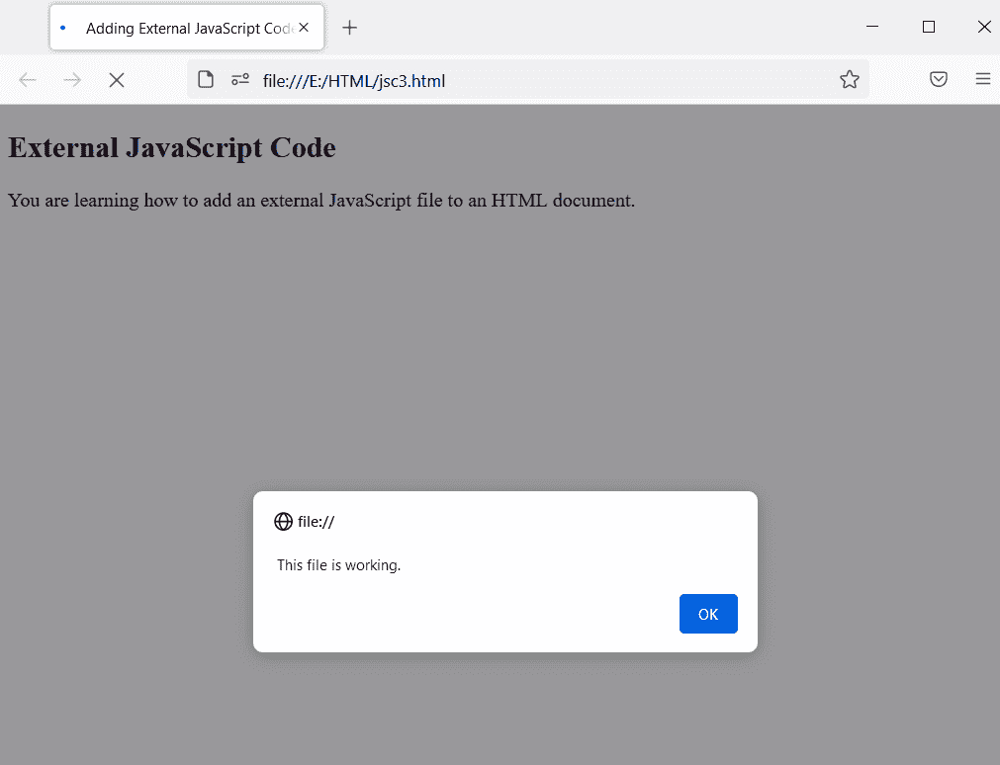
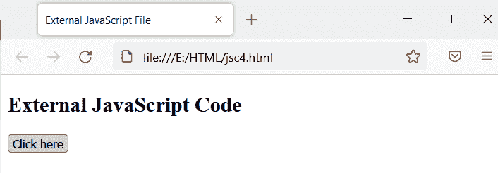
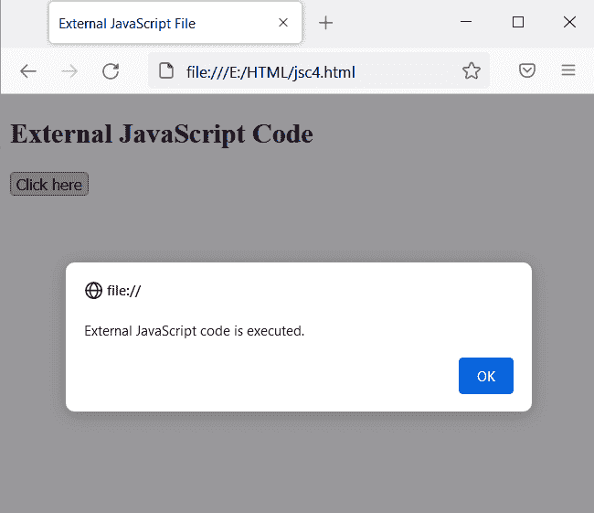
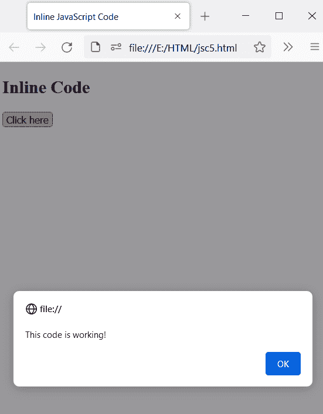
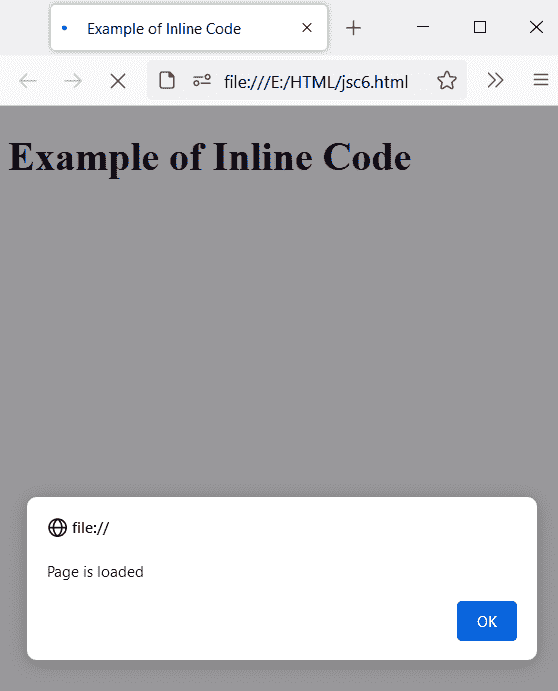

# 如何在 HTML 中添加 JavaScript

> 原文：<https://www.tutorialandexample.com/how-to-add-javascript-to-html>

JavaScript 是当今最重要的语言之一。它是一种高级的、解释性的、轻量级的编程语言，使网页更具交互性。它是一种网络语言。JavaScript 通过给网页添加动作来使网页生动起来。

JavaScript 是一种基于对象的脚本语言。JavaScript 支持多态、封装和继承。它不需要任何编译器，可以在网络浏览器中运行。一些最受欢迎的网站，如脸书、谷歌、亚马逊、网飞和 Flipkart，都使用 JavaScript 来构建他们的网站。它也被用来制作小规模的游戏。

它以创建漂亮的网页和应用程序而闻名。我们可以将 JavaScript 直接添加到 HTML 页面中。借助 HTML，执行 JavaScript。如果不使用 HTML，我们就无法运行 JavaScript 程序。

有三种方法可以将 JavaScript 添加到 HTML 中:

1.  嵌入 JavaScript 代码
2.  内嵌代码
3.  外部代码

让我们一个一个来看，了解一下:

 **## 1.嵌入 JavaScript 代码:

我们使用一个专用的 HTML 标签， **<脚本> JavaScript 代码</脚本>** 标签，在 HTML 中嵌入 JavaScript 代码。我们可以将<脚本>标签放在 HTML 文档的< head >部分或< body >部分。

为了将 JavaScript 代码放在主要内容之外，我们将 JavaScript 代码放在了部分中。

嵌入代码是将 JavaScript 添加到 HTML 的最简单方法。

让我们借助例子来理解。

**例 1:**

在这个例子中，我们将把 JavaScript 代码放在部分中。参见下面的代码:

```
<!DOCTYPE html>
<html>
<head>
<title> JavaScript in Head </title>
<script>
function myFunction() {
  document.getElementById("demo").innerHTML = "JavaScript is my favourite programming language";
}
</script>
</head>
<body>

<h2> Adding JavaScript in Head </h2>

<p id="language"> Your favourite programming language. </p>

<button type="button" onclick="myFunction()"> Try it </button>

</body>
</html> 
```

**输出:**

输出显示了标题、段落和按钮。



当您单击该按钮时，JavaScript 被执行，文本被更改。



**例 2:**

这个例子将把 JavaScript 代码放在部分中。

```
<!DOCTYPE html>
<html lang="en-US">

<head>
    <meta name="viewport" content="width=device-width, initial-scale=1">
    <title> JavaScript in Body </title>
</head>
<body>
  <script>
      let da = new Date();
      document.body.innerHTML = "<h2> Today's date is " + da + "</h2>"
  </script>
</body>
</html>
```

**输出:**

今天的日期可以在下面的输出中看到:



## 2.外部代码:

当我们必须在 HTML 文档中编写大型 JavaScript 代码时，代码变得难以阅读。为了增加代码的可读性，我们可以将大量的 JavaScript 代码保存在一个单独的文件中，并对其进行组织。

JavaScript 文件的扩展名是(。js)。我们可以使用

您也可以在另一个 HTML 文档中使用相同的 JavaScript 文件。

我们将使用以下代码将外部文件链接到 HTML 文档:

```
<script scr="filename.js"> </script>
```

**例 1:**

**外部 JavaScript 代码:**

```
document.write(" You are learning how to add an external JavaScript file to an HTML document. ")
alert(" This file is working. ")
```

您可以使用下面的代码所示的

```
<!DOCTYPE html>
<html lang="en-US">

<head>
    <meta name="viewport" content="width=device-width, initial-scale=1">
    <title> Adding External JavaScript Code to HTML </title>
</head>
<body>
<h2> External JavaScript Code </h2>
<script src="external.js"> </script>
</body>
</html> 
```

**输出:**



**例 2:**

**外部 JavaScript 代码:**

```
function sayHello() {
    alert("External JavaScript code is executed.");
}
document.getElementById("btn").onclick = sayHello;
```

您必须将外部 JavaScript 代码链接到 HTML 文档，就像这样，

```
<!DOCTYPE html>
<html lang="en">
<head>
    <meta charset="UTF-8">
    <meta name="viewport" content="width=device-width, initial-scale=1">
    <title> External JavaScript File </title>        
</head>
<body>
    <h2> External JavaScript Code </h2>    
    <button type="button" id="btn"> Click here </button>
    <script src="external2.js"></script>
</body>
</html>
```

**输出:**

您可以在输出中看到标题和一个按钮。



当您点击此按钮时，将执行外部 JavaScript，屏幕上将显示如下消息:



在 HTML 文档中使用外部 JavaScript 代码的好处:

*   它将 HTML 文档和 JavaScript 代码分开。
*   我们可以轻松管理 JavaScript 文件和 HTML 文档。
*   外部 JavaScript 文件最初只下载一次，并存储在浏览器的缓存中。这就是网页加载时间减少的原因。
*   我们可以重用代码。
*   我们可以在不同的 HTML 文档中使用精确的代码。
*   将 HTML、CSS 和 JavaScript 代码保存在单独的文件中是一个好习惯。

## 内嵌代码:

我们可以通过内嵌代码将 JavaScript 代码直接添加到 HTML 中。我们可以使用诸如 onload、onclick 等标签属性内嵌插入代码。

每当您必须编写小代码时，您可以编写内联代码，但是如果代码很大，那么不要保持代码内联，因为这会降低代码的可读性，并使其难以维护。

**例 1:**

我们使用 onclick 属性来添加内联代码，就像这样

```
<!DOCTYPE html>
<html lang="en">
<head>
    <meta charset="UTF-8">
    <title> Inline JavaScript Code </title>        
</head>
<body>    
    <h2> Inline Code </h2>
    <button onclick="alert('This code is working!')"> Click here </button>
</body>
</html>
```

**输出:**

单击该按钮时，屏幕上会出现一条警告消息。



**例 2:**

```
<!DOCTYPE html>
<html>
    <Title> Example of Inline Code </Title>
<body onload="myFunc()">

<h1> Example of Inline Code </h1>

<script>
function myFunc() {
  alert("Page is loaded");
}
</script>

</body>
</html>
```

**输出:**

当您加载页面时，屏幕上会出现一条警告消息。



### 浏览器支持:

它支持以下浏览器:

*   谷歌浏览器
*   微软公司出品的 web 浏览器
*   Mozilla Firefox
*   歌剧
*   旅行队**