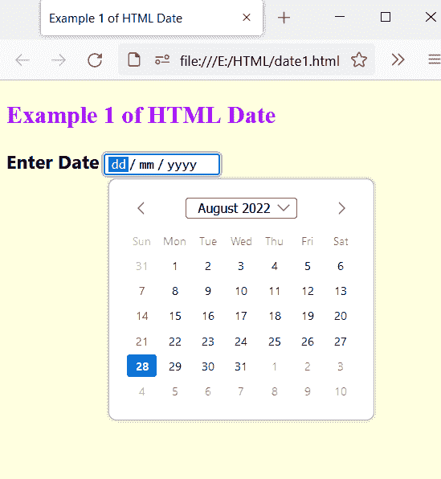
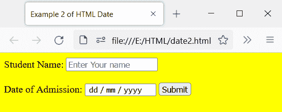
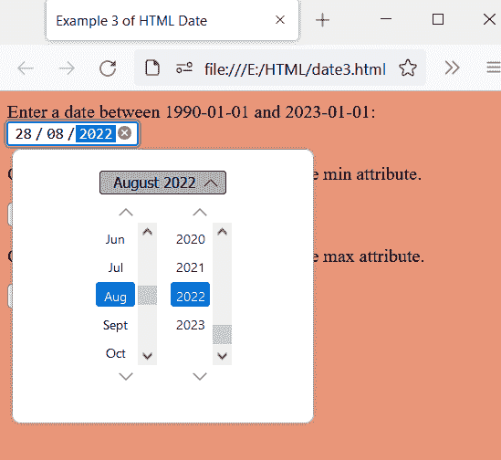
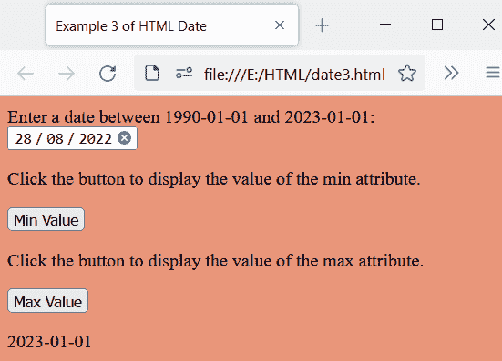
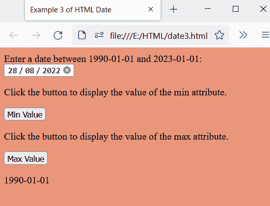
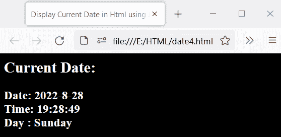
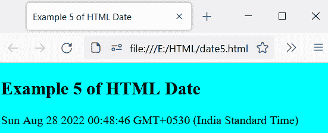
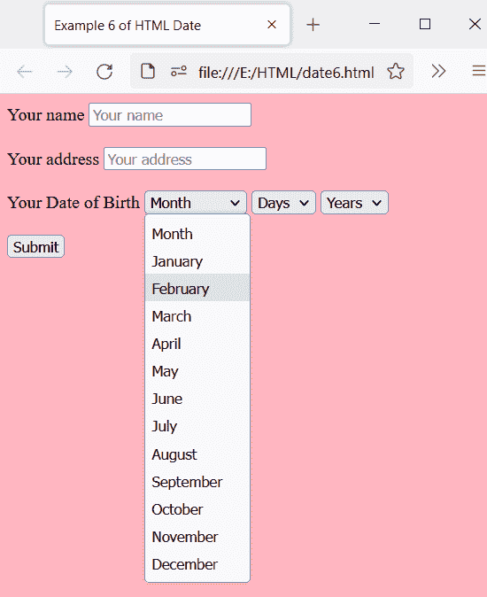

# HTML 日期

> 原文：<https://www.tutorialandexample.com/html-date>

HTML 中的 input 元素有几个属性。它的一个属性是 type 属性，该属性按照用户可以从日历中选择日期的顺序创建日历。只有单击输入字段，日历才可见。它包含日、月和年的值。

**语法:**

```
<input type="date">
```

## HTML 日期的示例:

**例 1:**

```
<!DOCTYPE html>
<html>

<head>
    <title> Example 1 of HTML Date </title>
    <style>
        h2 {
            color: rgb(163, 16, 248);
        }
        h3 {
            font-family: 'Segoe UI', Tahoma, Geneva, Verdana, sans-serif;
        } 
        body {
            text-align: left;
        }
    </style>
</head>

<body bgcolor="lightyellow">
    <h2> Example 1 of HTML Date </h2>
    <h3> Enter Date <input type="date"></h3>
</body>

</html> 
```

**输出:**

输出显示日期。当你试图输入日期时，屏幕上会出现一个日历。现在，你可以从日历中选择日期。



**例 2:**

这是 HTML 日期的另一个例子。我们使用输入文本和输入日期。

```
<!DOCTYPE html>   
<html>  
<head>   
<title> Example 2 of HTML Date </title>  
</head>  

<body bgcolor="yellow">   

<form>   
Student Name: <input type="text" placeholder="Enter Your name" required>  
<br>  
<br>  
<label for="admission date"> Date of Admission: </label>
<input type = "date" required>   
<button type="submit" name="btn"> Submit </button>  
</form>  

</body> 

</html> 
```

**输出:**

输出显示输入文本、输入日期和提交按钮。您可以填写详细信息并提交数据。黄色背景色也被用来使网页看起来更好。



**例 3:**

我们通过使用 input 元素中的 min 和 max 属性来设置最小值和最大值。

```
<!DOCTYPE html>
<html>
    <head>
          <title> Example 3 of HTML Date </title>
    </head>
<body bgcolor="DarkSalmon">

Enter a date between 1990-01-01 and 2023-01-01:
<input type="date" id="Date" name="bday" min="1990-01-01" max="2023-01-01">

<p> Click the button to display the value of the min attribute. </p>

<button onclick="myFunction()"> Min Value </button>

<p> Click the button to display the value of the max attribute. </p>

<button onclick="myFunc()"> Max Value </button>

<p id="demo"></p>

<script>
function myFunction() {
  var x = document.getElementById("Date").min;
  document.getElementById("demo").innerHTML = x;
}
function myFunc() {
  var x = document.getElementById("Date").max;
  document.getElementById("demo").innerHTML = x;
}
</script>

</body>
</html> 
```

**输出:**

您可以看到最小值和最大值是固定的，您可以选择这些值之间的日期。



单击最小值按钮时，最小值将如下所示:



单击最大值按钮时，最大值将如下所示:



**例 4:**

在这个例子中，我们将使用 JavaScript 显示当前的日期、时间和星期几。

```
<html>
<head>
  <title> Display Current Date in Html using Javascript </title>
</head>
<body bgcolor="AntiqueWhite">
  <h2> Current Date: </h2>

  <h3 id="DateTime"></h3>
</body>
  <script type="text/javascript">
  var today = new Date();
  var day = today.getDay();
  var daylist = ["Sunday","Monday","Tuesday","Wednesday ","Thursday","Friday","Saturday"];
  var date = today.getFullYear()+'-'+(today.getMonth()+1)+'-'+today.getDate();
  var time = today.getHours() + ":" + today.getMinutes() + ":" + today.getSeconds();
  var dateTime = ' Date: ' +date+' <br> Time: '+time;

  document.getElementById("DateTime").innerHTML = dateTime + ' <br> Day : ' + daylist[day];

  </script>
</html>
```

**输出:**

输出显示当前日期、时间和星期几。



**例 5:**

本示例将在网页上显示今天的日期、星期和时间。

```
<!DOCTYPE html>
<html>
    <head>
        <title> Example 5 of HTML Date </title>
    </head>
<body bgcolor="cyan">
<h2> Example 5 of HTML Date </h2>
<p id="date"></p>
<script>
var dates = new Date();
document.getElementById("date").innerHTML = dates;
</script>
</body>
</html> 
```

**输出:**

输出显示今天的日期、星期和时间。



**例 6:**

在这个例子中，我们将使用<select>和<option>标签并创建选项来选择日期。</option></select>

```
<!DOCTYPE html>
<html>
  <head>
    <title> Example 6 of HTML Date </title>
  </head>
<body bgcolor="lightpink">

<form action="#">
<label for="name"> Your name </label>
<input type="text" name="Your name" placeholder="Your name"> <br> <br>
<label for="address"> Your address </label>
<input type="text" name="Your address" placeholder="Your address"> 
<br> <br>
<label for="birthday"> Your Date of Birth </label>
<select name="month" id="month">
  <option value="month">Month</option>
  <option value="January">January</option>
  <option value="February">February</option>
  <option value="March">March</option>
  <option value="April">April</option>
  <option value="May">May</option>
  <option value="June">June</option>
  <option value="July">July</option>
  <option value="August">August</option>
  <option value="September">September</option>
  <option value="October">October</option>
  <option value="November">November</option>
  <option value="December">December</option>
</select>

<select name="days" id="days">
  <option value="days"> Days </option>
  <option value="1"> 1 </option>
  <option value="2"> 2 </option>
  <option value="3"> 3 </option>
  <option value="4"> 4 </option>
  <option value="5"> 5 </option>
  <option value="6"> 6 </option>
</select>

<select name="years" id="years">
<option value="years"> Years </option>
<option value="2000"> 2000 </option>
<option value="2001"> 2001 </option>
<option value="2002"> 2002 </option>
<option value="2003"> 2003 </option>
<option value="2004"> 2004 </option>
<option value="2005"> 2005 </option>
</select> <br> <br>

<input type="submit" value="Submit">
</form>

</body>
</html>
</html>
```

**输出:**

您可以通过单击下拉按钮选择月、日和年，如下所示:



### 浏览器支持:

它支持以下浏览器:

1.  谷歌浏览器
2.  微软公司出品的 web 浏览器
3.  Mozilla Firefox
4.  旅行队
5.  歌剧