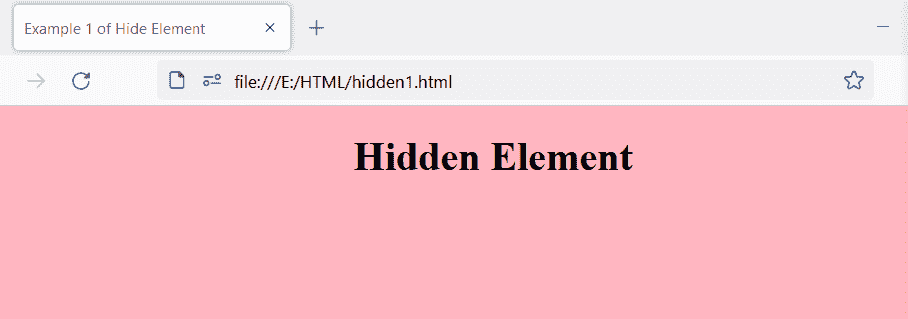
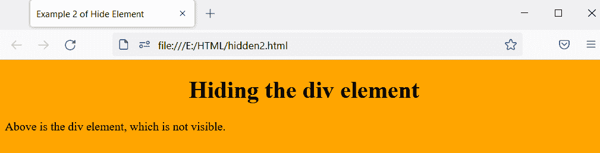
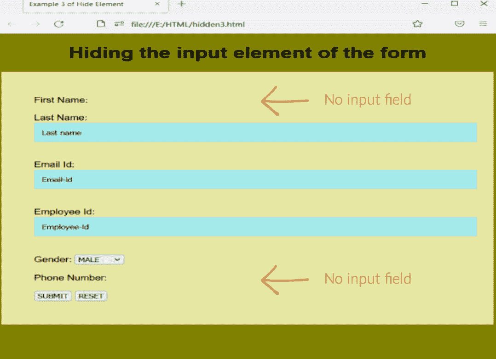

# HTML 隐藏元素

> 原文：<https://www.tutorialandexample.com/html-hide-element>

HTML hide 元素用于隐藏元素。我们将隐藏属性放在我们想要隐藏的元素中。隐藏属性是布尔属性。

具有隐藏属性的元素不会显示在网页上。我们可以应用条件来查看隐藏的元素。如果满足指定的条件，用户可以看到隐藏的元素。

隐藏属性是一个全局属性。我们可以在任何 HTML 元素上使用隐藏属性。

**语法:**

```
<element_name hidden> some text </element>
```

## HTML 隐藏元素的示例:

**例 1:**

我们使用

标签中的 hidden 属性来隐藏段落。

```
<!DOCTYPE html>  
<html>  
<head>  
<title> Example 1 of Hide Element </title>  
</head>  
<body bgcolor="lightpink">  
<center>  
<h1> Hidden Element </h1>  
</center>  
<div>
<p hidden> This paragraph should be hidden. </p>  
</div>
</body>  
</html> 
```

**输出:**

输出只显示标题标签，隐藏段落元素。



**例 2:**

这个例子说明了隐藏属性在

元素中的使用。

```
<!DOCTYPE html>  
<html>  
<head>  
<title> Example 2 of Hide Element </title>  
</head>  
<body bgcolor="orange">  
<center>  
<h1> Hiding the div element </h1>  
</center>  
<div hidden>
<p> This is the div element. </p>  
</div>
<p> Above is the div element, which is not visible. </p>
</body>  
</html> 
```

**输出:**

输出显示了标题元素和段落元素，但是隐藏了

元素，因为我们在元素中使用了 hidden 属性。



**例 3:**

我们在标有 first name 和 phone number 的输入元素中使用了 hidden 属性，隐藏了两个输入字段。

```
<!DOCTYPE html>  
<html>  
<head>  
<title> Example 3 of Hide Element </title>  
<style>
body {  
font-family: Arial, Helvetica, sans-serif;  
background-color: olive;  
}   
.container {  
padding: 50px;  
background-color: rgb(231, 231, 164);  
}  
input[type=text] {  
  padding: 12px; 
  width: 100%;  
  border: none;  
  margin: 2px 0 20px 0;  
  background: #a3eaea;  
}  
input[type=text]:focus {  
background-color: rgb(188, 229, 242);  
outline: none;
}  
</style>
</head>  
<body bgcolor="cyan">  
<center>  
<h1> Hiding the input element of the form </h1>  
</center>  
<form class="container"> 
    <label for="fname"> First Name: </label>  <input type="text" name="firstname" value="First name" hidden>
    <br> 
    <br>
    <label for="lname"> Last Name: </label>  
    <input type="text" name="lastname" value="Last name">
    <br>
    <br>
    <label for="Email-id"> Email Id: </label> 
    <input type="text" name="Email-id" value="Email-id">
    <br>
    <br>
    <label for="employee-id"> Employee Id: </label>
    <input type="text" name="Employee-id" value="Employee-id">
    <br>
    <br>
    <label for="Gender"> Gender: </label>
    <select name="Gender">
        <option value="male"> MALE </option>
        <option value="female"> FEMALE </option>
        <option value="other"> OTHER </option>
    </select>
    <br>
    <br>
    <label for="phone"> Phone Number: </label>
    <input type="text" name="phone" value="Phone Number" hidden>
    <br>
    <br>
   <button type="submit"> SUBMIT </button>
   <button type="reset"> RESET </button>
  </form>
</body>  
</html> 
```

**输出:**

正如您所看到的，两个输入元素都是隐藏的，只有两个元素的标签是可见的。



### 浏览器支持:

它支持以下浏览器:

*   谷歌浏览器
*   歌剧
*   Mozilla Firefox
*   微软公司出品的 web 浏览器
*   旅行队