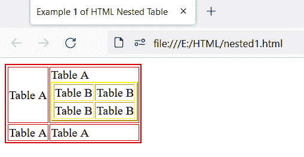
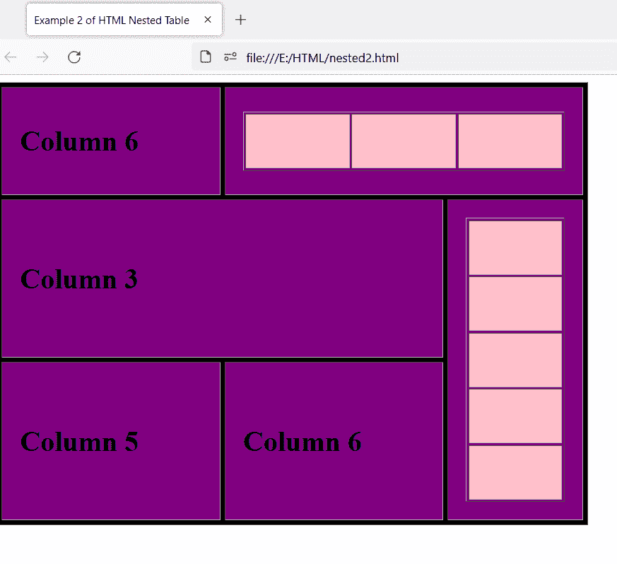
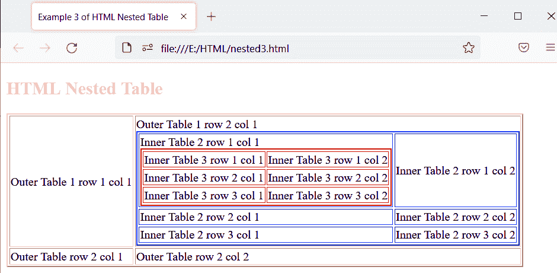

# HTML 嵌套表格

> 原文：<https://www.tutorialandexample.com/html-nested-table>

HTML 嵌套表是指在另一个表中创建的表。

表格是以行和列的形式出现的。从左到右称为水平行，从上到下称为垂直列。HTML 中的表格可以嵌套，这意味着一个表格可以插入到另一个表格中。

务必将内层桌子放在外层桌子的…之间。我们将创建一个表，并尝试在该表中嵌套另一个表，然后查看结果。

我们可以使用标签创建嵌套表。创建的第一个表称为外部表。外部表中的表称为嵌套表。

## HTML 嵌套表格的示例

**例 1:**

本示例在另一个表格中显示一个表格。我们将使用 HTML 创建表 A，并在其中嵌套另一个表 B。为了识别和区分这两个表，我们设置了表 A 的红色边框和表 b 的黄色边框。

```
<!DOCTYPE html>
<html>
    <head>
        <meta charset="UTF-8">
        <meta name="viewport" content="width=device-width, initial-scale=1.0">
        <title> Example 1 of HTML Nested Table </title>
    </head>
<body>
	<table border="2" bordercolor="red">
		<tr>
			<td> Table <Adr></Adr> </td>
			<td> Table A
	<table border="2" bordercolor="yellow">
		<tr>
		       <td> Table B </td>
			<td> Table B </td>
		</tr>
		<tr>
			<td> Table B </td>
			<td> Table B </td>
		</tr>
	</table>
		</td>
		</tr>
		<tr>
			<td> Table A </td>
			<td> Table A </td>
		</tr>
	</table>
</body>
</html> 
```

**输出:**

输出显示嵌套在外部表中的表。我们将在外部表格的第二列的第一行中添加嵌套表格。可以看到，表 A 的边框颜色是红色，这是外层的表，表 B 的边框颜色是黄色，这是内层的表。我们添加了边框颜色，便于区分内外桌。



**例 2:**

这个例子显示了一个具有某种样式的嵌套表，所以我们使用 HTML 和 CSS 来创建嵌套表。

```
<!DOCTYPE html>
<html lang="en">
<head>
    <meta charset="UTF-8">
    <meta name="viewport" content="width=device-width, initial-scale=1.0">
    <title> Example 2 of HTML Nested Table </title>
</head>
<body>

    <table border="1" cellpadding="20px" bgcolor="black" cellspacing="5px" width="50%">

        <tr>
            <td bgcolor="purple"><h1> Column 6 </h1> </td>
            <td colspan="2" bgcolor="purple" >

             <table border="1" width="100%"  align="center" cellpadding="30px">
                 <tr>
                <td bgcolor="pink"></td>
                 <td bgcolor="pink"></td>
                 <td bgcolor="pink"></td> </tr>
             </table>

            </td>
        </tr>
        <tr>
            <td colspan="2" bgcolor="purple"><h1> Column 3 </h1></td>
            <td rowspan="2" bgcolor="purple">

        <table border="1" width="100%" align="center" cellpadding="30px">

            <tr> <td  bgcolor="pink" ></td> </tr>
            <tr> <td bgcolor="pink" ></td> </tr>
            <tr> <td bgcolor="pink" ></td> </tr>
            <tr> <td bgcolor="pink" ></td> </tr>
            <tr> <td bgcolor="pink" ></td> </tr>

        </table>

            </td>
        </tr>

        <tr>
            <td bgcolor="purple"> <h1>Column 5</h1> </td>
            <td bgcolor="purple"> <h1> Column 6 </h1> </td>
        </tr>
    </table>

</body>
</html> 
```

**输出:**

输出显示了一个在 CSS 帮助下设计的嵌套表。



**例 3:**

在本例中，我们在另一个嵌套表中创建一个嵌套表。我们将在外部表 1 的第二列的第一行中添加内部表 2，并在内部表 2 的第二列的第一行中添加内部表 3。

```
<!DOCTYPE html>
<html>
    <head>
        <meta charset="UTF-8">
        <meta name="viewport" content="width=device-width, initial-scale=1.0">
        <title> Example 3 of HTML Nested Table </title>
    </head><body>
	<h2 style="color:pink"> HTML Nested Table </h2>

	<table border="2" bordercolor="pink">
		<tr>
			<td> Outer Table 1 row 1 col 1 </td>
			<td> Outer Table 1 row 2 col 1 
				<table border="2" bordercolor="blue">
					<tr>
						<td> Inner Table 2 row 1 col 1 
							<table border="2" bordercolor="red">
								<tr>
									<td> Inner Table 3 row 1 col 1 
									</td>
									<td> Inner Table 3 row 1 col 2 </td>
								</tr>
								<tr>
									<td> Inner Table 3 row 2 col 1 </td>
									<td> Inner Table 3 row 2 col 2 </td>
								</tr>
								<tr>
									<td> Inner Table 3 row 3 col 1 </td>
									<td> Inner Table 3 row 3 col 2 </td>
								</tr>
							</table>
						</td>
						<td> Inner Table 2 row 1 col 2</td>
					</tr>
					<tr>
						<td> Inner Table 2 row 2 col 1 </td>
						<td> Inner Table 2 row 2 col 2 </td>
					</tr>
					<tr>
						<td> Inner Table 2 row 3 col 1 </td>
						<td> Inner Table 2 row 3 col 2 </td>
					</tr>
				</table>
			</td>
		</tr>
		<tr>
			<td> Outer Table row 2 col 1 </td>
			<td> Outer Table row 2 col 2 </td>
		</tr>
	</table>
</body>

</html> 
```

**输出:**

输出显示了外部表中的嵌套表和第二个嵌套表中的另一个嵌套表。如您所见，外部表格 1 有粉色边框，内部表格 2 有蓝色边框，内部表格 3 有红色边框。借助不同的边框颜色，我们可以很容易地理解和识别表格。



## 浏览器支持:

它支持以下浏览器:

1.  谷歌浏览器
2.  微软公司出品的 web 浏览器
3.  Mozilla Firefox
4.  旅行队
5.  微软 Edge
6.  歌剧