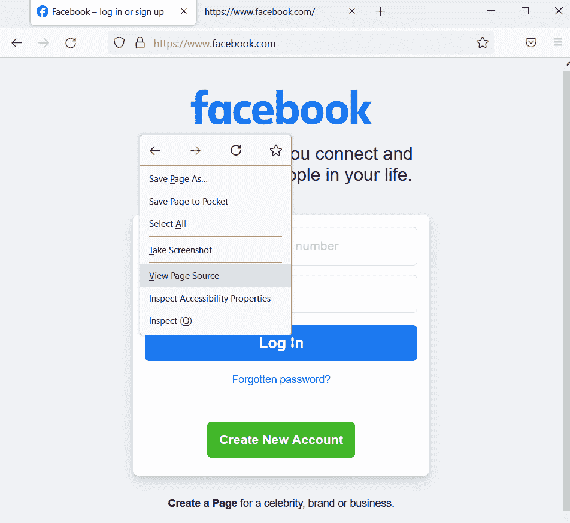
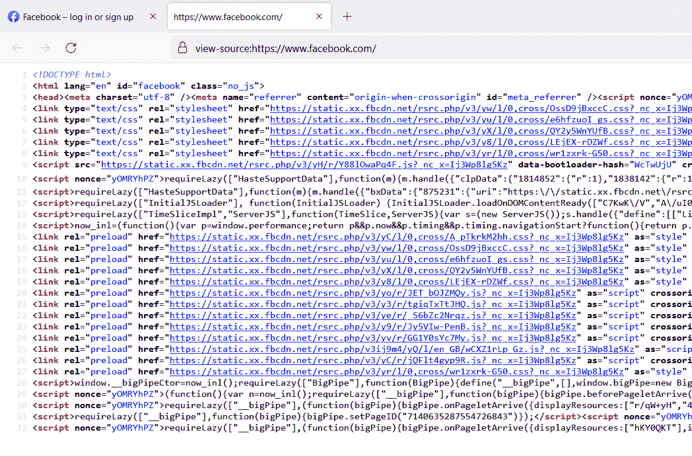
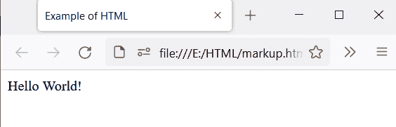

# HTML 代表什么？

> 原文：<https://www.tutorialandexample.com/what-does-html-stand-for>

HTML 代表超文本标记语言。我们用这种标记语言来设计网页。网络浏览器使用这种语言来展示文本、视频、图像、音频和其他人们可以理解的媒体。

HTML 是一种编码语言，我们用它来构建网站的结构。我们用这种语言来构建。任何网站，如谷歌、脸书等。，会有 HTML。比如你打开 facebook.com，在屏幕上点击右键，那么会出现如下图的对话框；该对话框由许多选项组成；点击查看页面源代码，你会看到一大段代码。



大代码是下面显示的源代码，其中包含 HTML 代码。蓝色的代码是 HTML 代码。



通过这样的方式，你可以看到任何网页的源代码。

HTML 语言有许多标签和属性，用于显示网页的文本、图像、视频、链接等。HTML 中的标签写在尖括号“”内。HTML 标签成对出现，如 、

、等。

**HTML 标签的语法**

```
<tag_name> content goes here </tag_name>
```

第一个标签<tag_name>称为开始标签，第二个标签 tag_name >称为结束标签。有些标签不需要结束标签。这些标签被称为自结束标签。比如<input>、
等。这些标签也称为空标签或不成对标签，这意味着这些标签没有配对。</tag_name>

HTML 标记还具有用于向元素提供附加属性的属性。属性总是在开始标记中定义。属性总是在包含名称和值对的开始标记中定义，比如<input type="text">，其中 input 是标记名，type 是属性名，text 是 type 属性的值。

当用户打开任何网页时，用户只会看到文本、图像、视频等。，但不是 HTML 代码。

## 历史:

超文本标记语言(HTML)的发明者是蒂姆·伯纳斯·李，他于 1990 年在日内瓦发明了 HTML。HTML 是一种不断发展的语言。从事 HTML 工作的组织定期更新新版本。

蒂姆·伯纳斯·李也在 1989 年开发了万维网；HTML 由万维网联盟(也称为 W3C)维护、创建、修改和更新。

## HTML 的不同版本:

1.  HTML 1.0
    HTML 1.0 是 HTML 的基础版本，也是标准通用标记语言(SGML)的一种形式。在这个版本中，文本可以被结构化。这个版本的功能较少。它不支持表格、样式等。

2.  HTML 2.0
    这个版本的 HTML 于 1995 年以互联网工程任务组(IETF)的名义发布。这个版本有几个新功能。引入了表单的概念，但只引入了基本的标签，如输入文本字段、按钮等。这个版本最重要的特性是 HTML 图像标签，用于在 web 浏览器中插入图像。

    万维网联盟组织成立于 HTML 2.0 版本发布之前。开发 W3C 是为了在各种 web 浏览器之间维护标准，以便 web 浏览器能够理解 HTML 标记。

3.  **HTML 3.0(从未发布)**
    那时候，互联网和 HTML 都在快速传播。HTML 变得流行起来。随着互联网用户数量的增加，更多的人开始使用互联网来搜索信息，所以 HTML 是唯一产生网页的语言。人们在网页上阅读信息；因此，互联网用户正在增长。Web 开发人员正在创建网页，因此网页的数量在不断增长。这一切都造成了复杂化，所以 HTML 3 版本来了，但因为没有修改，没有新功能等，所以一直没有发布。

4.  这个版本是由一个叫做万维网联盟的组织在 1997 年出版的。与以前的版本相比，它们包含了许多特性。HTML 3.2 引入了许多属性。属性是键值对的形式。互联网上网页的访问者数量正在上升。这个 HTML 4.01 版本中的另一个特性是 CSS，它的完整形式是级联样式表。此功能有助于设计网页的样式，使网页更具吸引力，从而让读者对阅读内容产生兴趣。浏览器速度非常慢，所以为了满足浏览器的需求，更新会接踵而至。

5.  互联网变得越来越普及。互联网用户的数量正在增加。Web 开发者需要更多的功能来构建最好的网页，于是 HTML 4.01 版本的发布弥补了这一不足。
    该版本中包含的一些新功能如下:
    *   样式表
    *   客户端脚本
    *   高级表格
    *   结构和表现的分离
    *   随着 HTML 版本的更新，更新网络浏览器也是必不可少的。Web 浏览器也必须更新以理解 HTML 中引入的新标签。因此，HTML 和 web 浏览器都在定期更新以满足用户的需求。
        HTML 4.01 引入外部样式表，将 HTML 和 CSS 代码分开。这个特性有助于维护代码。CSS 可以附加到 HTML 文档以使用 CSS 属性。

6.  HTML5 提出了干净的标记和干净的代码，这让用户和开发者都更容易理解。它允许 web 开发人员使用干净的代码，删除标签，并用新的 HTML5 元素替换它们。
    一些新功能如下:
    1.  视频和音频是 HTML 中包含的新标签，它允许我们在设计的网页中嵌入视频。这个功能增强了我们的网站，并吸引人们到网页的视频和音频。
    2.  页眉
    3.  帆布
    4.  页脚

        导航标签，用来链接不同的页面。我们可以把我们网站的所有网页的链接放在导航标签里面。

以下是 HTML5 版本中增加的一些新功能:

**音频标签:**<音频>标签用于给 HTML 文档添加音频。这个标签有助于在网页上嵌入音频。我们可以在网页上播放音频。

**视频标签:**<视频>标签用于将视频添加到 HTML 文档中。这个标签有助于在网页上嵌入视频。我们可以在网页上播放视频。

**Email 标签:**html 5 版本增加了 Email 类型的<输入>标签。电子邮件标签是一个用于添加电子邮件的<表单>标签。该标签用于检查输入的内容是否是有效的电子邮件。

语义标签:这些被称为结构标签，因为它们定义了 HTML 文档的结构。语义标签定义了特定的元素应该用于特定的功能，这意味着我们使用标题标签来描述标题，而不是定义段落。这个标签将页面分成不同的部分。

**密码:**这是密码类型的<输入>标签。用户使用这个标签来输入密码。用户键入的密码对用户是不可见的，而是由特殊符号表示。

**Section 标签:**这个标签表示网页上的节。

**Canvas:** 这个标签用来创建图形，组合照片等。，使用 JavaScript。

下面的例子演示了我们用来创建网页的基本 HTML 代码。

```
<!Doctype Html> 
<Html> 

<Head>   
<Title>     
 Example of HTML
</Title>  
</Head>  

<Body>     
Hello World!  
</Body>  

</Html>
```

**输出:**

下面的输出显示了使用上述标记创建的 HTML 页面。没有这些标签，我们就无法创建网页。



在上面的例子中，第一个标签表示文档的类型是 HTML5。

第二个标签是强制的，因为它是 HTML 页面的根元素。

标签由元信息组成，比如网页的标题。它还包括

<title>标签决定了网页的标题。该标题出现在浏览器的标题栏中。</title>

标签包含了文档的主体。它由标题、图像、段落、表格、表单、列表等元素组成。，出现在网页上。

### 浏览器支持:

1.  它支持以下浏览器:
2.  谷歌浏览器
3.  微软公司出品的 web 浏览器
4.  微软 Edge
5.  Mozilla Firefox
6.  歌剧
7.  旅行队