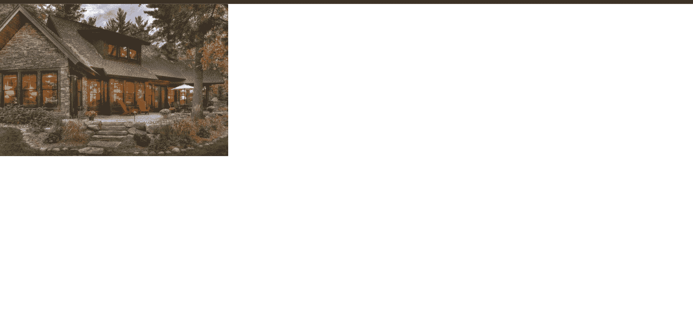
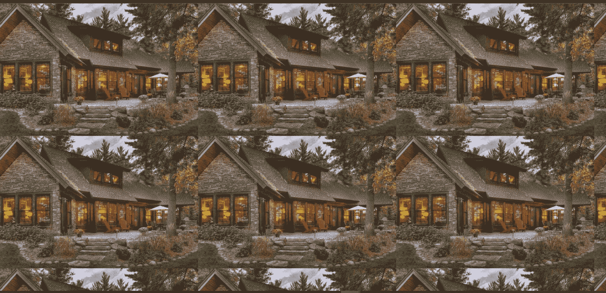
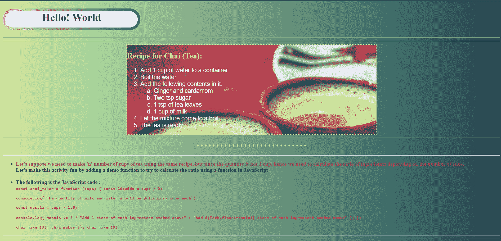
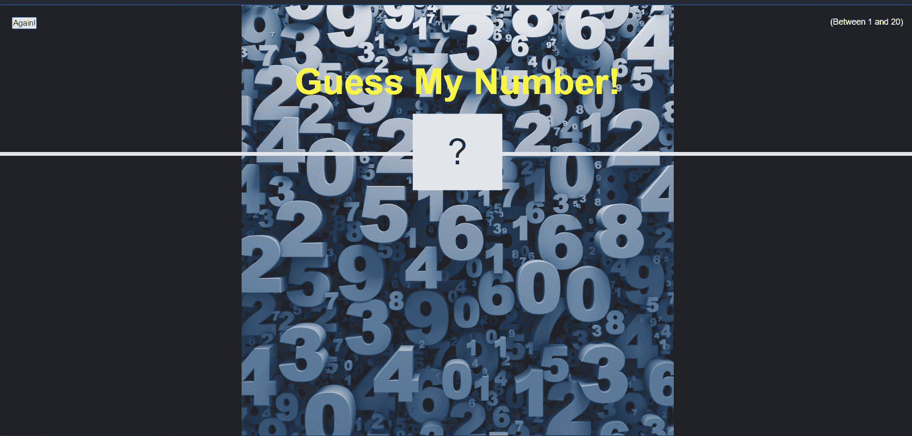

# HTML 背景图像

> 原文：<https://www.tutorialandexample.com/html-background-image/>

## 在 HTML 中插入图像

HTML 或一般技术方面的图像(技术上是数字图像)是视觉信息的二进制表示。我们所说的视觉信息是指图画/图片、gifs 单独的视频帧、标志或图形等形式的信息。

“在 HTML 中插入图片”可以借助 **< img >** 标签轻松实现。这个标签是一个空标签，因为它只包含属性，因此这里不需要结束标签。

> **注意:**使用< img >标签可以将图像插入任何地方或任何部分。随着我们的继续，我们将会看到各种各样的例子。唯一需要记住的一点是，< img >标签必须在< body > " " < /body >标签内声明。

**举例:**

```
<!DOCTYPE html>
<html lang="en">
  <head>
    <meta charset="UTF-8" />
    <meta http-equiv="X-UA-Compatible" content="IE=edge" />
    <meta name="viewport" content="width=device-width, initial-scale=1.0" />
    <title>HTML image</title>
</head>
  <body>
    
  </body>
</html> 
```

[Try it Now](https://onlinecompiler.javatpoint.com/)

**输出:**



**语法:**

```

```


| **T1】** | 代表图像标签 |
| **src** | 代表源属性，包含图像的地址/位置。 |
| **alt** | 包含当图像加载失败、找不到地址或发生任何其他错误时，代替图像显示的文本。 |
| **高度** | 用于调整图像的高度。 |
| **宽度** | 用于调整图像的宽度。 |


> **注意:**我们可以在图像标签中有更多的属性，如样式、边框、对齐等。以上是图像标签最常用的属性，用来定义和声明要显示的图像的基本结构。建议在 HTML 脚本/代码中始终使用上述 4 个属性。

***像素:**根据您显示输出的屏幕分辨率，它可以有不同的大小。

## HTML 背景图片

HTML 中的背景图像可以定义为元素后面或背景中的图像。它用于增强我们网页的整体外观，并使我们的网页/网站的用户界面吸引人和引人注目。

**语法:**

```
<style>
    body {
      background-image: url('//image url');
//image-properties
      background-attachment: fixed;
      background-size: auto;
    }
    </style> 
```

**举例:**

```
<style>
    body {
      background-image: url('//image url');
//image-properties
      background-attachment: fixed;
      background-size: auto;
    }
    </style> 
```

**输出:**



> **注意:**上述输出反映了插入的背景图像被一个接一个地打印为整页。即重复的图像。使用背景图像属性时，默认情况下会发生这种情况。这可以简单地通过使用' **no repeat'** 关键字来避免。

**无重复:**

```
<!DOCTYPE html>
<html lang="en">
  <head>
    <meta charset="UTF-8" />
    <meta http-equiv="X-UA-Compatible" content="IE=edge" />
    <meta name="viewport" content="width=device-width, initial-scale=1.0" />
    <title>HTML image</title>
    <link rel="stylesheet" href="style.css" />
  </head>
  <style>
    body {
      background-image: url('https://i.pinimg.com/originals/f7/67/2d/f7672d04fc037f5b22cae37ef569919b.jpg');
      background-attachment: fixed;
      background-size: auto;
      background-repeat: no-repeat;
    }
    </style>
    </body>
</html> 
```

**输出:**


HTML 中背景图片的另一个用途是定义网站的主题。有时，在你的网页背景中分配一个合适的图片决定了你的网站的整体用户体验，这对其他用户来说非常有吸引力。

我们可以通过以下方法添加背景图像:

*   通过在 HTML 标签中使用背景属性。
*   通过使用内嵌或内部样式表。

## 通过在 HTML 标签中使用背景属性

背景图像几乎适用于 HTML 中的任何元素。为了在 HTML 中为元素添加背景图像，我们只需将' **background-image'** 属性放在元素范围内，并提供图像的 URL/位置。在下面的例子中，我们试图通过包含背景图像属性来指定网页的主题。

**举例:**

**文件 1 = index.html**

```
<!DOCTYPE html>
<html>
  <head>
    <title>Revision 1</title>
    <link rel="stylesheet" href="style.css" />
  </head>
  <body class="body">
    <h1 class="contentinfo">Hello! World</h1>
    <hr />

    <hr />
    <div class="recipe">
      <h2 style="text-align: left; color: rgb(253, 241, 72)">
        Recipe for Chai (Tea):
      </h2>
      <ol type="1">
        <div
          style="
            color: azure;
            font-size: 18px;
            font-family: Arial, Helvetica, sans-serif;
          "
        >
          <li>Add 1 cup of water to a container</li>
          <li>Boil the water</li>
          <li>
            Add the following contents in it:
            <ol type="a">
              <li>Ginger and cardamom</li>
              <li>Two tsp sugar</li>
              <li>1 tsp of tea leaves</li>
              <li>1 cup of milk</li>
            </ol>
          </li>
          <li>Let the mixture come to a boil</li>
          <li>The tea is ready</li>
        </div>
      </ol>
    </div>
    <hr />
    <p style="text-align: center; color: rgb(247, 250, 69)">
      * * * * * * * * * * * * * * * * * * * * * * * * * * * *
    </p>
    <hr />
    <ul>
      <li>
        <b style="color: purple">
          Let's suppose we need to make 'n' number of cups of tea using the same
          recipe, but since the quantity is not 1 cup, hence we need to
          calculate the ratio of ingredients depending on the number of cups.
        </b>
        <br />
        <b
          >Let's make this activity fun by adding a demo function to try to
          calculate the ratio using a function in JavaScript</b
        >
      </li>
      <br />
      <li><b>The following is the JavaScript code : </b></li>
      <code style="color: rgb(219, 42, 101)">
        <b>
          const chai_maker = function (cups) { const liquids = cups / 2;
          <p>
            console.log(`The quantity of milk and water should be ${liquids}
            cups each`);
          </p>
          <p>const masala = cups / 1.6;</p>
          console.log( masala <= 3 ? "Add 1 piece of each ingredient stated
          above" : `Add ${Math.floor(masala)} piece of each ingredient stated
          above` ); };
          <p>chai_maker(3); chai_maker(5); chai_maker(9);</p>
        </b>
      </code>
    </ul>
    <hr />
    <hr />
  </body>
</html> 
```

**文件 2: style.css**

```
.recipe {
  display: block;
  margin-left: auto;
  margin-right: auto;
  width: 50%;
  background-image: url("https://www.thestatesman.com/wp-content/uploads/2019/05/tea-culture.jpg");
  background-size: auto;
  background-repeat: no-repeat;
  border-style: dotted;
  border-color: rgb(249, 252, 76);
}
.contentinfo {
  width: 400px;
  height: 50px;
  border: double 8px transparent;
  border-radius: 70px;
  background-image: linear-gradient(white, white),
    radial-gradient(circle at top left, #f69ec4, #32557f);
  background-origin: border-box;
  background-clip: content-box, border-box;
  text-align: center;
}
.body {
  background-image: linear-gradient(to left, #194757 0%, #c7f5a8 100%);
} 
```

**输出:**



## 通过使用内嵌或内部样式表。

在这个方法中，我们只是在 HTML 脚本中直接继承背景图像属性(内联),而不是在。css 文件。

**举例:**

```
<!DOCTYPE html>
<html lang="en">
  <head>
    <meta charset="UTF-8" />
    <meta name="viewport" content="width=device-width, initial-scale=1.0" />
    <meta http-equiv="X-UA-Compatible" content="ie=edge" />
    <link rel="stylesheet" href="style.css" />
    <title>Guess My Number!</title>
  </head>
  <body>
    <style>
      body {
        background-image: url("https://miro.medium.com/max/1000/1*as5gD8Y9pFOWX7JcsppLTA.jpeg");
        background-position: center;
        background-repeat: no-repeat;
        background-attachment: fixed;
        background-size: contain;
      }
    </style>
    
      <h1>Guess My Number!</h1>
      <p class="between">(Between 1 and 20)</p>
      <button class="btn again">Again!</button>
      <div class="number">?</div>
    
  </body>
</html> 
```

**文件 2: style.css**

```
* {
  margin: 0;
  padding: 0;
  box-sizing: inherit;
}

html {
  font-size: 62.5%;
  box-sizing: border-box;
}

body {
  font-family: "Press Start 2P", sans-serif;
  color: #eee;
  background-color: #222;
  /* background-color: #60b347; */
}

/* LAYOUT */
header {
  position: relative;
  height: 35vh;
  border-bottom: 7px solid #eee;
}
/* ELEMENTS STYLE */
h1 {
  font-size: 6rem;
  text-align: center;
  position: absolute;
  width: 100%;
  top: 52%;
  left: 50%;
  transform: translate(-50%, -50%);
  color: rgb(252, 249, 70);
}
.number {
  background: #eee;
  color: #333;
  font-size: 6rem;
  width: 15rem;
  padding: 3rem 0rem;
  text-align: center;
  position: absolute;
  bottom: 0;
  left: 50%;
  transform: translate(-50%, 50%);
}

.between {
  font-size: 1.4rem;
  position: absolute;
  top: 2rem;
  right: 2rem;
}

.again {
  position: absolute;
  top: 2rem;
  left: 2rem;
} 
```

**输出:**

