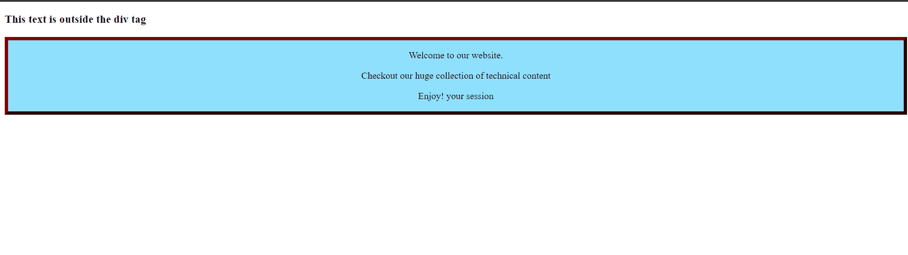
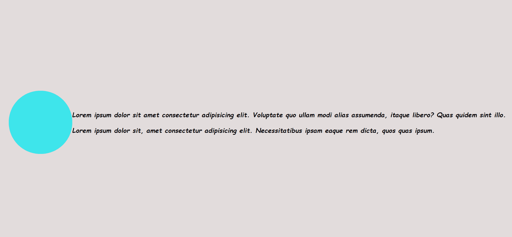
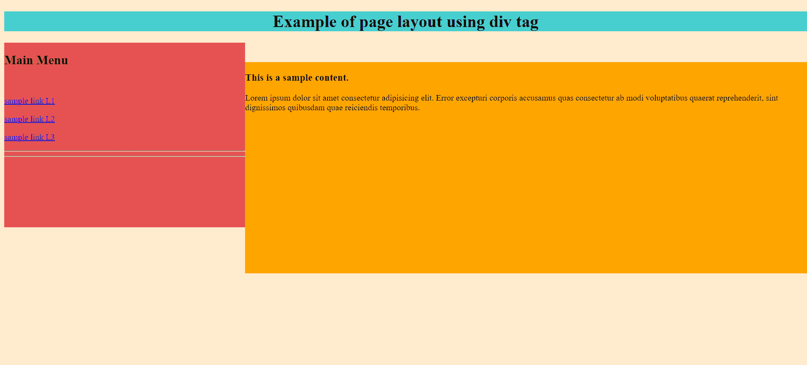

# HTML 中的 Div 标签

> 原文：<https://www.tutorialandexample.com/div-tag-in-html/>

***在 HTML 中，‘div’是在 HTML 文档*** 中指定分部或节的标签。但是在详细讨论之前，让我们先了解一下 HTML 中的标签。HTML 中的标签可以想象成一个关键字，它基本上定义了我们的浏览器(网络浏览器)将如何解释、格式化和显示内容。标签是 HTML 内容和非 HTML 内容的分界线，这有助于浏览器有效区分两者。

HTML 标签可以分为三个主要部分:

*   开始标记，
*   内容和
*   结束标记。

```
Eg:  <tag> content </tag>
```

> **注意:**HTML 中有一些标签不需要结束标签，即它们被称为未结束标签。

## HTML 中的语义标签和非语义标签

HTML 中的语义标签是一种标签，它的名字清楚地描述了它的目的和内容。

例如: **< h1 > — >用于显示重要文本(**一般为文档标题)

**<h6>——>用于显示不太重要的文本**

**<导航> — >用于显示**网页的导航信息

```
<nav>
  <a href="/html/">HTML</a> |
  <a href="/css/">CSS</a> |
  <a href="/js/">JavaScript</a> |

</nav> 
```

## HTML 中的非语义标签

非语义标签可以被称为 HTML 中的标签，它不告诉关于它们的内容的任何事情。

例如:**<div>–>**创建一个将其他元素分组的通用容器。

**–>**创建一个内嵌文本片段。

## HTML 中的标签

HTML 中的 div 标签是块级元素，用于创建一般不可见的通用容器，并用于对其他元素进行分组。

当一个 div 标签被声明时，它里面的所有标签都被指定为一个单独的块。这意味着如果我们在 div 标签中声明一个段落(

' ' '

)标签。该段落将被分配一个完整的块。

**例如**:

```
<!DOCTYPE html>
<html>
  <head>
    <title>HTML div Tag</title>
  </head>

  <body>
    <div id="contentinfo">
      <p>Welcome to our website.</p>
      <p>Checkout our huge collection of technical content</p>
<p> Enjoy! your session</p>

    </div>
  </body>
</html> 
```

**输出:**

```
Welcome to our website.
Checkout our huge collection of technical content
Enjoy! your session 
```

**代码 HTML 中 div 标签的例子**

```
<!DOCTYPE html>
<html>
  <head>
    <title>HTML div Tag</title>
  </head>
  <style>
    .contentinfo {
      border: 6px outset maroon;
      background-color: rgb(142, 224, 252);
      text-align: center;
    }
    </style>
    </head>
  <body>
      <h3>This text is outside the div tag</h3>
    <div class="contentinfo">
      <p>Welcome to our website.</p>
      <p>Checkout our huge collection of technical content</p>
      <p>Enjoy! your session</p>
    </div>
  </body>
</html> 
```

**输出:**



## vs| div 和 span 标签的区别


| **<师>** **师** | **<跨度>** |
| --- | --- |
| 它是一个块级元素 | 它是一个内联元素 |
| 它创建一个将其他元素分组的通用容器。 | 它创建一个内联文本片段。 |
| 整个块被分配给这个标签内的每个单独的实体。 | 仅分配所需的空间。 |
| 它在结束标记后添加一个换行符。 | 它不会在结束标记后添加换行符。 |
| 例:
< p >这是第一段< /p >
< p >这是第二段< /p >
< p >这是第三段< /p > | 例:
< em >这是 em 标签< /em > < em > em 用于< /em > < em >强调文字< /em > |
| 输出:
这是第一段
这是第二段
这是第三段 | Output:
这是 em 标签 em 用于强调文本 |


## 样式化内容

继承 div 标签特性的主要原因是为了享受根据用户选择/主题设计网页上每个实体样式的好处，div 标签为每个实体分配一个单独的块。这不仅有助于缩放，也有助于设计漂亮的网页。

**代码 2:对内容进行样式化**

**Html 文件:index.html**

```
<!DOCTYPE html>
<html>
  <head>
    <title>HTML div Tag</title>
  </head>
  <link rel=stylesheet href="style.css">
    </head>
  <body>

        <div class="div_styling">
    </div>
    <div class="text_styling">
        <p>
          Lorem ipsum dolor sit amet consectetur adipisicing elit. Voluptate quo
          ullam modi alias assumenda, itaque libero? Quas quidem sint illo.
        </p>
        <p>
          Lorem ipsum dolor sit, amet consectetur adipisicing elit. Necessitatibus
          ipsam eaque rem dicta, quos quas ipsum.
        </p>
  </div>
  </body>
</html> 
```

**CSS 文件:style.css**

```
body {
  margin: 0 auto;
  height: 100vh;
  display: flex;
  align-items: center;
  justify-content: center;
  background-color: #e2dcdc;
}

.div_styling {
  background-color: #3ee5eb;
  width: 185px;
  height: 185px;
  border-radius: 50%;
}

.text_styling {
  font-family: cursive, sans-serif;
  font-size: 1.2rem;
  font-weight: bolder;
  font-style: italic;
} 
```

**输出:**



代码 3:使用 div 标签的基本 HTML 网页布局

```
<!DOCTYPE html>
<html>
  <head>
    <title>Basic HTML Layout using Div</title>
  </head>
  <body
  style="background-color: blanchedalmond;">
    <div style="width: 100%">
      <div style="background-color: rgb(71, 207, 207); text-align: center">
        <h1>Example of page layout using div tag</h1>
      </div>
      <div
        style="
          background-color: rgb(230, 82, 82);
          height: 350px;
          width: 30%;
          float: left;
        "
      >
        <h2>Main Menu</h2><br />
        <p><a href="Link L1 ">sample link L1</href><br /> </p>
        <p><a href="Link L2 ">sample link L2</href><br /> </p>
        <p><a href="Link L3 ">sample link L3</href> <br /><hr><hr>
      </div>
      <br>
      <br>
      <div
        style="background-color: orange;
        color: black;
        height: 400px;
        width: 70%;
        float: left"
        >
       <h3> This is a sample content. </h3>
        <p>
          Lorem ipsum dolor sit amet consectetur adipisicing elit. Error
          excepturi corporis accusamus quas consectetur ab modi voluptatibus
          quaerat reprehenderit, sint dignissimos quibusdam quae reiciendis
          temporibus.
        </p>
      </div>
  </body>
</html> 
```

**输出:**



**代码 HTML 中的 span 标签示例**

**档案一:index.html**

```
<!DOCTYPE html>
<html lang="en">
  <head>
    <meta charset="UTF-8" />
    <meta http-equiv="X-UA-Compatible" content="IE=edge" />
    <meta name="viewport" content="width=device-width, initial-scale=1.0" />
    <title>Example of span tag</title>
    <link rel="stylesheet" href="style.css" />
  </head>
  <body>
    <p>
      We can use span tags to target text with CSS styling, like with
      this blue text and
      this orange text.
    </p>

    <p>
      Lorem ipsum dolor sit amet, consectetur adipisicing elit. Aspernatur,
      necessitatibus.
      Lorem ipsum dolor sit amet consectetur, adipisicing elit.
      
      or font size.
    </p>
  </body>
</html> 
```

**文件 2: style.css**

```
#blue-text {
  color: blue;
}
#orange-text {
  color: orange;
}

#new-font {
  font-family: Helvetica;
}

#new-font-size {
  font-size: 28px;
} 
```

**输出:**

我们可以使用 span 标签来定位 CSS 样式的文本，比如这个蓝色文本和这个橙色文本。

Lorem ipsum dolor sit amet，consectetur adipisicing elit。自然的，必要的。这是一个不言而喻的事实。或者**字号。**

## 结论:

HTML 中的 div 标签是块级元素，用于创建一般不可见的通用容器，并用于对其他元素进行分组。div 标签的一些要点是:


| 它是一个块级元素

创建一个通用容器，将其他元素分组。

整个块被分配给这个标记里面的每个个体实体。

它在它的结束标签后添加一个换行符。 |

