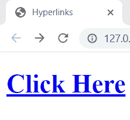
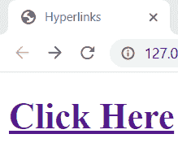
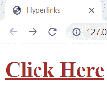
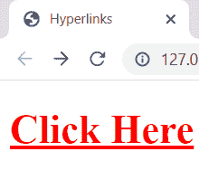
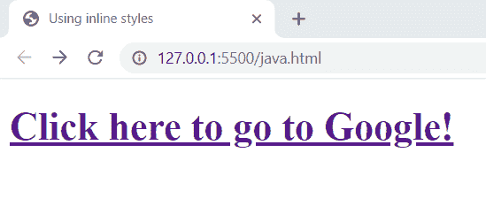
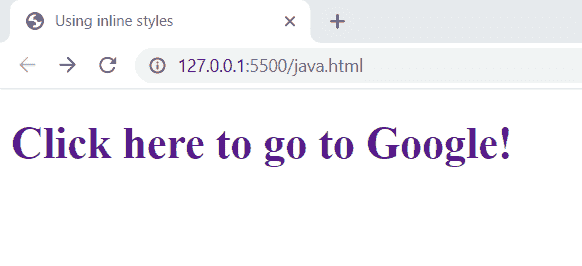
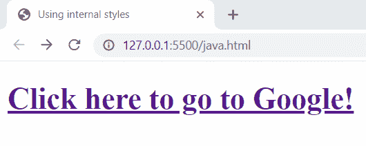
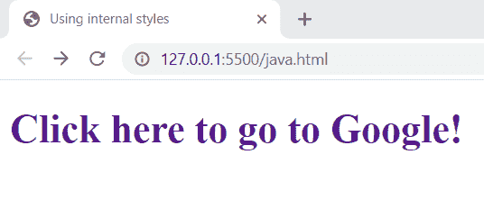
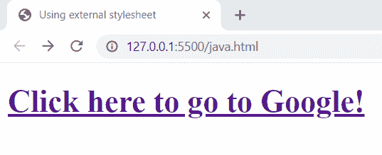
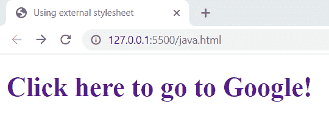

# 如何在 HTML 中创建没有下划线的链接

> 原文：<https://www.tutorialandexample.com/how-to-create-a-link-with-no-underline-in-html>

在 HTML 中，一个**锚** **标签(< a > )** 是一个样式化的容器标签，这意味着当一个超链接被创建时，默认情况下，浏览器通过应用一些样式来显示链接。这些样式可以包括文本颜色、文本装饰、字体大小等。所以浏览器的用户代理样式表中提到的这些样式，是给超链接加下划线，然后显示在网页上。但是如果开发者不想给超链接加下划线，这是很容易做到的。

让我们明白如何去做。

首先我们要知道，超链接在浏览器上出现时有四种不同的状态，根据这些状态，上面的默认样式也各不相同。

1.  **a:链接**–这是一个正常的链接，它表示这个链接还没有被访问过。在大多数浏览器中，这些链接是带下划线的蓝色。
2.  **a:visited**–这表示该链接已经被访问过，大多数浏览器都以带下划线的紫色显示。
3.  a:hover–这指定了当用户将鼠标悬停在链接上时的状态。开发人员可以在此状态下添加他们想要的显示样式。
4.  **a:active**–这表示链接当前是活动的，大多数浏览器倾向于用带下划线的红色显示它。

**例子**

```
<!DOCTYPE html>
<html>
<head>
<title>Hyperlinks</title>
</head>
<style>
a:link
{
color: blue;
}
a:visited
{
color: purple;
}
a:hover 
{
color: brown;
}
a:hover
{
color: red;
}
</style>
<body>
<h1><a href="https://xyz.com/">Click Here</a></h1>
</body>
</html>
```

**输出**

**未访问的链接看起来像:**



**被访问的链接看起来像:**



**鼠标悬停时的链接如下所示:**



**活动链接如下图所示**



正如你看到的这些链接有下划线，让我们看看如何从链接中删除下划线。

一个没有下划线的超链接可以被创建，只需通过使用选择器，将一个名为“文本装饰”的样式设置为“无”来锁定特定的锚标签。

这可以通过指定内联样式或提及内部样式，或者使用外部 CSS 样式表并将其链接到 HTML 文档来实现。

让我们一个一个地看看上面提到的所有方式。

### 1)使用内嵌样式

浏览器将名为 text-decoration 的样式设置为下划线，为超链接加下划线。因此，通过使用内联样式并指定从“下划线”到“无”的“文本修饰”,我们将能够实现我们的目标。

**例子**

**在将文本装饰指定为无之前。**

```
<!DOCTYPE html>
<html lang="en">
<head>
<meta charset="UTF-8">
<meta http-equiv="X-UA-Compatible" content="IE=edge">
<meta name="viewport" content="width=device-width, initial-scale=1.0">
<title>Using inline styles</title>
</head>
<body>
<h1><a href="https://www.google.com/">Click here to go to Google!</a></h1>
</body>
</html> 
```

**输出**



**例子**

**将文本装饰指定为无后。**

```
<!DOCTYPE html>
<html lang="en">
<head>
<meta charset="UTF-8">
<meta http-equiv="X-UA-Compatible" content="IE=edge">
<meta name="viewport" content="width=device-width, initial-scale=1.0">
<title>Using inline styles</title>
</head>
<body>
<h1><a href="https://www.google.com/" style="text-decoration:none;">Click here to go to Google!</a></h1>
</body>
</html>
```

**输出**



### 2)使用内部风格

除了使用内联样式，我们还可以借助内部样式来做同样的事情。在“<风格>”标签下的**’<头>标签**内指定了一个内部风格，通过同样的方式定位那个特定的链接并将其文本装饰设置为 none，可以删除下划线。

**例子**

**在将文本装饰指定为无之前。**

```
<!DOCTYPE html>
<html lang="en">
<head>
<meta charset="UTF-8">
<meta http-equiv="X-UA-Compatible" content="IE=edge">
<meta name="viewport" content="width=device-width, initial-scale=1.0">
<title>Using internal styles</title>
</head>
<body>
<h1><a href="https://www.google.com/">Click here to go to Google!</a></h1>
</body>
</html> 
```

**输出**



**例子**

**将文本装饰指定为无后。**

```
<!DOCTYPE html>
<html lang="en">
<head>
<meta charset="UTF-8">
<meta http-equiv="X-UA-Compatible" content="IE=edge">
<meta name="viewport" content="width=device-width, initial-scale=1.0">
<title>Using internal styles</title>
<style>
a
{
text-decoration: none;
}
</style>
</head>
<body>
  <h1><a href="https://www.google.com/" style="text-decoration:none;">Click here to go to Google!</a></h1>
</body>
</html> 
```

**输出**



### 3)使用外部样式表

链接外部样式表并将特定超链接的文本修饰定义为 none 是另一种方法。使用'<link>'标签将外部样式表链接到 HTML 文档，并注明链接文档的地址。

**例子**

**在将文本装饰指定为无之前。**

```
<!DOCTYPE html>
<html lang="en">
<head>
<meta charset="UTF-8">
<meta http-equiv="X-UA-Compatible" content="IE=edge">
<meta name="viewport" content="width=device-width, initial-scale=1.0">
<title>Using external stylesheet</title>
</head>
<body>
<h1><a href="https://www.google.com/">Click here to go to Google!</a></h1>
</body>
</html> 
```

**输出**



**例子**

**将文本装饰指定为无后。**

```
<!DOCTYPE html>
<html lang="en">
<head>
<meta charset="UTF-8">
<meta http-equiv="X-UA-Compatible" content="IE=edge">
<meta name="viewport" content="width=device-width, initial-scale=1.0">
<title>Using external stylesheet</title>
<link rel="stylesheet" href="/pstyles/index.css">
</head>
<body>
<h1><a href="https://www.google.com/">Click here to go to Google!</a></h1>
</body>
</html> 
```

**外部样式表代码**

```
a
{
    text-decoration: none;
} 
```

**输出**

