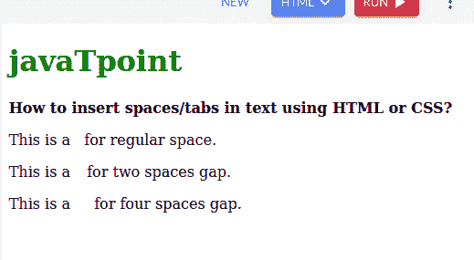
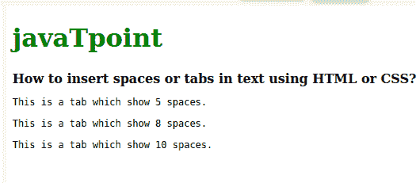
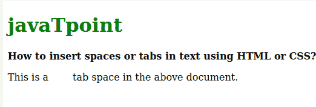
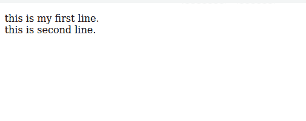

# 如何使用 HTML/CSS 在文本中插入空格/制表符

> 原文：<https://www.tutorialandexample.com/how-to-insert-spaces-tabs-in-text-using-html-css>

## 什么是 HTML？

HTML 或超文本标记语言用于设计网页。它于 1993 年发行。HTML 文件的文件扩展名是“”。html”。在 CSS 和 JavaScript 的帮助下创建一个 HTML 文件。HTML 描述了网页的结构，基本上就是页面是如何创建的，或者说是网页的骨架体。代码以元素的形式编写。这些元素也称为 HTML 标签。标签使用 HTML 的标记。HTML 的黄金法则是所有主要标签必须以<tags>开始，以</tags>结束。当我们有多个标签时，每个标签必须在序列中关闭。

## 什么是 CSS？

CSS 或级联样式表是一种用于设计 HTML 创建的网页的语言。它是网页设计的核心语言。

作为网页设计师，我们必须学会如何插入制表符和空格，以获得更好的网页外观。它还提高了 HTML 代码的可读性。要添加多个空格，我们不能多次使用空格键。我们在 HTML 代码中使用不同的空格将代码分成不同的行。代码中的空格也以更好的方式设计了代码，并且还提高了代码的可读性。如果我们的代码中有多个空格，浏览器会删除多余的空格，只允许代码中有一个空格。但这并不是说我们不能在代码中添加多个空格和制表符。

有一些方法可以在 HTML 和 CSS 中添加一些空格。

这些方法如下:

## 方法-1

通过使用独特和指定的字符，如果我们想在代码或网页中添加多个空格，我们必须使用这些标签。这些标签也表示不间断空格。

在 HTML 和 CSS 代码中使用空格有三种特殊的指定字符。

*   **&**——对于不换行空格，这个独特的字符被用在整个代码中。它可以产生两倍的公共空间。由这个唯一字符生成的空格不能被代码换行打破。
*   **&ensp**-这个独特的字符完全用来表示当前字体的半磅大小，也称为 en 空格。
*   **&em sp**-这个独特的字符完全用来表示当前字体的总大小，也称为 em 空格。它可以产生四倍的公共空间。

**语法**

```
for regular space - &nbsp.
For two space gaps - &ensp.
For four space gaps- &emsp.
```

**HTML 代码**

```
<!DOCTYPE html>
<html>
<head>
<title>
How to insert spaces/tabs in text using HTML/CSS?
</title>
</head>
<body>
<h1 style="color: green">javaTpoint</h1>
<b>How to insert spaces/tabs in text using HTML or CSS?</b>
<p>This is a &nbsp; for regular space.</p>
<p>This is a &ensp; for two spaces gap.</p>
<p>This is a &emsp; for four spaces gap.</p>
</body>
</html>
```

**输出**



## 方法 2

使用制表符大小属性:该属性用于在 HTML 代码中设置制表符大小间距。在代码中也可以更改制表符的值。这个方法只在

```
标签中有效。
```

**语法**

```
.tab {
        tab-size: 2;
    }
```

**HTML 代码**

```
<!DOCTYPE html>
<html>
<head>
<title>
How to insert spaces/tabs in text using HTML or CSS?
</title>
<style>
.tab5 {
tab-size: 5;
}

.tab6 {
tab-size: 8;
}

.tab7 {
tab-size: 10;
}
</style>
</head>
<body>
<h1 style="color: green">javaTpoint</h1>
<b>How to insert spaces or tabs in text using HTML or CSS?</b>
<pre class="tab5">This is a tab which show 5 spaces.</pre>
<pre class="tab6">This is a tab which show 8 spaces.</pre>
<pre class="tab7">This is a tab which show 10 spaces.</pre>
</body>
</html>
```

**输出**



## 方法-3

通过 CSS 为间距创建一个新的类:通过使用 margin-left 属性，一个新的类可以提供一定数量的空间。我们可以通过提供属性中的像素数来分配空格数。它还允许下一行有空格。

**语法**

```
.tab {
    display: inline-block;
    margin-left: 40px;
}
```

**HTML 代码**

```
<!DOCTYPE html>
<html>
<head>
<title>
How to insert spaces or tabs in text using HTML or CSS?
</title>
<style>
.tab {
display: inline-block;
margin-left: 40px;
}
</style>
</head>
<body>
<h1 style="color: green">javaTpoint</h1>
<b>How to insert spaces or tabs in text using HTML or CSS?</b>
<p>This is atab space in the above document.</p>
</body>
</html>
```

**输出**



## 方法-4

在 HTML 中添加一个换行符:我们可以在 HTML 代码中使用标签
来添加一个换行符。在这个标签的帮助下，我们可以创建一个新的行。

**HTML 代码**

```
<!DOCTYPE html>
<html>
<body>
  <p>this is my first line.
  <br>this is second line.
  </p>
</body>
</html> 
```

**输出**

