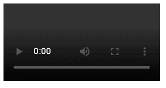
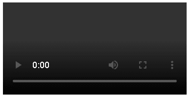
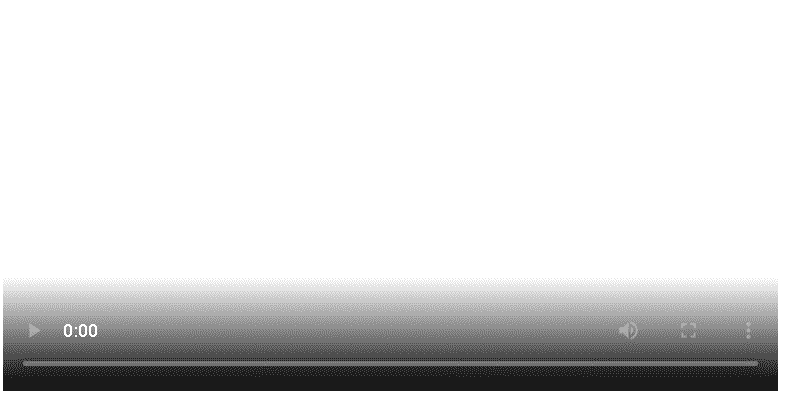

# HTML <video>标签</video>

> 原文：<https://www.tutorialandexample.com/html-video-tag>

HTML 中的 Video 标签用于在网页的媒体播放器上播放视频。我们也可以通过视频标签插入音频，但是音频标签更适合在网页上插入音频。

## 视频标签的语法:

```
<body>
<video controls >
<source src=" #"
Type =" # ">
……… ……….
</video>
</body>
```

**HTML:**

```
<!DOCTYPE html >
<html>
<head>
<title>HTML video tag </title >
</head>
<body>
<video controls width="250" >
<source src=" https://youtu.be/Vw7kviWV07k "
type="">
<source src="https://youtu.be/WroRpyGTOiA "
type="">
Sorry for inconvinencebut your web browser doesn't support this kind of embedded videos.
</video >
</body >
</html> 
```

**输出:**



通过使用< video >元素，可以将视频剪辑或其他电影流包含在文档中。该标签可以包含来自不同视频源的一个或多个“源”标签。浏览器将使用第一个来源来运行视频。

那些不支持视频元素的浏览器将显示文本而不是视频。MP4、WebM 和 OGG 是超文本标记语言完全支持的三种视频格式。

## 属性

这个元素也与全局属性兼容，就像所有其他 HTML 标签一样。

### 自动播放:

当你在视频标签中指定了这个属性，那么视频

自动开始。

自动播放的过程将一直进行，直到属性出现在

任何形式的视频标签。

如果您想从视频中删除此选项，则必须删除

完全从 html 文档中自动播放属性。

Chrome 7.0 是一款只支持这种属性的浏览器

静音属性。s 它准备好了

### 自动图像图像:

它是一个布尔属性，给出两种可能的结果:

1.True:如果该值为 true，则每当您在两个网站或其他程序之间切换时，该元素应自动启用画中画模式。

2.False:如果为 false，元素不应立即转换到图片模式。

### 控件:

使用此属性，用户或任何访问网站的人都可以访问以下各种控件:

*   视频播放，
*   增加或减少音量，
*   寻求，和
*   暂停/继续播放。

### 控件列表:

当您想要访问选定数量的控件时，可以使用该属性。通过使用该特性，您可以帮助浏览器决定应该向用户显示哪些控件。

也可以向用户显示不下载、不远程回放、不全屏和其他设置。

可以使用 disablepictureinpicture 属性关闭控件中的画中画模式。

### 交叉原点:

如果你想使用 CORS(跨原点资源共享)来获取相关的视频，那么你可以使用 crossorigin 属性。canvas 元素可以重用启用了 CORS 的资源，而无需引入任何更改。此属性允许下列值:

### 匿名:

当跨来源请求在没有凭证的情况下发送时，它是有目的的。换句话说，我们可以说它传递了原点。

### 产地:

Origin 是一个 HTTP 头，它不需要 X.509 证书、任何类型的 cookie 或 HTTP 基本身份验证。如果服务器没有设置 Access-Control-Allow-Origin，则它不会向源站点提供凭据。

### 访问控制允许来源:

这是 HTTP 的报头。

### 禁用图片图片

此属性用于防止 web 浏览器在画中画的上下文中显示视频。

### 禁用远程播放

该布尔值用于防止通过有线连接(如 HDMI、DVI 等)连接的设备上出现远程播放选项。它还可以防止无线技术，如 Miracast，Chromecast，DLNA，AirPlay 等。

可以将 x-webkit-airplay="deny "与 Safari 配合使用，这是一个例外。因为，这个属性只返回绝对值来定义网页上视频显示区域的高度。

### 环

如果在 video 标签中定义了该属性，那么浏览器将自动开始循环，并在到达电影的结束点后返回起点。

### 柔和的

电影的基本音频参数可以在这个布尔属性的帮助下设置。如果已指定静音属性，则音频最初会静音。如果我们讨论它的默认值，它是 false，表示音频只会在视频播放的时候播放。

### playsinline

它是一个布尔属性，指定视频应该“内联”播放，还是在元素的播放区域内播放。需要注意的是，没有这个功能并不能保证视频总是全屏播放。

### 海报

使用海报链接下载视频时，将会显示一个图像。如果没有这个特征，在第一帧可用之前什么也不显示，此时第一帧作为海报帧呈现。

### 事先装好

每个浏览器都有不同的默认设置。标准建议将其设置为元数据。自动播放属性的优先级高于预加载。

我们一次只能将以下三个值中的一个应用于该属性:

**1。none:** 该值表示不建议预加载视频。

**2。元数据:**这个值表示只获取视频元数据，比如长度。

**3。Auto:** 该值表示即使用户不希望使用视频，也可以下载完整的文件。空字符串是自动值的同义词。

### Src:

vedio 标签的这个属性用于指定或确定我们想要在 html 文档或文件中使用的 vedio 文件的 URL。该属性包含的值是“URL”。

### 宽度:

这个元素指定了视频在网站上显示的宽度。视频的宽度以像素为单位。宽度不能用像素度量，因为它只返回绝对值。

```
<!DOCTYPE html>
<html>
<head>
<title>HTML video tag </title>
</head>
<body>
<video controls>
<source src="myVideo.webm" type="video/webm">
<source src="myVideo.mp4" type="video/mp4">
<p>Sorry for inconvinencebut your web browser doesn't support this kind of embedded videos. Here is
a <a href="myVideo.mp4">link to the video</a> instead.</p>
</video>
</body>
</html>
```

**输出:**



如果 controls 属性为空，浏览器的内置控件将不会包含在视频中；但是，JavaScript 可用于创建自定义控件。

您可以使用这些事件可控地跟踪内容的下载和播放进度，以及播放的设置和位置。

您可以分别使用 object-position 和 object-fit 属性来控制视频在元素框架中的位置及其大小调整，以适应框架。

要在视频旁边显示标题和字幕，可以将元素和 WebVTT 格式与一些 JavaScript 结合起来。

通过使用<video>元素，可以播放音频文件。例如，如果您需要播放带有 WebVTT 脚本的音频，这可能会很有帮助，因为 WebVTT 不支持

<audio>元素的标题。</audio></video> 

你可以用“视频”替换一个不存在的元素，比如<notavideo>，在支持该元素的浏览器中测试回退内容。</notavideo>

**举例:**

此示例在网页上播放电影，并向用户提供标准视频控件的访问权限:

```
<!DOCTYPE html>
<html>
<head>
<title>HTML video tag </title>
</head>
<body>
<video controls  src="https://youtu.be/lmdLCz4CAeA"
poster="https://www.youtube.com/watch?v=wpG9j5v6LkY&list=RDGMEMCMFH2exzjBeE_zAHHJOdxg&index=20&ab_channel=MasoomSharma-Topic"
width="620">
Sorry for inconvinencebut your web browser doesn't support this kind of embedded videos.
but don't worry, you can <a href="https://www.youtube.com/watch?v=wpG9j5v6LkY&list=RDGMEMCMFH2exzjBeE_zAHHJOdxg&index=20&ab_channel=MasoomSharma-Topic">download it</a>
and watch it with your favorite video player
</video>
</body>
</html>
```

**输出:**



### 浏览器支持:

支持 html <video>标签的浏览器列表如下:</video>

是的，需要第三版

微软 Edge: 是的，需要第 12 版

是的，需要 3.5 版本

Safari: 是的，需要 3.1 版本

是的，需要 10.5 版本