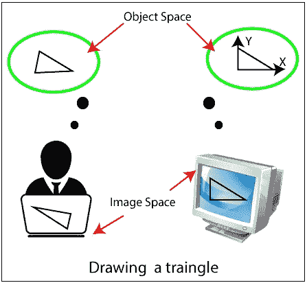
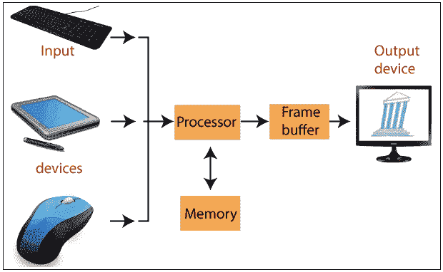
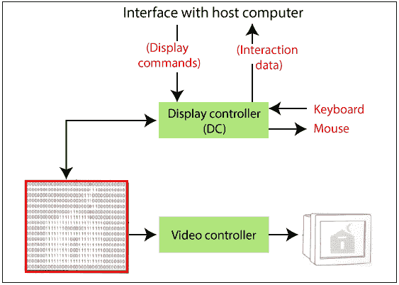
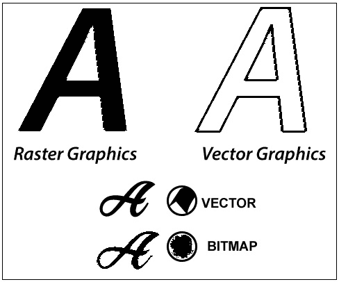

# 计算机图形学教程

> 原文：<https://www.tutorialandexample.com/computer-graphics-tutorial/>

**计算机图形学导论**

计算机图形学通常被认为是计算机科学的一个分支，研究计算机图像融合的理论和技术。简单到一个三角形的轮廓，计算机生成的图像可以代表一个场景。计算机已经成为快速而经济地制作图像的有力工具。

当使用计算机创建图像时，遵循与手动创建图像相同的过程。该过程的主要计算步骤推动了几个重要的计算机图形领域。

同样在计算机上，计算机图形这个术语几乎涵盖了一切。在计算机图形程序的教室里，我们认为计算机图形是在机器上绘制图像，通常被称为**渲染**。图像可以是照片、草图、动画或想象物品的图片。或者它们可能是图片，我们不能直接看到，像身体内部的部分。

我们投入了大量时间来开发计算机图像如何复制真实世界的场景。我们希望计算机上的物体不仅看起来更真实，而且它们的颜色和不同材料的外观也更真实。我们可以称之为“图像的真实合成”

计算机图形这个术语被用来定义“计算机上的几乎所有东西，包括文本或声音。”一般来说，计算机图形这个术语指的是下列事物:

*   图像数据的计算机表示和处理。
*   创建和处理图像的各种技术。
*   计算机图形学研究是计算机科学的一个分支，研究以数字方式合并和处理可视内容的方法。

计算机图形学的下一个领域是处理三角形的位置，叫做**变换**。这里我们可以用矩阵来得到一个三角形在图像空间中的映射。我们还可以设置转换矩阵来控制显示图像的位置和方向。我们也可以调整三角形的大小。

**计算机图形的定义-** 计算机图形可以是一系列图像，通常称为视频或单幅图像。计算机图形学是关于计算机上的设计和图片的技术。这就是为什么，计算机图形是在计算机显示器上显示的数据的可视化表示。

计算机图形学是用计算机来定义、存储、操作、查询和表示图形输出。计算机图形学中的图像由许多像素组成。

### 计算机图形的类型

有两种计算机图形是 **-**

*   交互式计算机图形学
*   非交互式计算机图形学

### 交互式计算机图形学

在交互式计算机图形中，用户对图像有一些控制，即用户可以对产生的图像进行任何改变。

 **交互式计算机图形学涉及计算机和用户的双向交流。

 ****例如:**

*   乒乓球比赛。
*   在触摸屏上画画。
*   在屏幕上显示天气预报或其他移动图表。
*   动画电影中的图片或图形。
*   电子游戏中的图形动画。

**交互式计算机图形工作**

现代的图形显示很容易建立。它由三部分组成:

*   显示控制器或视频控制器
*   数字存储器或帧缓冲器
*   电视监视器

**1。显示控制器或视频控制器-** 它是一个内存缓冲区和电视监视器接口。它的任务是将帧缓冲区的内容传递给监视器。显示控制器读取存储器帧缓冲器数据的每个连续字节，并将 0 和 1 转换成适当的视频信号。

在今天的术语中，显示控制器被认为是显卡，我们的选择之一可以是分辨率为 640x480 的 VGA(视频图形阵列)卡。显示控制器也能够显示彩色图像。

**2。数字内存或帧缓冲区**——这是一个将图像和图片存储为数组的地方(0 的矩阵& 1，0 代表黑暗，1 代表图像或图片)。它也被称为帧缓冲器。

用今天的术语来说，帧缓冲区被称为 V-RAM(视频 RAM)，它有助于以位的形式存储图像。它有助于提高图形的速度。

**3。电视监视器-** 监视器帮助我们观看显示器，它们利用了 CRT(阴极射线管)技术。

### 优势

1.  质量上乘。
2.  更准确的结果或产品。
3.  提高生产力。
4.  开发成本更低。
5.  显著提高理解信息和解释模式的能力。

### 非交互式计算机图形学

非交互式计算机图形也称为被动计算机图形。这是一种计算机图形，用户无法控制图像。照片完全由程序的指令控制，而不是用户。

**例如:**

*   屏幕保护程序。
*   数据的地图表示。
*   图形元素用于文本、文档和 PDF 演示文稿。
*   静态图像用于移动应用程序和网站。
*   商业图形被用作酒店的宣传册、名片和菜单。

### 图形的表示

我们可以通过以下两种方式来表示图形:

1.  光栅(位图)图形
2.  向量图形

**1。光栅图形:**在光栅图形中，图像呈现为彩色正方形的矩形网格。

光栅图像也称为位图图像。位图图像存储为称为像素的单个小点的集合。

位图图像需要高分辨率和抗锯齿以获得平滑的外观。

**比如** -绘画，Photoshop 等。

**2。矢量图形:**在矢量图形中，图像是以连续的几何对象的形式表示的:直线、曲线等。

矢量图像不是基于像素模式的。他们用数学公式画直线和曲线。可以将直线和曲线结合起来创建图像。

**比如** - PowerPoint、Corel Draw 等。

**图:光栅(路径合成)矢量(像素合成)**

### 光栅图形和矢量图形的区别:

| **光栅图形** | **矢量图形** |
| 光栅图像是像素的集合。 | 矢量图像由路径组成。 |
| 需要扫描转换。 | 不需要扫描转换。 |
| 光栅图形成本较低。 | 与光栅图形相比，矢量图形的成本更高。 |
| 光栅图像占用较少的存储空间。 | 矢量图像占用更多空间。 |
| 光栅图形可以绘制数学曲线、多边形和边界。 | 矢量图形只能画出连续平滑的线条。 |
| **文件扩展名:**。BMP，。TIF。JPG 等。 | **档案副档名:**。SVG，SVG。PDF 文件。哦，等等。 |

### 计算机图形主题

*   [计算机图形学简介](https://www.tutorialandexample.com/computer-graphics-tutorial/)
*   [计算机图形学的历史](https://www.tutorialandexample.com/history-of-computer-graphics/)
*   [计算机图形的种类](https://www.tutorialandexample.com/types-of-computer-graphics/)
*   [计算机图形学的应用](https://www.tutorialandexample.com/applications-of-computer-graphics/)
*   [输入设备](https://www.tutorialandexample.com/input-devices-in-computer-graphics/)
*   [输出设备](https://www.tutorialandexample.com/output-devices-in-computer-graphics/)
*   [显示设备](https://www.tutorialandexample.com/display-devices-in-computer-graphics/)
*   [显示处理器](https://www.tutorialandexample.com/display-processor/)
*   [图像表示](https://www.tutorialandexample.com/image-representation-in-computer-graphics/)
*   [颜色模型](https://www.tutorialandexample.com/color-models-in-computer-graphics/) s
*   [动画](https://www.tutorialandexample.com/animation-in-computer-graphics/)
*   [投影](https://www.tutorialandexample.com/projection-in-computer-graphics/)
*   [转换](https://www.tutorialandexample.com/transformation/)
*   [2D 译](https://www.tutorialandexample.com/2d-translation/)
*   [2D 旋转](https://www.tutorialandexample.com/2d-rotation/)
*   [2D 标度](https://www.tutorialandexample.com/2d-scaling/)
*   [2D 的反思](https://www.tutorialandexample.com/2d-reflection/)
*   [2D 剪](https://www.tutorialandexample.com/2d-shearing/)
*   [3D 平移](https://www.tutorialandexample.com/3d-translation/)
*   [3D 旋转](https://www.tutorialandexample.com/3d-rotation/)
*   [3D 缩放](https://www.tutorialandexample.com/3d-scaling/)
*   [3D 倒影](https://www.tutorialandexample.com/3d-reflection/)
*   [3D 剪切](https://www.tutorialandexample.com/3d-shearing/)
*   [计算机图形窗口](https://www.tutorialandexample.com/computer-graphics-window/)
*   [平移](https://www.tutorialandexample.com/panning/)
*   [变焦](https://www.tutorialandexample.com/zooming/)
*   [剪辑](https://www.tutorialandexample.com/clipping-in-computer-graphics/)
*   [线裁剪](https://www.tutorialandexample.com/line-clipping/)
*   [点裁剪](https://www.tutorialandexample.com/point-clipping/)
*   [文本剪辑](https://www.tutorialandexample.com/text-clipping/)
*   [多边形裁剪](https://www.tutorialandexample.com/polygon-clipping/)
*   [扫描转换](https://www.tutorialandexample.com/scan-conversion/)
*   [画线算法](https://www.tutorialandexample.com/line-drawing-algorithm/)
*   [DDA 画线算法](https://www.tutorialandexample.com/dda-line-drawing-algorithm/)
*   [Bresenham 的画线算法](https://www.tutorialandexample.com/bresenhams-line-drawing-algorithm/)
*   [中点画线算法](https://www.tutorialandexample.com/mid-point-line-drawing-algorithm/)
*   [扫描转换一个圆](https://www.tutorialandexample.com/scan-conversion-of-a-circle/)
*   [Bresenham 的画圆算法](https://www.tutorialandexample.com/bresenhams-circle-drawing-algorithm/)
*   [中点画圆算法](https://www.tutorialandexample.com/midpoint-circle-drawing-algorithm/)
*   [椭圆的扫描转换](https://www.tutorialandexample.com/scan-conversion-of-an-ellipse/)
*   [指向和定位技术](https://www.tutorialandexample.com/pointing-and-positioning-technique/)
*   [填充区域图元](https://www.tutorialandexample.com/filled-area-primitives/)

**杂项**

*   [计算机图形学中的 2D 变换](https://www.tutorialandexample.com/2d-transformation-in-computer-graphics/)
*   计算机图形学中的三维变换
*   [计算机图形的种类](https://www.tutorialandexample.com/types-of-computer-graphics/)
*   [计算机图形学中的分辨率](https://www.tutorialandexample.com/types-of-computer-graphics/)
*   [计算机图形学中的反走样](https://www.tutorialandexample.com/anti-aliasing-in-computer-graphics/)
*   [计算机图形学中的长宽比](https://www.tutorialandexample.com/aspect-ratio-in-computer-graphics/)
*   [计算机图形学中的复合变换](https://www.tutorialandexample.com/composite-transformation-in-computer-graphics/)
*   计算机图形学中的洪水填充算法
*   [计算机图形学中的齐次坐标](https://www.tutorialandexample.com/homogenous-coordinates-in-computer-graphics/)
*   计算机图形学中的边界填充算法
*   计算机图形学中的 b 样条曲线
*   [计算机图形学中的光照模型](https://www.tutorialandexample.com/illumination-model-in-computer-graphics/)
*   计算机图形学中的平行投影
*   计算机图形学中的透视投影
*   计算机图形学中的像素
*   [计算机图形学中的渲染](https://www.tutorialandexample.com/rendering-in-computer-graphics/)****