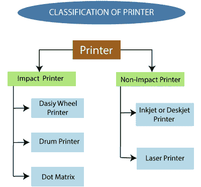
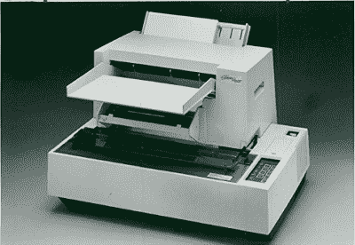
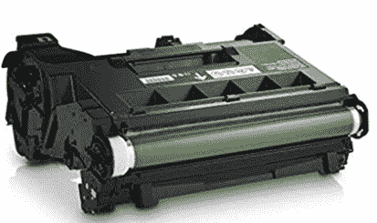
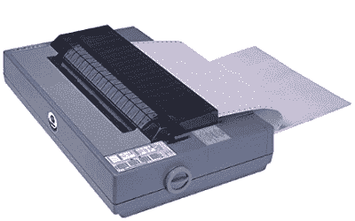
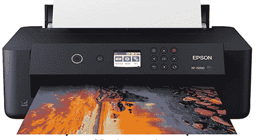
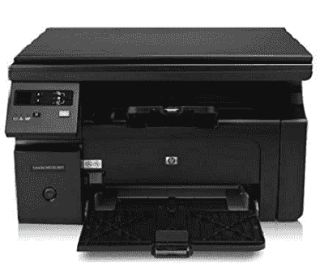
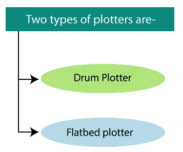
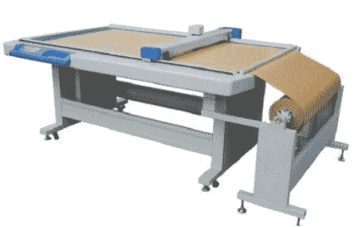
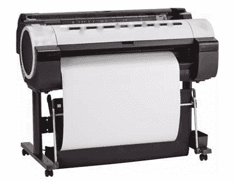

# 计算机图形学中的输出设备

> 原文：<https://www.tutorialandexample.com/output-devices-in-computer-graphics/>

**计算机图形输出设备**

输出设备是可以触摸和看到的硬件组件或计算机的主要物理部分。输出设备是机电设备。

> 计算机给出来自输入设备的指令和数据，对其进行处理并返回结果，称为输出

**例如:**打印机、绘图仪、显示器、投影仪等。

### **打印机:**

打印机是用来在纸上显示图形或文本的外围设备。质量由其分辨率来衡量。任何打印机的分辨率都是以每英寸点数(dpi)来衡量的。

打印机通常与计算机一起工作，并通过电缆连接。目前，许多数字设备都支持打印机功能，因此我们可以使用蓝牙、Wi-fi 和云技术进行打印。

### 打印机类型

一些类型的打印机有:

*   击打式打印机
*   非击打式打印机

### 击打式打印机

在击打式打印机中，打印头、色带、墨盒和纸张之间存在物理接触。

打印机打在一个充满墨水的色带打印头比信打印在纸上。击打式打印机的工作原理类似于打字机。

这些打印机有三种类型:

*   菊花轮式打印机
*   鼓式打印机
*   点阵式打印机

**菊花轮式打印机:**

通过这些，我们一次只能打印一个字符。这台打印机的头部看起来像一朵雏菊花，打印臂看起来像花瓣；这就是为什么它被称为“**雏菊打印机**”

它可以打印大约。每秒 90 个字符。

Fig: Daisy Wheel Printer

菊花轮式打印机用于打印专业质量的文档。它也被称为**“信件质量打印机”**

**优点:**

1.  更可靠
2.  更好的印刷质量

**缺点:**

1.  比点阵慢
2.  更贵
3.  运转时有噪音

**鼓式打印机:**

它的形状像鼓，所以被称为**“鼓式打印机”**这种打印机包含许多打印在感光鼓上的字符。

滚筒的表面被分解成若干个轨道。总轨迹等于字符 132。一个鼓将有 132 个轨道。轨道的数量根据纸张的宽度进行划分。

它可以打印大约。每分钟 150-2500 行。

Fig: Drum Printer

**优点:**

1.  高速
2.  低成本

**缺点:**

1.  印刷质量差
2.  运转时有噪音

**点阵打印机:**

也被称为**“击打式点阵打印机**”点阵打印机一次只能打印一个字符。点阵打印机使用由 9 到 24 个针组成的打印头。这些针用于在纸上产生点的图案，以创建一个单独的字符。

点阵打印机可以打印任何形状的字符、特殊字符、图形和图表。

Fig: Dot Matrix Printer

**优点:**

1.  低印刷成本
2.  大打印尺寸
3.  长寿命

**缺点:**

1.  低速
2.  低分辨率

### 非击打式打印机

在非击打式打印机中，打印头和纸头之间没有物理接触。非击打式打印机一次打印一整页。非击打式打印机通过喷嘴将墨水喷在纸上，形成字母和图案。

不用色带在纸上打印字母的打印机被称为非击打式打印机。非击打式打印机也被称为“**页面打印机**”

这些打印机有两种类型:

*   **喷墨打印机:**
*   **激光打印机:**

**1** 。**喷墨打印机:**又称**台式喷墨打印机。**“它是一种非击打式打印机，用喷头将一滴墨水喷在纸上，打印出文字和图形。

彩色喷墨打印机有四个墨水喷嘴，蓝宝石、红色、黄色和黑色，因此也称为 CMYK 打印机。我们可以用这四种颜色产生任何颜色。

这台打印机的打印和图形非常清晰。这些打印机通常用于家庭用途。

Fig: Inkjet Printer

**优点:**

1.  高质量打印输出
2.  低噪声
3.  高分辨率

**缺点:**

1.  打印头的耐用性较差
2.  不适合大批量打印
3.  墨盒更换非常昂贵

**2。** **激光打印机:**又叫**【页面打印机】**因为激光打印机在打印之前会对整页进行处理和存储。激光打印机用于产生高质量的图像和文本。它主要用于个人电脑。激光打印机最适合在纸上打印大量内容。

Fig: Laser printer

**优点:**

1.  高分辨率
2.  高印刷速度
3.  低印刷成本

**缺点:**

比喷墨打印机贵

比喷墨打印机更大更重

### **绘图仪:**

绘图仪是一种特殊类型的输出设备。它被用来在一张大纸上打印大型图表和大型设计。**例如:**施工图、工程图、建筑平面图、业务图表等。

它是由**【雷明顿·兰德】**在 1953 年发明的。

它类似于打印机，但用于打印矢量图形。

### 绘图仪的类型

1.  **平板式绘图仪:**在平板式绘图仪中，纸张保持在桌子或托盘上的固定位置。平板绘图仪有多支笔和一个支架。该笔通过使用马达在纸上上下左右旋转。

 **每支笔都有不同颜色的墨水，用来绘制多色图案。我们可以使用平板打印机快速绘制以下设计。

**比如:**汽车、轮船、飞机、服装设计、道路和高速公路蓝图等。

Fig: A Flatbed Plotter

平板绘图仪的优势

1.  可以使用更大尺寸的纸张
2.  绘图质量类似于专家

平板绘图仪的缺点

1.  比打印机慢
2.  比打印机更贵
3.  不要打印出高质量的文本

**2。鼓式绘图仪:**又称**“滚筒绘图仪”**这台绘图仪里有一个滚筒。我们可以把纸贴在鼓上。绘图仪工作时，这些鼓来回移动，图像就绘制出来了。

鼓式绘图仪有一支以上的笔和笔杆。笔可以轻松地从右向左和从左向右移动。

笔和滚筒的运动由绘图程序控制。

它在工业中用于绘制大型图纸(高达 A0)。

Fig: A Drum Plotter

**鼓式绘图仪的优势**

1.  绘制更大尺寸的图像
2.  我们可以打印无限长的图像

**鼓式绘图仪的缺点**

1.  非常昂贵

#### 相关帖子:

*   [计算机图形学中的输入设备](https://www.tutorialandexample.com/input-devices-in-computer-graphics/)
*   [计算机图形学中的显示设备](https://www.tutorialandexample.com/display-devices-in-computer-graphics/)
*   [计算机图形学中的图像表示](https://www.tutorialandexample.com/image-representation-in-computer-graphics/)
*   [计算机图形学中的输出设备](https://www.tutorialandexample.com/output-devices-in-computer-graphics/)
*   [计算机图形学中的颜色模型](https://www.tutorialandexample.com/color-models-in-computer-graphics/)
*   [计算机图形学中的动画](https://www.tutorialandexample.com/animation-in-computer-graphics/)
*   [计算机图形学的应用](https://www.tutorialandexample.com/applications-of-computer-graphics/)
*   [计算机图形学的历史](https://www.tutorialandexample.com/history-of-computer-graphics/)
*   [计算机图形学中的齐次坐标](https://www.tutorialandexample.com/homogenous-coordinates-in-computer-graphics/)
*   [椭圆的扫描转换计算机图形](https://www.tutorialandexample.com/scan-conversion-of-an-ellipse/)
*   [填充区域图元计算机图形学](https://www.tutorialandexample.com/filled-area-primitives/)**