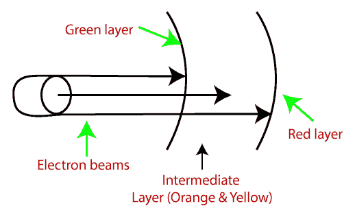

# 计算机图形学中的显示设备

> 原文：<https://www.tutorialandexample.com/display-devices-in-computer-graphics/>

显示设备是用于以图像形式(视觉形式)表示信息的输出设备。显示系统通常被称为视频监视器或 T2。

显示设备被设计成模拟、显示、观看或显示信息。显示技术的目的是简化信息共享。

如今，对高质量显示器的需求正在增加。

下面给出了一些显示设备:

1.  阴极射线管
2.  彩色阴极射线管监视器
3.  液晶显示器
4.  发光二极管
5.  直视存储管(DVST)
6.  等离子体显示
7.  3D 显示

1.  **阴极射线管(CRT):** 这里 CRT 代表阴极射线管。这是一种用于传统电脑[显示器](https://www.tutorialandexample.com/monitors-in-operating-system/)和电视的技术。

阴极射线管是一种特殊类型的真空管，当电子束碰撞到辐射表面时，它显示图像。

### 阴极射线管组件

*   **电子枪:**电子枪由几个元件组成，主要是加热丝(加热器)和阴极。电子枪是一个电子源，聚焦在面对阴极射线管的窄束上。
*   **聚焦&加速阳极:**这些阳极用来产生一个窄而尖锐的聚焦电子束。
*   **水平&垂直偏转板:**这些板用来引导电子束的路径。这些板产生一个电磁场，当电子束通过这个区域时，电磁场会使电子束弯曲。
*   **涂磷屏:**涂磷屏是用来在高速电子束击中它时产生亮点的。

有两种方法可以在屏幕上显示一个物体:

1.  **光栅扫描:**是一种电子束沿屏幕移动的扫描技术。它从上到下移动，一次覆盖一行。

 **光栅扫描基于像素强度控制，在屏幕上显示为一个矩形框，称为**光栅**。

图片描述存储在称为**刷新缓冲区或帧缓冲区的存储区中。**

帧缓冲区也称为**光栅或位图。**光栅扫描提供每秒 60 至 80 帧的刷新率。

**例如:电视**

光束刷新有两种类型:

1.  水平折回
2.  垂直折回

当光束从左上角开始，到达右下角，再次回到左上角时，称为**垂直回扫**。

它会从顶部到底部更水平地回调，作为水平反转。

**优点:**

1.  真实图像
2.  要生产多种颜色
3.  黑暗的场景可以是图片

**缺点:**

1.  分辨率较低
2.  **逐行显示图片**
3.  ****成本更高****

 ********2。随机扫描(矢量扫描):**又称笔画显示或[书法显示](https://en.wikipedia.org/wiki/Calligraphic_projection)。在这种情况下，电子束只指向要画图的区域。

它使用像铅笔一样的电子束在屏幕上形成线条图像。图像是由一系列直线段构成的。在屏幕上，每条线段由光束绘制，从屏幕上的一点到达另一点，其 x 和 y 坐标定义了每个点。

在画面绘制完成后，系统循环回到第一行，每秒钟创建画面的所有行 30 到 60 次。

**图:随机扫描显示器以特定顺序绘制物体的线条**

**优点:**

1.  高分辨率
2.  画流畅的线条画

**缺点:**

1.  它只做线框。
2.  由于闪烁，它会创建复杂的场景。

**2** 。**彩色 CRT 显示器:**类似于 CRT 显示器。

彩色 CRT 显示器背后的基本思想是组合三种基本颜色-红、绿和蓝。通过使用这三种颜色，我们可以产生数百万种不同的颜色。

**两种基本的彩色显示制作技术是:**

1.  **光束** - **穿透方式:**配合**随机扫描**监视器显示画面。屏幕内部有两层磷层——红色和绿色。显示的颜色取决于电子束穿透磷表面的深度。

强大的电子束穿透阴极射线管，穿过红色层，激发其中的绿色层。

一束慢电子只会激发红色层。

一束具有中等电子速度的红色和绿色混合光被发射出来，以显示另外两种颜色——橙色和黄色。

**优点:**

1.  更高的分辨率
2.  一半成本
3.  便宜的

**缺点:**

1.  只有四种可能的颜色
2.  耗费时间的

**2。阴影** - **蒙版法:**配合**光栅扫描**显示器显示画面。它比光束穿透法有更多的颜色范围。它用于电视机和监视器。

### 结构:

1.  它在像素的每个位置都有三个磷色点。

第一个圆点:**红色**颜色

第二个圆点:**绿色**颜色

第三个圆点:**蓝色**彩色

1.  它有三种不同的枪。每种颜色一个。
2.  它在磷屏前面有一个金属屏或金属板，叫做**“荫罩”**
3.  它在磷涂层屏幕后面还有一个阴影网格，上面有三角形的小孔。

**工作原理:**荫罩是一块金属板，在彩色显示器内部有许多小孔。

荫罩通过消耗电子来引导电子束，使电子束只击中所需的点，从而显示出最终的图像。

它有三种不同的枪。这些枪将它们的光束射向荫罩，荫罩允许它们通过。荫罩的一个任务是将电子束对准屏幕上特定的点，并在屏幕上产生图像。

与电子束穿透相比，荫罩可以显示更大范围的图像。

**优点:**

1.  显示更宽范围的图片。
2.  显示逼真的图像。
3.  RGB 颜色的内嵌排列。

**缺点:**

1.  很难在同一个孔上覆盖所有三个光束。
2.  分辨率差。

**3** 。**液晶显示器(LCD):** 液晶显示器依靠液晶的光调制特性。

液晶显示器用于手表和便携式电脑。LCD 需要交流电源而不是 DC，所以很难在电路中使用。

它通常在平板显示技术上工作。LCD 比 LED 耗电更少。LCD 屏幕使用液晶来打开或关闭像素。

液晶是固体和液体的混合物。当电流在里面流动时，它的位置会变成想要的颜色。

**比如:** TFT(薄膜晶体管)

**优点:**

1.  产生鲜明的形象
2.  节能
3.  完全平面屏幕

**缺点:**

1.  固定纵横比和分辨率
2.  较低对比度
3.  更贵

**4。发光二极管(LED):** LED 是电流通过时会发光的器件。它是一种半导体器件。

LED 的尺寸很小，所以我们可以很容易地通过排列大量的 LED 来制作任何显示单元。

与 LCD 相比，LED 耗电更多。LED 用于电视、智能手机、机动车、交通灯等。

led 在结构上很强大，所以它们能够承受机械压力。LED 在高温下也能工作。

**优点:**

1.  光的强度是可以控制的。
2.  低工作电压。
3.  能够承受高温。

**缺点:**

1.  比 LCD 更耗电。

**5。直观存储管(DVST):** 用于将图像信息存储为荧光屏后面的电荷分布。

DVST 使用两种枪:

1.  **主枪:**用于存储图片信息。
2.  **泛光灯/副枪:**用于在屏幕上显示一个画面。

**优点:**

1.  耗时更少
2.  不需要刷新
3.  高分辨率
4.  成本更低

**缺点:**

*   图像的特定部分不能被擦除。
*   它们不显示颜色。

**6。等离子显示器:**它是一种平板显示器，使用微小的等离子电池。气体放电显示器也被称为**。**

 **#### 等离子显示器的组件

1.  **阳极:**用于输送正电压。它也有电线。
2.  **阴极:**用于给气室提供负电压。它也有细导线。
3.  **气体板:**这些板作为电容器工作。当我们通过电压时，电池有规律地发光。
4.  **荧光电池:**当电压传递到这种氖气上时，它包含了小口袋的气体液体。它会发光。

**优点:**

 **1.  壁装式的
2.  微小的
3.  更宽的角度

**缺点:**

1.  随着时间的推移，磷会失去亮度。
2.  它比液晶显示器更耗电。
3.  大号

**7。3D 显示:**也叫立体显示技术。这项技术能够给观众带来深度感。

它用于 3D 游戏和 3D 电视。

**例如:**雾显、全息显示、视网膜显示等。

**优点:**

*   令人印象深刻的画质
*   令人印象深刻的画质
*   令人印象深刻的画质

**劣势:**

*   昂贵的
*   双目融合

#### 相关帖子:

*   [计算机图形学教程](https://www.tutorialandexample.com/computer-graphics-tutorial/)
*   [椭圆的扫描转换计算机图形](https://www.tutorialandexample.com/scan-conversion-of-an-ellipse/)
*   [指向和定位技术计算机图形学](https://www.tutorialandexample.com/pointing-and-positioning-technique/)
*   [计算机图形学中的扫描转换](https://www.tutorialandexample.com/scan-conversion/)
*   [扫描转换一个圆的计算机图形](https://www.tutorialandexample.com/scan-conversion-of-a-circle/)
*   [计算机图形学中的中点画线算法](https://www.tutorialandexample.com/mid-point-line-drawing-algorithm/)
*   [计算机图形学中的 Bresenham 画线算法](https://www.tutorialandexample.com/bresenhams-line-drawing-algorithm/)
*   [计算机图形学中的画线算法](https://www.tutorialandexample.com/line-drawing-algorithm/)
*   [计算机图形学中的线裁剪](https://www.tutorialandexample.com/line-clipping/)
*   [计算机图形学中的三维旋转](https://www.tutorialandexample.com/3d-rotation/)
*   [计算机图形学中的 2D 剪切](https://www.tutorialandexample.com/2d-shearing/)************