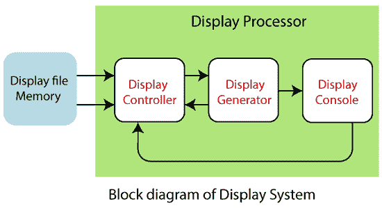
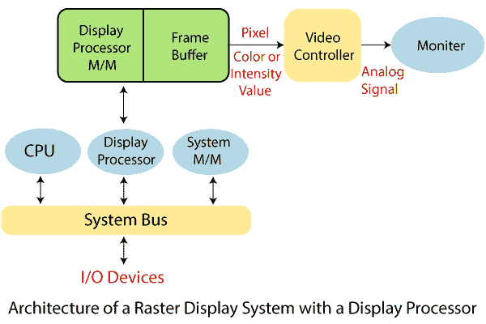
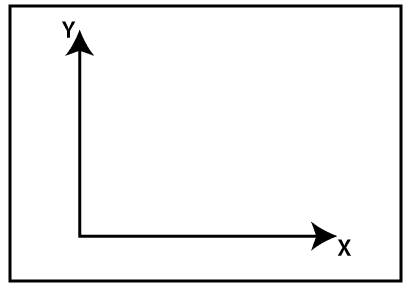
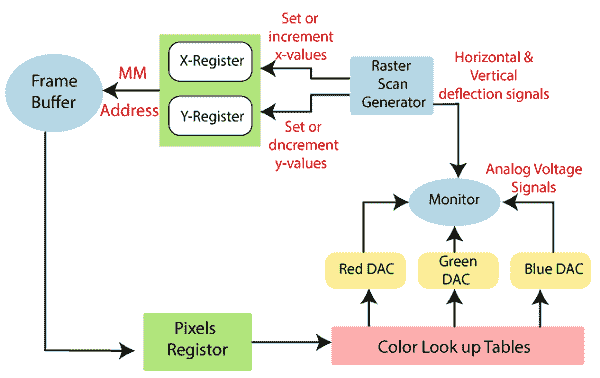

# 显示处理机

> 原文：<https://www.tutorialandexample.com/display-processor/>

它是硬件或解释程序的一部分，用于将显示处理器代码转换成图像。它用于将来自 CPU 的数字信息转换成模拟数据。

这是一种数模转换，取决于设备类型和图形功能。显示处理器的主要功能叫做扫描转换。

在这个过程中，连续的图形对象必须被分离为椭圆、矩形和多边形的集合。

显示处理器有时也被称为显示处理单元(DPU)。

**显示处理器部件:**有以下四个部分:

1.  显示控制器
2.  显示文件存储器
3.  显示生成器
4.  显示控制台

**显示控制器:**也叫视频控制器。它用于控制显示设备的操作。其职能如下:

*   它用于处理中断。
*   它用于解释指令。
*   它也被用来管理时间。

**显示文件存储器:**用于创建图像。它也用于视觉对象识别。

**显示生成器:**用于产生字符。它也用于创建曲线。

显示控制台:它由一个阴极射线管、光笔、键盘和偏转系统组成。

### **显示处理器的特性:**

1.  它用于执行各种操作，例如不同的线条样式、显示颜色区域以及操纵和变换显示器上的对象。
2.  显示处理器是在 GPU(图形显示处理器)之前使用的。
3.  视频控制器是基于 CRT(阴极射线管)的广泛使用的显示设备。
4.  除了系统内存之外，显示处理器还有一个单独的内存区域。

### **工作:**

输出电路中的视频控制器产生水平和垂直驱动信号，以便扫描监视器。

要存储屏幕的坐标像素，我们可以使用两个寄存器(寄存器 X，寄存器 Y)，如图所示。假设 y 相邻扫描线的值从屏幕底部的 1 向上增加到 Ymax，屏幕位置或 x 值随着每条扫描线从 0 增加到 Xmax 在最右侧的位置。

在标准的笛卡尔坐标系中，原点在屏幕的左下角。

图:屏幕位置识别的坐标系原点通常在左下角指定。

**新鲜周期开始:**

寄存器 X 设为 0，寄存器 Y 设为 Ymax。这个地址(X，y `)被转换成帧缓冲器的存储器地址，在那里存储这个像素位置的颜色值。

控制器已经从帧缓冲器接收到颜色值(二进制形式)。控制器将其分为三部分，并将每个元素发送到单独的 DAC(数模转换器)。

反过来，这些电压控制 3-e 电子束的强度，该电子束通过垂直和水平驱动信号聚焦在(X，Y)屏幕位置上。

对于沿顶部扫描线的每个像素，每当 Y 增加 X 寄存器时，重复该过程。

当通过 Xmax 在第一个扫描行上创建像素时，它增加 X 寄存器。然后 X 寄存器设置为 0，Y 寄存器减 1 以访问下一条扫描线。

然后，沿着每条扫描线处理像素，并且对于生成的每个扫描单元，在最后一条扫描线(Y=0)上重复该过程。

对于使用颜色查找表缓冲值的显示系统，它不直接用于控制 CRT 电子束的清晰度。

从查找表中取出三个像素颜色值用作索引。在每个显示周期，对每个显示周期的每个像素进行这种查找操作。

窗口中用于观察或刷新单个像素的时间很短。每次到达帧缓冲器以读取允许的每个像素的亮度值需要更长的时间:

在单次访问中，几个相邻的像素值被放入帧缓冲器并存储在寄存器中。

在每个可接受的时间间隔后，从寄存器中移出一个像素值，以控制像素的热强度。

对下一个像素节点重复该过程，并且将以相同的方式处理整个像素组。