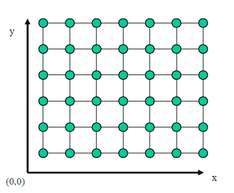
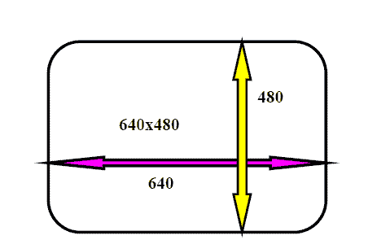

# 计算机图形学中的图像表示

> 原文：<https://www.tutorialandexample.com/image-representation-in-computer-graphics/>

**图像表示**:在计算机科学中，我们可以用各种形式来表示一幅图像。大多数情况下，它指的是带来信息的方式，例如颜色是以数字方式编码的，以及图像是如何存储的，即图像文件是如何构造的。**T3】**

推荐了几个开放标准来创建、操作、存储和交换数字图像。这些规则描述了图像文件的格式、图像编码的算法、通常称为元数据的附加信息的形式。

 **数字图像是单个像素或图片元素的组合。像素以行和列的形式排列以形成图像区域。图像中的像素数是图像尺寸以及水平和垂直方向上每单位长度(例如，英寸)的像素数的函数。

 **### 图像处理

它是一种在图像上实现一些操作的方法。它还用于获得增强的图像或从图像中获取一些有用的信息。这是一种输入是图像，输出可以是图像或与该图像相关的特性/特征的处理。

**例如** -照片、视频帧。

大多数图像处理技术认为图像是二维的，并在其上应用标准的信号处理技术。

**像素:****像素是电脑屏幕上显示的图片的最小单位。**

 ****一个像素包括它自己的:-

*   强度
*   姓名或地址

图像的大小定义为水平方向的总像素数乘以垂直方向的总像素数(512 x 512，640 x 480 或 1024 x 768)。

图像的宽高比，我们可以用单位长度或像素数来衡量，称为图像的**纵横比**。

**例如**-2 x 2 英寸图像和 512 x 512 图像的纵横比为 1/1，而 6 x 英寸图像和 1024 x 768 图像的纵横比为 4/3。

**分辨率:**是屏幕上显示的独立像素的数量，用横轴和纵轴上的像素表示。

显示图像的清晰度取决于显示器的分辨率和尺寸。

**“每单位的像素数称为图像的分辨率。”**

它还包括-

 ***   **图像分辨率:**两个像素之间的距离
*   **屏幕分辨率:“**屏幕上显示的水平和垂直像素数称为屏幕分辨率。”

**例如** - 640 x 480，1024 x 768(水平 x 垂直)

**长宽比:**“图像的宽高比称为图像的长宽比**。**“图像的高度和宽度以长度或像素数来衡量。

**例如:**如果一个图形的长宽比为 2:1，就意味着宽度是高度的两倍。

它包括 **-**

*   **框架长宽比:**水平/垂直尺寸
*   **像素长宽比:**像素宽度/像素高度

### 图像处理的应用

图像处理的一些应用领域如下:

1.  电脑摄影
2.  空间图像处理(例如，哈勃空间望远镜图像、星际探测器图像)
3.  医学/生物图像处理
4.  自动字符识别
5.  指纹/面部/虹膜识别
6.  遥感
7.  工业应用

### 图像文件的格式

有一些不同类型的图像被提及为:

*   **JPEG(联合摄影专家组):**用于数字图像，尤其是那些由数字摄影组成的图像。的’。“jpeg”文件扩展名用于保存文件。
*   **PNG(便携式网络图形):**这些文件通常用于存储网页图像的图形。开发 PNG 是为了增强图形交换格式的非注册替代。的’。' png '文件扩展名用于保存文件。
*   **GIF(图形交换格式):**是一种存储图形图像的文件格式，最高可达 256 色。PNG 基于无损压缩方法，可产生更高质量的输出。PNG 是作为 GIF 文件格式的一个更强大的选项而创建的。的’。“gif”文件扩展名用于保存文件。
*   **TIFF/ TIF(标记图像文件):**这些文件可以保存为多种颜色格式和多种压缩形式。TIFF 文件用于保持图像的完整性和清晰度。它常用于专业摄影。的’。“tif”文件扩展名用于保存文件。
*   **PSD (Photoshop Document):** 是在 [Adobe PhotoShop](https://www.tutorialandexample.com/photoshop-tutorial/) 中使用的分层图像文件。这是 PhotoShop 用来保存数据的默认格式。PSD 是一个保管文件，即使在文件保存后，用户也可以使用图像的单独层。的’。psd '文件扩展名用于保存文件。
*   **PDF(Portable Document Format):**当用户需要保存不可更改的文件时，用于在计算机之间和跨操作系统平台共享文档。的’。“pdf”文件扩展名用于保存文件。
*   **EPS(Encapsulated Postscript):**是一种图形文件格式，用于基于矢量的图像。在 Windows 中，用户需要图形软件来打开 EPS 文件(即 Adobe Illustrator、Coral Draw)。的’。eps 的文件扩展名用于保存文件。
*   **AI (Adobe Illustrator 文档):**是 Adobe system 开发的文件格式。它用于表示 EPS 或 PDF 格式的单页矢量绘图。的’。“ai”文件扩展名用于保存文件。

#### 相关帖子:

*   [计算机图形学中的齐次坐标](https://www.tutorialandexample.com/homogenous-coordinates-in-computer-graphics/)
*   [填充区域图元计算机图形学](https://www.tutorialandexample.com/filled-area-primitives/)
*   [计算机图形学中的扫描转换](https://www.tutorialandexample.com/scan-conversion/)
*   [计算机图形学中的 Bresenham 画线算法](https://www.tutorialandexample.com/bresenhams-line-drawing-algorithm/)
*   [计算机图形学中的画线算法](https://www.tutorialandexample.com/line-drawing-algorithm/)
*   [计算机图形学中的 DDA 画线算法](https://www.tutorialandexample.com/dda-line-drawing-algorithm/)
*   [计算机图形学中的多边形裁剪](https://www.tutorialandexample.com/polygon-clipping/)
*   [计算机图形学中的线裁剪](https://www.tutorialandexample.com/line-clipping/)
*   [计算机图形学中的剪辑](https://www.tutorialandexample.com/clipping-in-computer-graphics/)
*   [计算机图形学中的三维旋转](https://www.tutorialandexample.com/3d-rotation/)**********