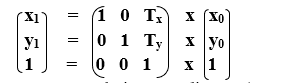

# 2D 翻译

> 原文：<https://www.tutorialandexample.com/2d-translation/>

我们可以把任何物体从一个地方移到另一个地方，而不改变物体的形状。

**例如-**

**一个点的平移:**如果我们要将一个点从 P (x 0 ，y 0 )平移到 Q (x 1 ，y 1 )，那么我们就要用原坐标加上平移坐标(Tx，Ty)。

**我们也可以用矩阵形式来表示翻译-**

我们可以对以下对象应用平移 **s-**

*   **线**
*   **矩形**
*   **多边形**
*   **正方形**

## 齐次坐标表示:

上述翻译也以 3×3 矩阵的形式显示-

在这里，平移坐标( **T x ，TyT5)也被称为“**平移**或**平移矢量。**”**

**Ex****ample**——给定一个坐标为(2，4)的点。向 x 轴方向平移 4，向 y 轴方向平移 2。在不改变半径的情况下找到新坐标？

**解:** P = (x 0 ，y 0 ) = (2，4)

移位向量= (T x ， Ty ) = (4，2)

让我们假设 P = (x 1 ，y 1 的新坐标

现在我们要添加平移向量和给定的坐标，然后

x1= x0+Tx=(2+4)= 6

y1= y0+Ty=(4+2)= 6

因此，新的坐标= (6，6)

 