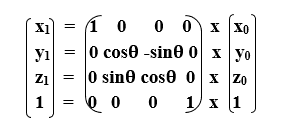
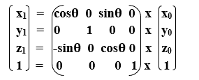
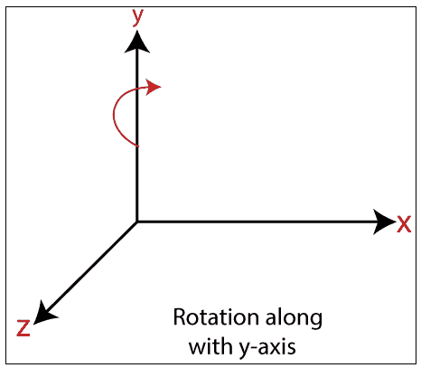

# 3D 旋转

> 原文：<https://www.tutorialandexample.com/3d-rotation/>

3D 旋转不同于 2D 旋转。在 3D 旋转中，我们还必须定义旋转轴的旋转角度。

**例如**——让我们假设**、**

一个物体的初始坐标= (x 0 ，y 0 ，z 0

从原点开始的初始角度= **β**

旋转角度= **θ**

旋转后的新坐标= (x 1 ，y 1 ，z 1

**在三维平面中，我们可以通过以下三种方式定义旋转**

*   **X 轴旋转:**我们可以沿着 X 轴旋转物体。我们可以用下面的等式旋转一个物体- 

**我们可以用矩阵的形式来表示 3D 旋转-**

  

*   **Y 轴旋转:**我们可以沿着 Y 轴旋转物体。我们可以用下面的等式旋转一个物体- 

**我们可以用矩阵**的形式来表示三维旋转

  

*   **Z 轴旋转:**我们可以沿着 Z 轴旋转物体。我们可以用下面的等式旋转一个物体- 

**我们可以用矩阵**的形式来表示三维旋转

  

**举例:**一个点在 x，y，z 方向的坐标为 P (2，3，4)。旋转角度为 90 度。应用 x，y，z 方向的旋转，找出点的新坐标？

**解:**点的初始坐标= P (x 0 ，y 0 ，z0【T7)=(2，3，4)

旋转角度(**θ**)= 90**T3】**

**对于 x 轴** -

设新坐标= (x 1 ，y 1 ，z 1 那么

x 1 = x 0 = 2

y1= y0x cosθ–z0x sinθ= 3 x cos 90–4 x sin 90 = 3 x 0–4 x 1 =-4

z1= y0x sinθ+z0x cosθ= 3 x sin 90+4 x cos 90 = 3 x 1+4 x 0 = 3

**点的新坐标= (2，-4，3)**

**对于 y 轴** -

设新坐标= (x 1 ，y 1 ，z 1 那么

x1= z0x sinθ+x0x cosθ= 4 x sin 90+2 x cos 90 = 4 x 1+2 x 0 = 4

y1:y0= 3

z1= y0x cosθ–x0x sinθ= 3 x cos 90–2 x sin 90 = 3 x 0–4 x 0 = 0

**点的新坐标= (4，3，0)**

**对于 z 轴** -

设新坐标= (x 1 ，y 1 ，z 1 那么

x1= x0x cosθ–y0x sinθ= 2 x cos 90–3 x sin 90 = 2 x 0+3 x 1 = 3

y1= x0x sinθ+y0x cosθ= 2 x sin 90+3 x cos 90 = 2 x 1+3 x 0 = 2

z 1 = z 0 =4

**点的新坐标= (3，2，4)**