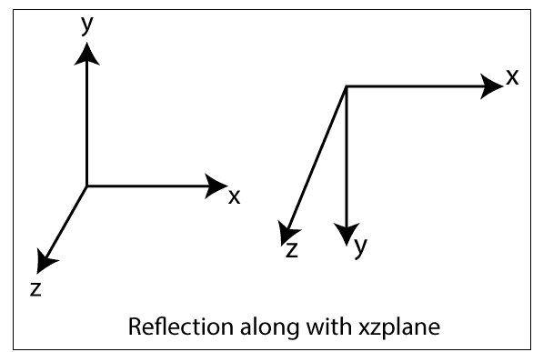

# 3D 反射

> 原文：<https://www.tutorialandexample.com/3d-reflection/>

反射是原始对象的镜像。我们可以通过添加 Z 轴来区分 2D 和 3D 反射。Z 轴显示表面的深度。在反射过程中，对象的大小不变。

**我们可以用以下三种方式来表示反射——**

*   **沿 xy 平面反射:**在 xy 平面反射中，z 的值为负。

**x1= x0T5】**

**y1= y0T5】**

**z1=**-**z0T7】**

**三维反射矩阵-**

*   **沿 xz 平面反射:**在 xz 平面反射中，y 值为负。

**x1= x0T5】**

**y1=-y0T5】**

**z1= z0T5】**

**三维反射矩阵-**

*   **沿 yz 平面反射:**在 yz 平面反射中，x 的值为负。

**x1=-x0T5】**

**y1= y0T5】**

**z1= z0T5】**

**三维反射矩阵-**

**举例:**一个坐标点为 P (4，5，2)，Q (7，5，3)，R (6，7，4)的 3D 三角形。在 xy 平面上应用反射，求三角形的新坐标？

**解决方案:**我们有，

三角形的初始坐标= P (4，5，2)，Q (7，5，3)，R (6，7，4)

反射平面= xy

设三角形的新坐标= (x 1 ，y 1 ，z)

**对于坐标 P (4，5，2)** -

X 1 = x 0 = 4

y 1 = y 0 = 5

z 1 = -z 0 = -2

**新坐标= (4，5，-2)**

**对于坐标 Q (7，5，3)** -

X 1 = x 0 = 7

Y 1 = y 0 = 5

Z 1 = -z 0 = -3

**新坐标= (7，5，-3)**

**对于坐标 P (6，7，4)** -

X 1 = x 0 = 6

y1:y0= 7

z 1 = -z 0 = -4

**新坐标= (6，7，4)**