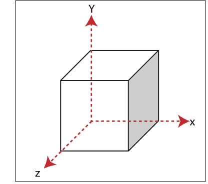
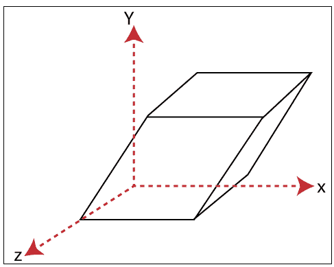
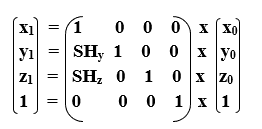
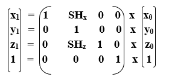
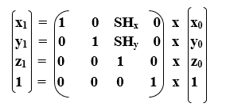

# 三维剪切

> 原文：<https://www.tutorialandexample.com/3d-shearing/>

我们可以用**‘SHx、‘SHy、‘SHz .’**来表示剪切，这些’**SHx、‘SHy、‘SHz’**称为**“剪切系数”**

2D 和 3D 剪切的基本区别在于 3D 平面也包括 z 轴。

 

我们可以通过以下三种方式对对象进行剪切-

*   **沿 x 轴剪切:**在这里，我们可以存储 x 坐标，只改变 y 和 z 坐标。

我们可以用下面的等式来表示沿 x 轴的剪切

**x1= x0T5】**

**y1= y0+SHy。x0T9】**

**z1= z0+SHz。x0T9】**

**三维剪切矩阵:**

*   **沿 y 轴剪切:**在这里，我们可以存储 y 坐标，只改变 x 和 z 坐标。

我们可以用下面的等式来表示沿 y 轴的剪切

**x1= x0+SHx。y0T9】**

**y1= y0T5】**

**z1= z0+SHz。y0T9】**

**三维剪切矩阵:**

*   **沿 z 轴剪切:**这里可以存储 z 坐标，只改变 x 和 y 坐标。

我们可以用下面的等式来表示沿 z 轴的剪切

**x1= x0+SHx。z0T9】**

**y1= y0+SHy。z0T9】**

**z1= z0T5】**

**三维剪切矩阵:**

