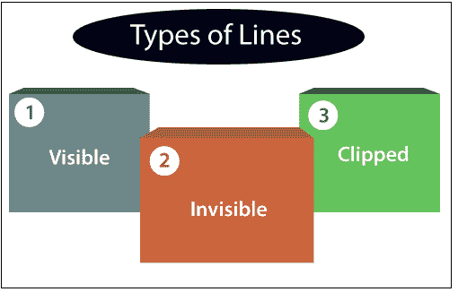
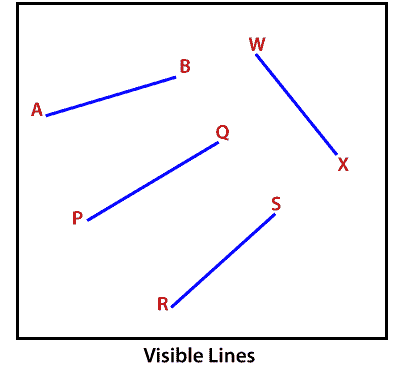
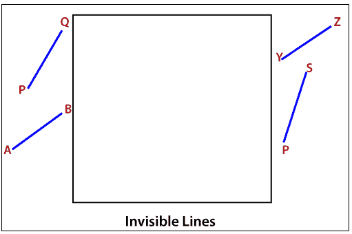
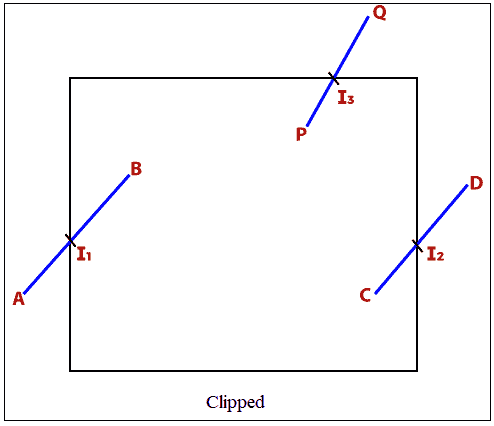
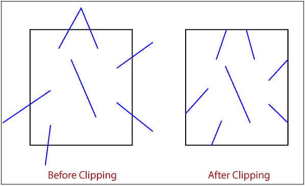

# 计算机图形学中的剪辑

> 原文：<https://www.tutorialandexample.com/clipping-in-computer-graphics/>

裁剪是计算机图形中使用的一种变换，用于删除计算机屏幕或查看窗格之外的线条、对象和线段裁剪是决定图像、对象或任何线段的可见和不可见部分的过程。

 **我们只选择线的可见部分，去掉不可见部分。过程剪辑可用于二维和三维图形。

### 二维(2D)图形中的剪辑

我们也可以用二维图形来描述裁剪。在二维图形系统中，裁剪是一个过程，其中图像的所有像素都位于视图窗格(窗口)的边界内。我们还可以控制像素渲染来制作有创意和功能的剪辑区域。

### 三维(3D)图形中的剪辑

在三维图形中，我们可以以多种方式使用术语裁剪来定义各种特征。裁剪是一个术语，描述在具有矩形形状的三维平面中工作的一些操作。我们可以将剪辑扩展到更高维度。我们可以使用各种方法和算法来增加裁剪的维度。

### 剪辑的应用

我们可以使用剪辑进行绘图操作。

*   它用于分离图像的重要部分。
*   裁剪中的实体建模技术有助于构建三维对象。
*   我们可以执行与指向对象相关的各种操作。**例如，**删除、复制、插入、移动对象的选定部分等。
*   裁剪帮助我们描述 3D 对象的可见和不可见部分。

### 线条类型

这些线条分为三种类型。

*   **可见线**
*   **看不见的线**
*   **剪切线**

*   **可见线:**位于视图窗格内的线是一条可见线。
*   **不可见线:**位于视图窗格外的线是一条不可见线。
*   **裁剪线:**位于窗口内部或外部的线称为裁剪线。**直线与视图窗格相交的点称为直线的交点**

 **### 线条示例

下面给出的一些图代表了线的类型。

我们可以使用世界坐标的裁剪过程。视图窗格中的对象和图像可以映射到设备坐标。

### 剪辑的类型

我们可以将剪辑分为以下几种类型-

1.  线条剪辑
2.  点裁剪
3.  文本剪辑
4.  外部剪裁
5.  曲线剪辑
6.  多边形裁剪****