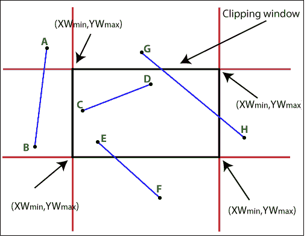

# 计算机图形学中的线裁剪

> 原文：<https://www.tutorialandexample.com/line-clipping/>

线裁剪是一个过程，在这个过程中，我们可以剪切位于视图窗格之外的那部分线。只有那些位于视图窗格内的线是可见的。

线裁剪过程通过以下线裁剪算法实现 **-**

*   Cohen Sutherland 线裁剪算法
*   梁-巴斯基线裁剪算法
*   中点细分线裁剪算法

### Cohen Sutherland 线裁剪算法

这个算法被命名为**【丹尼·科恩】****【伊凡·苏泽兰】**

该算法将在以下步骤中工作:

*   在这个算法中，我们将视图窗格分成九个相等的部分(如下图所示),这些部分只服务于视窗。
*   现在，我们将用 4 位来表示窗口的上、下、左、右四个角。这 4 位可以用以下要点来描述:
*   如果对象位于任何特定的角位置，则该角值将为 1，否则将为 0。
*   比特的分配取决于**“TBRL”**(上、下、右、左)规则。
*   假设，如果一条线的点出现在左上角，那么根据 TBRL，值是 1001。我们会把这些比特分配成-
*   对于顶角，因为对象出现在顶角。
*   因为物体不在底部。
*   因为物体不在右边。
*   因为对象位于左上角。
*   这样，我们检查每个数据段的 TBRL，并相应地分配比特。

在 Cohen- Sutherland 算法中，我们将把线分成以下几部分

*   **可见线:**当线的两个点(起点和终点)完全位于窗口内时。
*   **看不见的线:**当线的两点(起点和终点)都完全位于窗外时。**T3】**

如果我们有(x 最小，x 最大)和(y 最小，y 最大)视图窗格(窗口)的坐标。

那么，应该描述为——

x 0 ，x1T6】xmax

y 0 ，y1T6】ymax

x 0 ，x1T6】xmin

y 0 ，y1T6】ymin

*   **裁剪线:**每条线都有两个端点。设(x 0， y 0 )和(x 1， y 1 )为直线的点。如果直线的一点在窗口内，另一点在窗口外，那么这条直线就是所谓的截断直线。

### Cohen-Sutherland 线裁剪算法；

**第一步:**为线的两个端点分配位代码。

**第二步:**现在，在线的两端点上实现 OR 运算。

**第三步:**如果 OR = 0000，

然后

{线条可以接受(可见)}

其他

{在端点上实现和操作}

然后

如果和？0000

然后

**{线条不可接受(不可见)}**

 **其他

AND = 0000

{线条需要修剪}

**第四步:**如果需要裁剪一条线，先用下面的公式找到所有边界的交点-

m =(y1-y0)(x1-x0)

**步骤 4.1:** 直线与窗口左侧边界相交时。

y0= y1+m(x-x1

这里 x = xwmin(x 坐标的最小值)

**步骤 4.2:** 直线与窗口右侧边界相交时。

y0= y1+m(x-x1

这里 x = xwmax(x 坐标的最大值)

**步骤 4.3:** 当直线与窗口顶侧边界相交时。

**x0= x1+(y-y1)/m**

 ****这里 y = ywmax(y 坐标的最大值)

**步骤 4.4:** 直线与窗孔底边边界相交时。**T3】**

**x0= x1+(y-y1)/m**

 **这里 y = ywmin(y 坐标的最小值)

**示例:**在下面提到的示例中，我们有不同的行。这条线的不同类别-

AB 线是一个剪辑案例。

CD 线完全可见。

EF 线完全看不见。

GH 线是一个剪辑案例。

KL 线完全看不见。

IJ 线是一个剪辑案件。

线的端点如下所示-

答？0000

b？1010

c？0000

d？0000

e？0100

f？0100

g？0001

h？0000

我？0000

j？0010

k？1000

l？1000

**优点:**

1.  它易于使用和实现。
2.  我们可以以特定的方式执行裁剪和测试。
3.  这是一种快速算法。

**缺点:**

1.  有时会进行不必要的裁剪。

### 梁-巴斯基线裁剪算法；

该算法由**“尤-梁冬”**和**“布莱恩·a·巴斯基”提出**用于线裁剪。这是一个比 Cohen-Sutherland 算法更强大的算法。

### 我们在这个算法中使用了以下概念-

*   我们可以用线的参数方程和不等式。
*   这些用来描述窗口的范围，以找出线和裁剪窗口之间的交点。
*   参量线也被称为**“赛勒斯-贝克”**

在这个算法中，我们必须根据时间间隔来寻找交点。

**时间间隔** ( **t** )可以定义为从初始位置(0)到最终位置(1)的行程时间。然后我们有，

**0 < t < 1** (这里，t 介于 0 和 1 之间)

我们有公式来找到这条线的 x 和 y 点-

**x= x 1 + t.** **？** **x** (针对 x 点)

**y = y1+t .**T4？ **y** (针对 y 点)

检查点是在窗口之间还是在方程之外是-

**XwminT12】= x1+t .****？****x<= Xwmax**

**YwminT12】= y1+t .****？****y<= Ywmax**

这两个条件可以写成-

**x 1 + t.** **？** **x > = Xw min**

**x 1 + t.** **？** **x < = Xw max**

**y 1 + t.** **？** **y > = Yw min**

**y 1 + t.** **？** **y < = Yw max**

对于上述四种情况，我们可以采用一个通用的表达式。这将是-

**t . pk<= qk**(这里 k 的值是倍数)

**t = qk/pkT5】**

**p 1 =** - **？****x q1= x1-xwmin**(用于左边界)

**p2=**T4？**x q2= xwmax-x1**(右边界)

**p 3 =** - **？****y q3= y1-ywmin**(用于底部边界)

**p4=**T4？**y q4= ywmax–y1**(对于顶部边界)

### 梁-巴斯基线裁剪算法；

**第一步:**设置线的端点 **(x 1 ，y 1 )** 和 **(x 2 ，y 2 )。**

**第二步:**计算 **p 1 ，p 2 ，p 3 ，p 4** 和 **q 1 ，q 2 ，q 3 ，q 4 的值。**

**第三步:**现在我们计算 **t** 的值

**t 1 = 0(初始点)**

**t 2 = 1(对于终点)**

**第四步:**现在我们要计算**pkT5】和**qkT9】的值****

如果

**p k**

然后

{这条线与窗户平行}

如果

**QkT4】0**

然后

{行完全在窗口之外}

**步骤 5:** 如果我们有非零值的**pkT5】**

如果

**pkT4】0**

然后

**t 1 = max (0，q k / p k )**

如果

**pkT4】0**

然后

**t 2 = min (1，q k / p k )**

现在，如果**t1T10】t2{**If**t1**值被改变

那么第一个点就是窗外。

如果 **t 2** 值被改变

然后第二个点在窗口外 **}**

其他

**t1T6】t2T5】**

然后

{线完全在窗外}

**第六步:**停止。

**举例:**

设一个矩形窗口大小为(5，9)。直线的点是(4，12)和(8，8)。使用 Liang- Barsky 算法裁剪直线并找到交点。

**解决方案:**

我们有，

直线的起点(p 1 ) = (4，12)

直线的终点(p 2 ) = (8，8)

x 1 = 4，x 2 = 8

y 1 = 12，y 2 = 8

xw 最小值 = 5，xw 最大值 = 9

yw ­min = 5, yw ­max = 9

**第一步:**我们要计算**的值？** **x** 和**？** **y-**

**？****x =**x2x1= 8-4 = 4

**？**T2】y =y2-y1= 8-12 =-4

第二步:现在，我们将计算-

p 1 = -4 q 1 = 4-5 = -1

p 2 = 4 q 2 = 9-4 = 5

p 3 = 4 q 3 = 12-5 = 7

p4=-4 q4= 9-12 =-3

**第三步:**现在我们将计算 t 1 值 **-**

如果 p 1 ，p4T4】0

那么 t 1 =max (0，q k /p k

=max (0，q 1 /p 1 ，q 4 /p 4 )

=最大值(0，1/4，3/4)

t 1 = 3/4

如果 p 2 ，p3T4】0

那么 t 2 = min (1，q k /p k )

= min (1，q 2 /p 2 ，q 3 /p 3

=最小值(1，5/4，7/4)

t 2 = 1

**第四步:**现在，我们要计算交点。

x = x 1 + t 1。？x= 4+ 3/4 * 4 = 7

y = y 1 + t 1。？y = 12+3/4 *(4)= 9

**坐标交点= (7，9)**

### 中点细分线裁剪算法；

中点细分算法用于裁剪线。该算法基于寻找直线的中点。我们可以把这条线分成相等的两部分。该行应有以下类别-

 ****可见线**

**隐形线**

**部分可见**

我们可以通过下面的公式计算直线的中点-

**pm=(p1+p2)/2**

### 算法中点细分线裁剪:

**第一步:**为线的两个端点分配位代码。

**第二步:**现在，在线的两端点上实现 OR 运算。

**第三步:**如果 OR = 0000，

然后

{线条可见}

其他

{在端点上实现和操作}

然后

如果和？0000

然后

**{线条不可见}**

 **其他

AND = 0000

{线条是部分可见的}

**第四步:**对于部分可见的直线，我们需要找到中点。

**Xm=(X1+X2)/2(对于 X 坐标)**

**Ym=(Y1+Y2)/2(对于 Y 坐标)**

第五步:我们需要检查这条线是否靠近窗口的边界。

**步骤 6:** 如果线条可见或不可见，则重复步骤 1 至 5。

**第七步:**停止。

**例子:**一个窗口包含大小(0，50，0，50)。直线 PQ 的坐标为(-10，40)和(30，-20)。使用中点细分找到线的可见点。

**解决方案:**我们有，

x 和 y 的坐标= P (-10，40)

x 和 y 的坐标= Q (30，-20)

现在，

**第一步:**我们要计算线段 PQ 的中点。

Q = [(-10 + 30) /2，(40 - 20)/2]

    = (10, 10)

**现在新的坐标 Q = (10，10)**

第二步:现在，我们将找到

Q ' ' = '和 Q 的中点

Q'' = [(10 + 30) /2，(10 + (-20))/2]

**=** (20，-5)

**现在新的坐标 Q'' = (20，-5)**

这里(20，-5)比(10，10)好得多

现在我们必须找到 Q ' ' '，

Q''' = [(20 + 30) /2，(-5 + (-20))/2]

= (25, -12.5)

**现在 Q 的新坐标' ' = (25，-12.5)**

我们可以从顶部剪开从 Q ' '到 Q 的线。

第三步:现在，我们将左手边部分。端点是 P 和 Q

我们会找到 P 和 Q 的中点

P (-10，40)和 Q ' '(25，-12.5)

P' = [(-10 + 25) /2，(40 + (-12.5))/2]

    = (7.5, 27.5)

现在我们将找到 P 和 P '的中点

P (-10，40)和 P' (7.5，27.5)

P'' = [(-10 + 7.5) /2，(40 + (27.5))/2]

      = (-1.25, 33.75)

现在我们将找到 P ' '和 P 的中点

P ' ' = P(-10，40)和 P'' (-1.25，33.75)

       = [(-10 + (-1.25)) /2, (40 + 33.75)/2]

= (5.62, 36.87)

现在我们将从 P 到 P 的线剪短

最后，我们有 P ' ' =(5.62，36.87)

q ' ' =(25，-12.5)

#### 相关帖子:

*   [计算机图形学中的中点圆绘制算法](https://www.tutorialandexample.com/midpoint-circle-drawing-algorithm/)
*   [计算机图形学中的中点画线算法](https://www.tutorialandexample.com/mid-point-line-drawing-algorithm/)
*   [计算机图形学中的 Bresenham 画线算法](https://www.tutorialandexample.com/bresenhams-line-drawing-algorithm/)
*   [计算机图形学中的 Bresenham 圆绘制算法](https://www.tutorialandexample.com/bresenhams-circle-drawing-algorithm/)
*   [计算机图形学中的画线算法](https://www.tutorialandexample.com/line-drawing-algorithm/)
*   [计算机图形学中的 DDA 画线算法](https://www.tutorialandexample.com/dda-line-drawing-algorithm/)
*   [计算机图形学中的线裁剪](https://www.tutorialandexample.com/line-clipping/)
*   [计算机图形学中的颜色模型](https://www.tutorialandexample.com/color-models-in-computer-graphics/)
*   [计算机图形学中的图像表示](https://www.tutorialandexample.com/image-representation-in-computer-graphics/)
*   [计算机图形学中的投影](https://www.tutorialandexample.com/projection-in-computer-graphics/)************