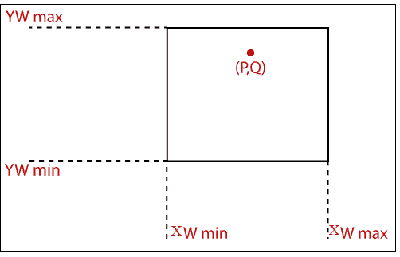

# 点裁剪

> 原文：<https://www.tutorialandexample.com/point-clipping/>

"点裁剪是一个用来定义点位置的过程."该点位于视图窗格(窗口)内或视图窗格外。

在计算机图形学中，计算机屏幕像二维坐标系一样工作。每个点不需要显示在计算机屏幕内。

它包括两个术语-

*   **窗口:**表示显示什么？
*   **裁剪:**表示舍弃窗口之外的部分。

例:让我们有一个视图窗格(窗口)。窗户的坐标是-

窗口 X 轴的 **(xw 最大，xw 最小 ) -**

窗口 Y 轴****(yw最大，yw 最小 ) -****

 **让我们假设一个点坐标(P，Q)。如果点位于窗口内，则不需要执行点裁剪。但是如果点位于窗口之外，我们需要执行裁剪。我们可以通过下面的等式来理解它-

**xwmax<= P<= xwminT5】**

**ywmax<= Q<= ywmin**

有四个条件；如果这四个都满足了，那么重点就在窗口里面。如果任何一个条件都不满足，那么该点位于窗口之外，这意味着我们必须对该点进行裁剪。

**xw min < = P**

**xw max = > P**

**ywminT4】= Q**

**yw max = > Q**

### 点裁剪算法；

**第一步:**首先，我们为窗口设置**xwminT5】和 **xw max** 坐标的值。**

**第二步:**现在，设置给定点的坐标(P，Q)。

第三步:现在检查上述条件。

**第四步:**如果

点坐标位于 **(xw 最小值，xw 最大值 )** 和 **(yw 最小值，yw 最大值 )** 之间

然后

**{** 在视图窗格中显示该点 **}**

目不斜视

**{** 删除点 **}**

**第五步:**停止。**