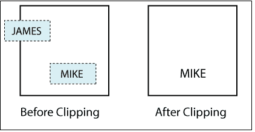
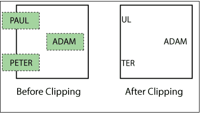
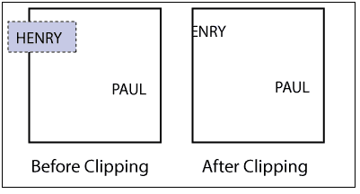
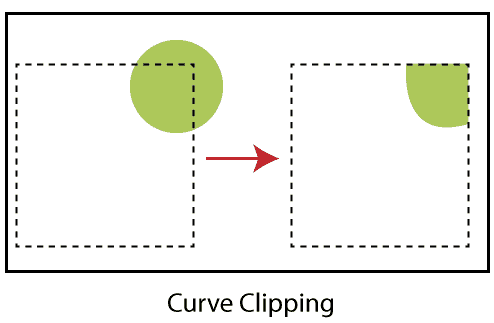

# 文本剪辑

> 原文：<https://www.tutorialandexample.com/text-clipping/>

“文本剪辑是一个过程，在这个过程中，我们删除那些在视图窗格(窗口)之外的字符串部分。”各种方法和技术都可以做文本裁剪。这些技术依赖于字符生成方法。这意味着我们可以根据文本生成技术来选择文本裁剪技术。

### 文本剪辑方法

有以下三种方法来执行文本剪辑。

*   **全部或无字符串裁剪**
*   **全部或无字符剪辑**
*   **文字剪辑**

**全部或无字符串裁剪:**在这种方法中，我们只考虑完全在视图窗格(窗口)内的字符串。我们移除部分或全部在边界之外的字符串。我们将窗口坐标与字符串坐标进行比较。

**全字符或无字符裁剪:**类似于字符串裁剪，但基于字符而非字符串。在这种方法中，我们将字符坐标与窗口坐标进行比较。应考虑以下情况-

1.  如果角色在窗口内，那么我们会考虑。
2.  如果字符完全或部分在窗口之外，那么我们将删除字符。

**文本裁剪:**又称**、【单个字符裁剪】、**或**位图字符裁剪**在这种方法中，我们只考虑那些完全在视图窗格(窗口)内的字符。如果角色的某个部分在视图窗格之外，那么-

1.  我们将删除那些完全在窗口之外的部分。
2.  如果任何字符位于视图窗格边界上，那么我们将移除那些在窗口边界之外的部分。

### 曲线剪辑

这是一个只与非线性方程相关的裁剪过程。曲线裁剪是一个复杂的实现过程。在这个过程中，我们只考虑圆在窗口里面的那部分。我们将丢弃视图窗格(窗口)之外或视图窗格边界上的部分。

### 外部剪裁

外部裁剪是这样一个过程:我们考虑并保存视图窗格(窗口)外部的对象部分，并丢弃窗口内部的部分。这是先前讨论过的剪报的反向过程。

### 外部剪裁的使用

我们可以将外部剪裁用于以下目的-

*   它用于在应用程序中重叠图片。
*   它也用于营销和广告。
*   我们可以在多窗口系统中使用它。
*   外部剪辑有助于设计图片模式。
*   我们可以在出版中使用外部剪辑。
*   我们还可以借助外部剪辑来设计和展示地图和图表。