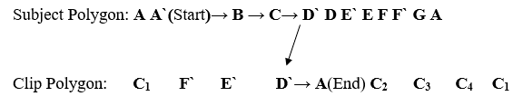

# 计算机图形学中的多边形裁剪

> 原文：<https://www.tutorialandexample.com/polygon-clipping/>

> "多边形可以描述为封闭的线的集合或组."

在多边形中，所有的线都是相连的。线可以是边和顶点的组合，它们共同构成一个多边形。多边形是指由多条直线组成的二维建筑。

**多边形的一些例子:**

1.  三角形
2.  五边形
3.  六边形
4.  四边形

多边形的名称定义了建筑包含的边数。

三角形:它有三条边。

五边形:五边形有五条边。

**六边形:**它包含六个边。

**四边形:**它包含四条边。

### 多边形的类型

多边形有两种基本类型

1.  **凹多边形**
2.  **凸多边形**

**凹多边形:**凹多边形的外部没有任何对角线。在凹多边形中，至少有一个角应该大于 180 度(角度> 180 度)。

**凸多边形:**凸多边形的外部至少有一部分对角线。在凸多边形中，所有的角都应该小于 180°(角<180°)。

### 多边形裁剪

**多边形裁剪**是一个过程，我们只考虑视图窗格或窗口内的部分。我们将移除或剪辑窗口之外的部分。我们将使用以下算法进行[多边形裁剪](https://en.wikipedia.org/wiki/Category:Polygon_clipping_algorithms)

*   **萨瑟兰-霍奇曼多边形裁剪算法**
*   **魏勒-阿泽顿多边形裁剪算法**

### 萨瑟兰-霍奇曼多边形裁剪算法

多边形裁剪算法处理四种不同的裁剪情况。每个案例的输出是下一个案例的输入。

 ****Case1)左侧裁剪:**左侧多边形裁剪中，我们只去掉多边形的左侧部分，在窗口之外。我们只保存窗口内的部分。

**Case2)右侧裁剪:**在右侧多边形裁剪中，我们只去掉多边形的右侧部分，在窗口之外。我们只保存窗口内的部分。

**Case3) Top clip:** 在顶边多边形裁剪上，我们只去掉多边形的顶部，在窗口之外。我们只保存窗口内的部分。

**Case4)底部裁剪:**在底部边多边形裁剪中，我们只去掉多边形的底部部分，它在窗口之外。我们只保存窗口内的部分。

当我们裁剪一个多边形时，应该有以下条件。

**条件 1(Out-In):** 如果多边形的第一个顶点在窗口外，第二个顶点在窗口内，那么输出的将是交点和第二个顶点。

**条件 2(In-Out):** 如果多边形的第一个顶点在窗口内，第二个顶点在窗口外，那么输出的将是交点。

**条件 3(In-In):** 如果多边形的两个顶点都在窗口内部，那么输出的将是第二个顶点。

**条件 4(Out-Out):** 如果多边形的两个顶点都在窗口之外，那么输出将是 nothing。这意味着我们找到了一个裁剪过的多边形。

### 魏勒-阿泽顿多边形裁剪算法

这个算法帮助我们裁剪一个填充区域。填充区域可以是凸多边形或凹多边形。引入该算法来识别可见表面。在某些情况下，该算法有助于创建单独的多边形。在**魏勒-阿泽顿算法中，**我们考虑视图窗格的边界，而不是多边形的边和顶点。

### 魏勒-阿泽顿多边形裁剪算法

**第一步:**首先，创建一个处于开始或结束状态的交点列表。(我 1 ，我 2…… I n )。

第二步:现在，再创建两个列表；一个用于主题多边形，另一个用于剪辑多边形。用多边形的交点和顶点填充这两个列表。

**主题多边形列表顺序-** 在主题多边形列写下多边形的所有顶点。

**裁剪多边形列表的顺序-**记下裁剪窗口的点。

**步骤 3:** 在两个列表中插入顶点，以使交点存在于正确的顶点之间。

**第四步:**现在，从多边形的第一个顶点开始。选择第一个交叉点作为入口点，并遵循相同的过程，直到我们到达出口点。

**第五步:**我们可以从裁剪多边形列表移动到主题多边形列表，搜索结束交点。重复这个过程，直到我们找到进入点。

**第六步:**现在，多边形正在被裁剪。重复相同的过程，直到每个点都被访问一次。

**第七步:**停止。

例:考虑一个顶点为 ABCDEFG 的多边形。应用魏勒-阿泽顿算法寻找裁剪多边形？

**解法:**我们假设 window 的顶点= C 1 ，C 2 ，C 3 ，C 4

多边形的顶点= ABCDEFG

首先，创建两个列表，一个用于主题多边形，另一个用于剪辑多边形。

**迭代 1-**

第一个新列表是- **A `，B，C，d `，a `。**

**迭代 2-**

第二个新列表是- **E `，E，F，F `，F `。**

**说明:**

*   检查 **A** 如果是交点，则从 **A** 开始，否则转到下一步。
*   **A`** 是一个交点( **A`** 将被保存在新列表中)然后检查下一个顶点。
*   **B** 不是新列表中保存的交叉点。然后转到下一步。
*   **C** 也不是交点；将其保存在新列表中，并移动到下一个点。
*   现在，移动到 **D`** ( **D** 是一个交点)。我们跳转到剪辑多边形列表来查找 **D`** 。
*   我们将在下一次迭代中遵循相同的过程。
*   这个过程一直重复，直到我们找到终点。

#### 相关帖子:

*   [文本剪辑](https://www.tutorialandexample.com/text-clipping/)
*   [点裁剪](https://www.tutorialandexample.com/point-clipping/)
*   [计算机图形学中的线裁剪](https://www.tutorialandexample.com/line-clipping/)
*   [计算机图形学中的 2D 缩放](https://www.tutorialandexample.com/2d-scaling/)
*   [计算机图形学中的 2D 翻译](https://www.tutorialandexample.com/2d-translation/)
*   [计算机图形学中的 2D 反射](https://www.tutorialandexample.com/2d-reflection/)
*   [计算机图形学中的投影](https://www.tutorialandexample.com/projection-in-computer-graphics/)
*   [计算机图形学中的动画](https://www.tutorialandexample.com/animation-in-computer-graphics/)
*   [计算机图形学中的颜色模型](https://www.tutorialandexample.com/color-models-in-computer-graphics/)
*   [计算机图形学的应用](https://www.tutorialandexample.com/applications-of-computer-graphics/)**