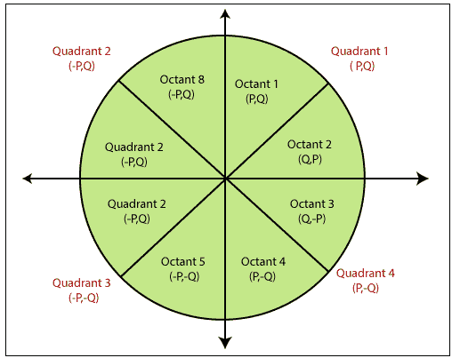
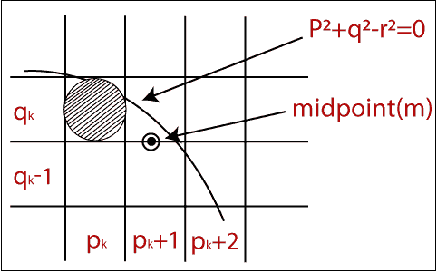

# 计算机图形学中的中点圆绘制算法

> 原文：<https://www.tutorialandexample.com/midpoint-circle-drawing-algorithm/>

**中点画圆算法**帮助我们计算第一个八分圆的完整周长点。我们可以借助第一个八分点快速找到并计算其他八分点的点。其余的点是第一个八分点的镜像。

该算法在[计算机图形](https://www.tutorialandexample.com/computer-graphics-tutorial/)中使用，定义圆光栅化所需的坐标。中点画圆算法有助于我们对圆锥曲线进行概括。 [Bresenham 的画圆算法](https://www.tutorialandexample.com/bresenhams-circle-drawing-algorithm/)也是从中点画圆算法中提取出来的。在算法中，我们将使用 8 路对称性。

在该算法中，我们定义了单位区间，并在每一步中考虑圆边界的最近点。

让我们假设在圆的边界上有一个点 **a (p，q)** 并且半径 **r** 满足方程 **f c (p，q) = 0**

正如我们所知，圆的方程式是

**f c (p，q)= p2+q2= r2……………………………………(1)**

如果

**f c (p，q) < 0**

然后

**点在圆的边界内。**

如果

**f c (p，q) = 0**

然后

**点在圆的边界上。**

如果

**f c (p，q) > 0**

然后

**点在圆的边界之外。**

在图中，我们计算中点 **(m)。**中点出现在**qkT5 和 **q k -1 之间。****

像素的当前位置= **p k +1**

像素的下一个位置= **(p k +1，q k )** 和 **(p k +1，q k - 1)**

现在，我们将计算决策参数 **(d k )**

**d k = (p k +1，qk–1/2)**

现在，我们用等式 **(1)** 替换所有的值

**dk=(pk+1)2+(qk–1/2)2–r2……………………………………T12【2】**

现在，应该有两个条件。

**条件 1:** 如果

**d k 为负**

然后

**中点(m)在圆边界内**

**条件二:**如果

**d k 为正**

然后

**中点(m)在圆边界外**

现在，我们找到 x 坐标的下一个点。然后，

**Pk+1+1 = Pk+2**

**现在，**我们用 **(k+1)** 代替**方程(2)** 的所有值。我们得到-

**dk+1=(pk+1+1)2+(qk+1–1/2)2–r2…………(3)**

现在，我们将会发现

**dk+1–dk= {(pk+1+1)2+(qk+1–1/2)2–r2}–{(pk+1)2+(qk1–1**

**= dk+(2pk+1)+(qk+1**

这里，如果

**dkT3】为负然后**dk+1T7】****

然后

**2pk+11**

否则

**2pk+1+1–2qk+1T5】**

现在，x 和 y 点的下一个坐标

**2pk+1= 2pk+2**

**2qk+1= 2qk–2**

现在，在位置 **(p，q) = (0，r)** 的初始决策参数 **(d 0 )**

我们把 **(0，r)** 放入圆方程，我们得到-

**d 0 = (1，r–1/2)**

**=(1+(r–1/2)2–r2)**

**= 5/4–r**

我们只取整数值**= 1–r**

### 中点画圆算法

**第一步:**开始。

**第二步:**首先，我们分配中心坐标 **(p 0 ，q 0 )** 如下-

**P 0 = 0**

**q 0 =r**

**第三步:**现在，我们计算初始决策参数**d0T5】**

**d0= 1–r**

**第四步:**假设，起始坐标= **(p k ，q k )**

下一个坐标将是 **(p k+1 ，q k+1 )**

现在，我们根据决策参数( **d k 的值)找到第一个八分圆的下一个点。**

**步骤 5:** 现在，我们遵循两种情况-

**情况 1:** 如果

**dkT4】0**

然后

**pk+1T3】=**pk+1****

**qk+1T3】=**qkT7】****

**dk+1= dk+2pk+1+1**

**情况二:**如果

**d k**

然后

**pk+1T3】=**pk+1****

**qk+1T3】=**qk–1****

**dk+1= dk-2(qk+1+2pk+1)+1**

**第六步:**如果中心坐标点 **(p 0 ，q 0 )** 不在原点 **(0，0)** 那么我们将绘制如下的点-

对于 x 坐标=**xc+p0T5】**

对于 y 坐标=**yc+q0{ xcT7】和**ycT11】包含 x 和 y 坐标的当前值 **}******

**步骤 7:** 我们重复步骤 **5** 和 **6** ，直到我们得到 **x > =y.**

**第八步:**停止。

**举例:**圆心坐标为 **(0，0)，**，圆的半径为 **10** 。用中点画圆算法求圆的所有点？

**解决方案:**

**第一步** **:** 给定圆心坐标 **(p 0， q 0 ) = (0，0)**

圆的半径 **(r)** = **10**

**第二步:**现在，我们将确定起始坐标 **(p 0， q 0 )** 如下-

**P 0 = 0**

**q 0 = r(半径)= 10**

 ****步骤 3:** 现在，我们将确定初始决策参数 **(d 0 )**

**d0= 1–r**

**d0= 1–10**

**d 0 = -9**

**第四步:**初始参数**d0T6】0**那么，满足情况 1。

**pk+1T3】=**pk+1 = 0+1 = 1****

**qk+1T3】=**qkT7】=**10******

**dk+1= dk+2pk+1+1 =-9+2(1)+1 =-6**

**第五步:**圆的圆心坐标已经是 **(0，0)。**因此，进入下一步。

**步骤 6:** 我们将执行步骤 4，直到我们得到 **x > = y.**

### 八分圆 1 坐标表

| **dkT3】** | **dk+1T3】** | **(p k+1 ，q k+1 )** |
|  |  | **(0，10)** |
| **-9** | **-6** | **(1，10)** |
| **-6** | **-1** | **(2，10)** |
| **-1** | **6** | **(3，10)** |
| **6** | **-3** | **(4，9)** |
| **-3** | **8** | **(5，9)** |
| **8** | **5** | **(6，8)** |

现在，我们将通过交换 p 和 q 坐标来确定八分圆 2 的坐标。

| **八分圆 1 的点** | **八分点 2 的点数** |
| **(0，10)** | **(8，6)** |
| **(1，10)** | **(9，5)** |
| **(2，10)** | **(9，4)** |
| **(3，10)** | **(10，3)** |
| **(4，9)** | **(10，2)** |
| **(5，9)** | **(10，1)** |
| **(6，8)** | **(10，0)** |

因此，我们可以为所有象限找到圆的所有坐标。

| **象限 1 (p，q)** | **象限 2 (-p，q)** | **象限 3 (-p，-q)** | **象限 4 (p，-q)** |
| **(0，10)** | **(0，10)** | **(0，-10)** | **(0，-10)** |
| **(1，10)** | **(-1，10)** | **(-1，-10)** | **(1，-10)** |
| **(2，10)** | **(-2，10)** | **(-2，-10)** | **(2，-10)** |
| **(3，10)** | **(-3，10)** | **(-3，-10)** | **(3，-10)** |
| **(4，9)** | **(-4，9)** | **(-4，-9)** | **(4，-9)** |
| **(5，9)** | **(-5，9)** | **(-5，-9)** | **(5，-9)** |
| **(6，8)** | **(-6，8)** | **(-6，-8)** | **(6，-8)** |
| **(8，6)** | **(-8，6)** | **(-8，-6)** | **(8，-6)** |
| **(9，5)** | **(-9，5)** | **(-9，-5)** | **(9，-5)** |
| **(9，4)** | **(-9，4)** | **(-9，-4)** | **(9，-4)** |
| **(10，3)** | **(-10，3)** | **(-10，-3)** | **(10，-3)** |
| **(10，2)** | **(-10，2)** | **(-10，-2)** | **(10，-2)** |
| **(10，1)** | **(-10，1)** | **(-10，-1)** | **(10，-1)** |
| **(10，0)** | **(-10，0)** | **(-10，0)** | **(10，0)** |

### 中点画圆算法的优势

*   这是一个强大而有效的算法。
*   中点画圆算法容易实现。
*   也是基于简单圆方程**(x2+y2= r2)的算法。**
*   该算法有助于在光栅显示器上创建曲线。

### 中点画圆算法的缺点

*   这是一个耗时的算法。
*   有时候圆的点并不准确。

#### 相关帖子:

*   [椭圆的扫描转换计算机图形](https://www.tutorialandexample.com/scan-conversion-of-an-ellipse/)
*   [扫描转换一个圆的计算机图形](https://www.tutorialandexample.com/scan-conversion-of-a-circle/)
*   [计算机图形学中的 Bresenham 圆绘制算法](https://www.tutorialandexample.com/bresenhams-circle-drawing-algorithm/)
*   [计算机图形学中的画线算法](https://www.tutorialandexample.com/line-drawing-algorithm/)
*   [计算机图形学中的 DDA 画线算法](https://www.tutorialandexample.com/dda-line-drawing-algorithm/)
*   [计算机图形学中的三维旋转](https://www.tutorialandexample.com/3d-rotation/)
*   [计算机图形学中的 2D 旋转](https://www.tutorialandexample.com/2d-rotation/)
*   [计算机图形学教程](https://www.tutorialandexample.com/computer-graphics-tutorial/)
*   [计算机图形学中的投影](https://www.tutorialandexample.com/projection-in-computer-graphics/)
*   [计算机图形学中的动画](https://www.tutorialandexample.com/animation-in-computer-graphics/)**