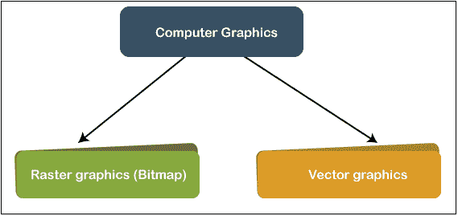
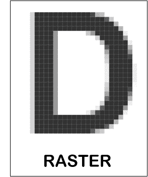
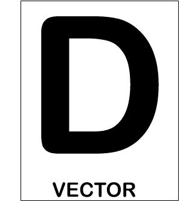

# 计算机图形的类型

> 原文：<https://www.tutorialandexample.com/types-of-computer-graphics/>

**计算机图形的种类**

计算机图形学包含两种类型。他们是-

*   **光栅(位图)图形**
*   **矢量图形**

许多人可能会考虑计算机(或手机、平板电脑或其他具有图片界面的电子设备)上的图片，而不担心图形如何在计算机设备上处理和显示。当你只是一个图形用户时，这很好，但是对于所有想要构造或修改计算机图形图像的人来说，注意图像的特定设计是很重要的。

### 光栅(位图)图形

如果您曾经捕获或下载过数字图片，您可能对光栅图形很熟悉；即使你没有意识到，这就是数码照片。

通过将图形域视为矩形并将矩形分割成某种二维小像素阵列，光栅表示一幅图像。

**例如-** 高分辨率数码相机生成的图像也可能包含 4128 像素和 3096 像素的水平和垂直尺寸，使得整个图像为 4128 x 3096 = 12，780，288 像素。每个像素描述了该级别图像的标准像素值。(光栅图形通常需要大量的像素，但是设备非常擅长处理大量的对象！).**T3】**

这里，我们有一个图像来表示位图图形。

如果你放大上面的图像，你可以看到图像的每个像素。您现在可以在这里看到像素的边界，并测量它们以确保图片实际上是 16x16 像素(包括顶点处的白色像素)。放大的图片实际上看起来杂乱无章，但由于图片通常不会在这个缩放阶段显示，它足以作为一个图标使用。

在某些情况下，位图图像中有几个像素，就像数码照片一样，我们的眼睛在常规显示尺寸下无法识别它们，因此您将图片视为色调的恒定集合。

在没有可见损失的情况下，位图图形包含的“分辨率”会降低图片的放大倍数。图像质量越好的图形分辨率越高。由于光栅图像文件通常很大，能够以某种方式聚合像素图表是有益的，但有几种非常著名的方法可以做到这一点。缺点是图片显示得越差，应用的饱和度就越多。JPEG(由合作摄影专家小组开发的标准)是最著名的标准之一，旨在方便您向数码照片添加可变的失真量。

**比如——Photoshop、Paint 等。**

### 光栅(位图)图形的优势

*   通过存储在内存空间序列中的现有像素信息来构造光栅文件是很简单的。
*   还可以检索存储在光栅文件中的像素信息，同时使用坐标集合来以网格形式表征信息。
*   如果可用，像素值可以单独更改，也可以通过更改渐变作为一个大集合来更改。
*   光栅图形可以很好地转换为外部设备，如 CRT 和打印机的专色格式。

### 光栅(位图)图形的缺点

**<u>矢量图形</u>**

构建数字图片的最佳关键是编制一个解释如何描绘图片的命令列表，然后将该列表保存为图像文件。机器感知每个命令，并在文件打开时重新绘制完整的图像，通常作为演示用的位图。这种机制被称为光栅化。

对于要产生的图形图像来说，这似乎是一种过于复杂的方法。矢量图形有几种规范，其中一些规范(例如 AI、CDR)已经申请了专利。SVG(可伸缩矢量图形)是一个更加开放的矢量图形标准，它变得非常有名。矢量格式文件可以通过用文本编辑器(如记事本)软件打开来访问。

如今，矢量图像通常被放置在图形文件格式中，如 SVG、EPS、PDF 或 AI，这与更传统的光栅图像格式(如 JPEG、PNG、APNG、GIF 和 MPEG4)有着内在的区别。

**比如——Corel Draw，Adobe Illustrator 等。**

### 矢量图形标准

可缩放矢量图形(SVG)是万维网联盟(W3C)的矢量格式规范。规范是复杂的，并且由于商业实体的原因，至少在某些部分，其发展极其缓慢。现在，对于在许多互联网浏览器上显示 SVG 信息，已经有了一些帮助，但是完整的标准实现仍然相对少见。

SVG 似乎是近几十年来一种基本的完全独立于渲染系统的分辨率，通常是打印机或显示监视器。本质上，矢量格式文档是说明直线和曲线路线以及其他属性的可定制文本。对于基本地图、线图、盾徽和旗帜等通常不像图片或其他常量图片的照片，我们更喜欢 SVG。渲染 SVG 包含位图格式转换，分辨率适合当前任务。SVG 也是动画图像的媒介。

对于智能手机，还有一种可缩放矢量图形的变体。智能手机的基本格式通常被称为 SVGT (SVG 微型版)。这些图形可以计算连接，也可以处理抗锯齿。它们也可以显示为壁纸。

### 矢量图形标准

通常，矢量图像编辑器允许转换，旋转，镜像，拉伸，倾斜，仿射变换，广义的 z-顺序移位，什么在什么前面以及图元被组合成更复杂的对象。封闭曲线上的集合活动(并集、差集、交集等)。)提供了更复杂的转换。矢量图像非常适合需要独立于设备或不需要获得一系列图片的基本或混合设计。

例如，基于矢量的图形模型用于 PostScript 和 PDF 页面描述语言。

### 光栅图形和矢量图形之间的转换

将矢量图形转换成光栅图像是经常需要的，而且更少。因此，将光栅图像转换成矢量图形。

每当您试图显示矢量文件的内容时，矢量图像到光栅的转换一直在发生。当您访问矢量文件并将轮廓创建到它为您显示的临时位图中时，该消息包括文档的命令。

需要软件应用程序将光栅图像转换为矢量图像。通常，这种方法称为“跟踪”几年前，你必须有额外的补偿跟踪应用程序，但大多数矢量绘画软件现在提供设计跟踪功能。顾名思义，通过“在光栅的轮廓周围绘制草图”,描摹技术进行操作，从而形成描述图片的图案和轮廓。该程序的效果是一个数学曲线的集合，表示由程序生成的矢量图像。

### 矢量图形的优势

*   矢量文件很小，因为它们比位图图像文件包含的信息少。
*   矢量图像比位图图形更通用，因为图形保真度可以快速上下增加而没有任何损失。
*   与矩形、基于像素的位图图形相比，矢量图像文件具有更清晰的线条，因此比具有直线和流动曲线的光栅图像更清晰。

### 矢量图形的缺点

*   当矢量图像有微小缺陷时，这些缺陷会在矢量图像被大幅放大时显示出来。
*   静态颜色或渐变通常由矢量图像加载。综合图片(照片)属性不能作为位图图形查看。