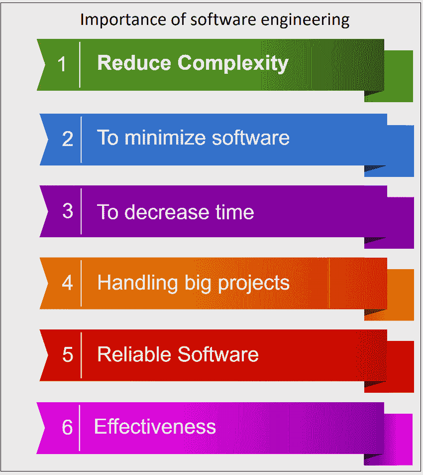
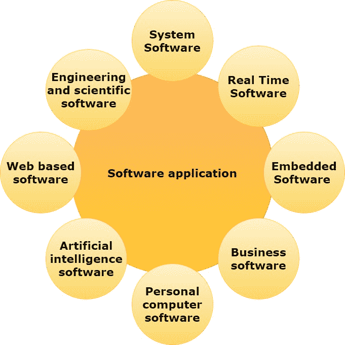

# 软件工程教程

> 原文：<https://www.tutorialandexample.com/software-engineering-tutorial/>

该软件已经成为人类努力的几乎所有领域的进步的关键。编程艺术已经不足以构建大型程序。许多软件产品的成本、及时性、维护和质量都存在严重的问题。

软件工程旨在通过生产高质量的软件来解决这些问题，这些软件在预算之内并且按时维护。我们必须关注产品的质量和体面地生产产品的过程。

### 什么是软件工程？

术语**软件工程**由两个词组成，**“软件”**和**“工程”**

术语**软件**是指程序的集合。

**工程学**是科学的应用。它有助于使用科学原理和方法开发产品。

### 定义

> 软件工程是对软件的设计、开发和维护的完整研究。

> 一种旨在生产高质量软件的方法，该软件在预算内按时交付并满足需求。

### 为什么需要软件工程？

出于以下原因需要软件工程

*   用于管理大型软件。
*   以提高可伸缩性。
*   控制软件的动态特性。
*   为了更好地管理性能

### 对软件工程的需求

对软件工程的需求是由于用户需求的高速发展和程序运行的环境而产生的

*   **大型软件-** 做一面墙比做一栋房子或建筑容易，因为编程的尺度是广泛的，工程需要一个步骤给它一个科学的过程。
*   **成本 -随着硬件行业证明了自己的技能，大规模制造降低了电脑硬件的成本。然而，如果不采用适当的程序，编程的成本仍然很高。**
*   ******动态特性-** 编程的持续性和可伸缩性高度依赖于客户端的工作环境。如果软件的质量不断变化，就必须对现有的软件进行新的升级。****
*   ******质量管理**——一个更好的软件开发过程提供了一个更好质量的软件产品。****
*   ******适应性-** 如果软件过程没有遵循科学和工程，那么创造新的软件会比当前的软件更容易。****

 ****### 软件工程的重要性

**下面给出一些软件工程的重要性:**

*   **降低复杂性-** 大型软件总是复杂而富有挑战性的才能取得进展。为了减少任何项目的复杂性，软件工程有一个很好的解决方案。软件工程把大问题分解成不同的小问题。然后继续逐一解决每个小问题。所有这些小问题都单独处理。
*   **最小化软件成本-** 软件需要大量的艰苦工作，软件工程师要用大量的代码来开发程序。在软件工程中，程序员投射一切，剔除一切不必要的东西。另一方面，与任何不使用软件工程方法的软件相比，软件生产的成本更低。
*   **减少时间-** 如果你在做软件，那么你需要运行多个代码才能得到一个特定的代码。如果处理不好，这是一个非常耗时的过程。所以如果你是按照软件工程的方法开发软件，那么花费的时间会更少。
*   **处理大项目- 大项目不是几天就能完成的，需要大量的耐心、计划和管理。该公司提供了许多资源与计划，并需要完成。因此，为了顺利处理一个大型项目，公司需要寻找一种软件工程方法。**
*   ******可靠的软件-** 软件必须安全。也就是说，如果您提供了软件，它必须在特定的时间内运行。如果软件有任何错误，公司负责解决所有这些错误。该公司将处理测试和维护过程。****
*   ******有效性-** 有效性发生在某件事情已经按照规范实现的时候。技术规范是组织提高效率的主要目标。因此，借助于软件工程，软件变得更加成功。****

 ******### 软件特征

**软件的一些基本特征如下:-**

**1)** **软件不会磨损-** 硬件产品的生命周期有三个阶段。

*   **初始阶段—**初始阶段是老化阶段，故障强度很高。该产品将在交付前接受行业测试。由于测试和修复故障，故障强度最初会下降，并可能在特定时间后稳定下来。
*   **第二阶段-** 第二阶段是有用寿命阶段，此阶段失效强度近似恒定，称为产品的有用寿命。
*   **磨损阶段-** 再过几年，由于部件磨损，失效强度会增加。这个阶段被称为磨损阶段。重要的一点是，随着时间的推移，软件变得可靠，而不是磨损。如果开发它的环境改变了，它就不再被使用了。因此，软件可能由于环境变化、新的需求、新的期望等而退役。

**2)软件不是制造出来的** -计算机软件的生命周期是从发现创意到软件产品退役。这是一次性的开发工作和持续的维护工作，以保持其可操作性。制作 1000 份拷贝不是问题，也不需要任何费用。就硬件产品而言，由于原材料和其他加工费用，每件产品都要花费我们的成本。我们不必在软件开发中组装生产线。因此，它不是在经典意义上产生的。

**3** ) **组件的可重用性-** 如果我们必须制造一些东西，我们可能有标准的质量指南和有效的流程来生产高质量的产品。技术方面，每个项目都是新项目。我们从零开始，设计软件产品的每一个单元。开发软件需要巨大的努力，这进一步增加了软件产品的成本。然而，已经做出努力来设计可用于新项目的标准组件。软件可重用性增加了另一个领域，被称为基于组件的软件工程**。**

**4)软件的弹性——**我们都觉得软件是弹性的。该软件可以被配置成做几乎任何事情。有时候，这些特征可能是最好的，可以帮助我们适应任何变化。然而，大多数时候，这种“几乎任何事情”的特性使得软件开发难以计划、监控和控制。由于计算机代码危机，这种不可预测性是过去 30 年来一直被关注的基础。

### 软件分类

软件已经成为人类生活大多数领域中不可或缺的一部分。软件应用分为八个方面。

**1** ) **系统软件**——这类管理和控制计算机系统内部功能的软件。它是一组为其他程序有效使用它提供服务的程序，例如驱动程序、编译器、操作系统等。

**2)** **嵌入式软件-** 这类软件放置在产品的“只读存储器(ROM)”中，控制产品的各种功能。结果可能是飞机、汽车、安全系统、信号系统、发电厂的控制单元等。嵌入式软件监控硬件组件。它也被称为智能软件。

3)商业软件- 这种类型的软件广泛应用于管理和控制财务活动具有最高优先级的领域。商业系统的主要组成部分是工资、库存和会计软件，它允许用户从数据库中访问相关数据。这些活动通常在特定商业软件的帮助下进行，这些软件为商业运作和管理决策提供了一个有效的框架。

**4)个人电脑软件-** 本软件用于公务和个人使用。在过去的二十年里，从简单的文本编辑器到标准的文字处理器，个人电脑软件市场已经发展壮大。无论是数据库管理系统、财务会计软件包，还是基于多媒体的软件，这个软件几乎在每个领域都被广泛使用。它被证明是一个用于日常应用的通用工具。

**5)** **实时软件—**这类软件可以观察、分析和控制现实世界中发生的事件。一般来说，实时系统确保在规定的时间内对外部事件做出响应。实时软件的一个例子是天气预报软件，它收集和处理诸如室外环境的温度和湿度的参数来预报天气。世界各地的国防组织大多使用实时软件来控制他们的军事硬件。

**6)人工智能软件-** 这种类型的软件在解决问题的技巧不是算法的时候使用。这类问题的解决方案通常不符合简单的计算或分析。相反，这些问题需要特定的故障排除策略，包括专家系统、模式识别等。此外，这些是不同类型的研究技术，包括使用启发式。人工智能软件的作用是给机械硬件增加一定程度的智能，以快速完成工作。

**7)基于网络的软件–**这种类型的软件充当用户和互联网之间的接口。互联网上的数据以链接到超链接的文本、音频或视频格式存在。网络浏览器是检索网页的软件。该软件结合了用专门的脚本语言如 CGI 或 ASP 编写的操作指令。除了提供互联网浏览，该软件还支持其他有用的功能。

8)工程和科学软件- 这类软件已经成为研发下一代技术的强大工具。该软件旨在对实时环境中获得的复杂数字数据进行精确计算。

### **程序对软件**

 **软件不仅仅是一个程序。软件包含用于设置和实施软件系统的程序、文档和步骤。**程序**是软件的子集，只有准备好文档和操作程序手册才能成为软件。程序是源代码和目标代码的组合。

## 软件工程

*   [简介](/software-engineering-tutorial/)
*   [SDLC](/sdlc-in-software-engineering/)

## SDLC 模型

*   [敏捷模式](/agile-model-in-software-engineering/)
*   [大爆炸模型](/big-bang-model-in-software-engineering/)
*   [增量模式](/incremental-model-in-software-engineering/)
*   [迭代模型](/iterative-model-in-software-engineering/)
*   [原型模型](/prototype-model-in-software-engineering/)
*   [RAD 型号](/rad-model-in-software-engineering/)
*   [螺旋模型](/spiral-model/)
*   [V 型车](/v-model/)
*   [瀑布模型](/waterfall-model-in-software-engineering/)

## 软件管理

*   [项目管理](/project-management/)
*   [项目管理活动](/project-management-activities/)
*   [项目管理工具](/project-management-tools/)

## 软件度量

*   软件度量
*   面向大小的度量
*   [软件质量度量](/software-quality-metrics)
*   [霍尔斯特德的软件指标](/software-engineering-halsteads-software-metrics)
*   功能点分析
*   [面向对象的矩阵](//object-oriented-metrices-in-software-engineering)
*   扩展功能点(EFP)指标
*   [数据结构指标](//data-structure-metrics-in-software-engineering)
*   信息流度量
*   圈复杂度
*   软件度量的案例工具
*   [整体设备效能](/overall-equipment-effectiveness)
*   [一些重要的质量指标](/some-important-quality-metrics)

## 计划图编制

*   [软件项目策划](/software-project-planning/)
*   估价
*   [成本估算模型(COCOMO)](/constructive-cost-model-cocomo/)
*   普特南资源分配模型

## 风险管理

*   风险管理
*   风险管理活动

## 软件需求

*   软件需求规范
*   需求分析
*   数据流图
*   数据字典
*   实体关系图

## 软件配置

*   [软件配置管理](/software-configuration-management/)
*   供应链管理流程
*   软件质量
*   保证
*   [项目监控](/project-monitoring-and-control/)

## 软件质量

*   软件质量
*   ISO 9000 认证
*   seicom
*   PCMM
*   六西格玛

## 软件设计

*   软件设计
*   软件设计原则
*   耦合和内聚
*   面向功能的设计
*   面向对象的设计
*   用户界面设计

## 编码

*   编码
*   程序设计式样
*   结构化程序设计

## 软件可靠性

*   软件可靠性
*   软件故障机制
*   软件可靠性度量技术
*   软件可靠性度量
*   软件容错

## 模型

*   软件可靠性模型
*   杰林斯基和莫兰达模型
*   基本执行时间模型
*   GO 模型
*   穆萨-奥库本对数模型

## 软件维护

*   软件维护
*   软件维护问题的原因
*   软件维护成本因素

## 系统设计

*   [系统设计策略](/strategies-for-system-design)
*   [系统设计中的缓存](/caching-in-system-design)
*   [负载平衡器-系统设计](/load-balancer-system-design)

## 混杂的

*   [通过负载平衡器路由请求](/routing-requests-through-load-balancers)************