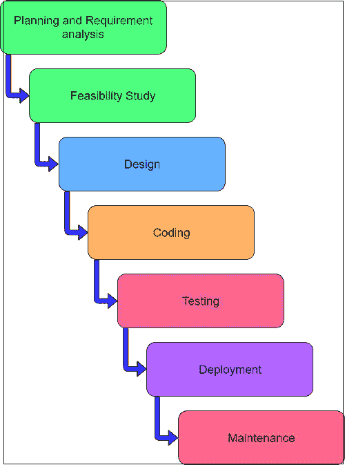

# 软件工程中的 SDLC

> 原文：<https://www.tutorialandexample.com/sdlc-in-software-engineering/>

### SDLC

**SDLC** 代表软件开发生命周期。它是软件生命周期的图形和图解表示。生命周期模型代表了将软件集成到程序中所需的所有技术。它还提供了执行这些方法的框架。

换句话说，从开始到退休，各种活动的地理生活的视觉表现都是在计算机系统上进行的。不同的生命周期可能以不同的方式决定不同领域的适当发展活动。因此，没有任何元素遵循生活的模式，生活中包括基本活动，尽管这些活动可能在不同的生活水平下以不同的方向进行。在任何生命周期中，也可以执行一个以上的活动。

SDLC 是用于开发软件的过程。SDLC 的目标是生产满足客户期望的高质量软件。软件开发应该在指定的时间和成本内完成。

### **SDLC 的需求**

【SDLC 对于软件开发至关重要，原因如下:-

1.  SDLC 帮助分析开发软件的需求和成本估算。
2.  它为开发者系统化地制作了所有的过程。
3.  它给出了做什么和什么时候做的想法。
4.  它降低了产品故障的几率。

### **SDLC 阶段**

1) **规划和需求分析**

规划阶段反映了项目的目标，这些目标是在需求收集阶段收集的。它包括确定完成项目所需的具体活动和资源，并计划完成这些目标所需的步骤。

需求分析是软件开发生命周期中最重要的一步。业务分析师从客户那里收集需求。客户的需求记录在业务需求规范中。

业务分析师和项目组织者与客户召开会议，收集客户想要的所有数据，谁将是最终用户，产品的目的是什么。在制造产品之前，对产品的核心理解或知识是必不可少的。

2) **可行性研究**

在这一阶段，项目团队希望回答一些关键问题。外汇-该项目能否按时完成，它可以在现有的预算内完成，这是为这个特定的项目预留的。此外，以你现有的员工。内部专家来做这种项目，或者你不得不雇用外部承包商。如果你有内部的专业知识，这是一个定制类型的软件。您是继续与内部员工一起构建它，还是有一个现有的软件包，您可以自己购买来满足您的需求。

3) **设计**

下一步是带来完整的需求和分析知识，并设计一个软件产品。从用户那里收集的信息是这一阶段的输入。这个阶段的结果以两种设计的形式出现；逻辑设计和物理设计。

4) **编码**

在 SDLC 的这个阶段，真正的开发开始了，编程也完成了。软件设计的实现始于用适当的编程语言编写代码和有效地开发无错误的可执行程序。

5) **测试**

当软件被开发时，它被测试来满足软件的需求，这在需求阶段被提到。开发人员一边编码一边做软件测试，专家也在不同的层面做，比如模块测试、程序测试、产品测试、内部测试、用户终端测试。

6) **部署**

部署阶段旨在使开发的软件在实际环境中运行。当产品经过全面测试并被业务部门接受后，它就被部署到操作环境中。

7) **维护**

通过根据用户环境或技术随时间的变化更新代码来维护软件。在这个阶段，挑战可能来自隐藏的错误和未知的现实问题。