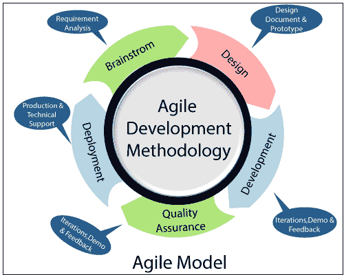

# 软件工程中的敏捷模型

> 原文：<https://www.tutorialandexample.com/agile-model-in-software-engineering/>

敏捷方法获得了迭代或增量过程模型的特征。通过工作软件的及时交付，更加关注过程适应性和客户满意度。敏捷方法将项目分割成小的迭代，这些迭代不直接涉及长期规划。项目的范围和要求是在开发过程的开始确定的。关于迭代次数、持续时间和每个迭代的范围的计划已经被清楚地定义了。每次迭代被认为是一个很短的周期，称为一个帧，通常持续一到四周。每次迭代都由跨职能团队组成，他们在不同的领域一起工作，例如:-

*   规划
*   需求分析
*   设计
*   发展
*   质量保证
*   部署

在迭代结束时，向客户和重要的涉众展示一个工作产品。

### 敏捷模式的运作

敏捷模型认为，每个项目都需要以不同的方式来满足项目需求，当前的方法应该改变。在 Agile 中，任务被划分为多个时间段，为发布提供特定的功能。

在敏捷中，任务被划分成时间框架(更短的时间框架)来交付特定的、可变的任务。采用迭代方法，并且在每次迭代之后交付操作软件的构造。每一次构建在特性方面都是递增的；最终版本包含客户要求的所有功能。

敏捷思维过程在软件开发的早期就开始了，并且因为它的灵活性和适应性而逐渐流行起来。

### 敏捷模型的优势

1.  这种模式鼓励团队合作和交叉培训。
2.  可以快速开发功能。
3.  需要更少的规划。
4.  灵活。
5.  所需资源较少。

### 敏捷模型的缺点

1.  稳定性、稳定性和可扩展性的风险更大。
2.  有太多的个体依赖性，因为生成的文档很少。