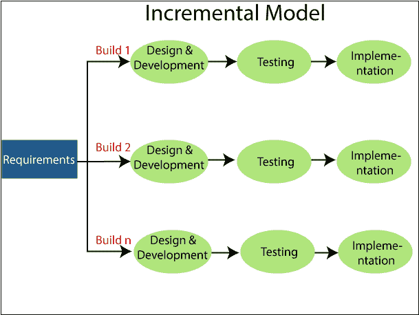

# 软件工程中的增量模型

> 原文：<https://www.tutorialandexample.com/incremental-model-in-software-engineering/>

增量模型是一个软件开发过程，其中需求被分成几个独立的软件开发模块。在这个例子中，每个模块都经历了需求、设计、开发、实现和测试阶段。该模块的后续版本在先前版本的基础上增加了一项功能。该过程将继续，直到完成整个软件。

### 增量模型的阶段

**需求分析**

在增量模型的第一步中，产品分析专家识别功能性需求和非功能性需求。在渐进方法下开发软件时，这个阶段起着重要的作用。

**设计&开发**

在 SDLC 增量模型的这个阶段，系统功能和开发方法的设计已经成功结束。当软件开发新的实用性时，增量模型使用设计和开发阶段。

**测试**

 **在增量模型中，测试阶段检查每个现有功能以及附加功能的性能。在测试阶段，使用不同的方法来测试每个任务的行为。

**实施**

在实现阶段，编码是为了开发软件。在设计阶段进行的软件设计现已实际实施，并完成了最终编码。完成这一过程后，产品工作的质量将得到提高，并升级到最终的系统产品。

### 增量模型的优势

1.  错误很容易被发现。
2.  易于测试和调试。
3.  灵活。
4.  易于管理风险，因为它是通过迭代来管理的。
5.  客户端在早期阶段就被提供了重要的功能。

### 增量模型的缺点

1.  它需要很好的计划。
2.  总成本高。
3.  它需要定义良好的模块接口。**