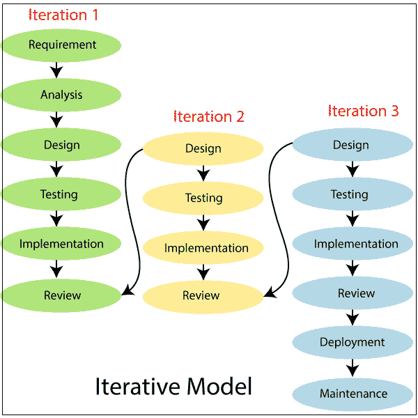

# 软件工程中的迭代模型

> 原文：<https://www.tutorialandexample.com/iterative-model-in-software-engineering/>

该模型包含与瀑布模型相同的阶段，但是限制较少。一般来说，这些阶段的发生顺序与瀑布模型中的顺序相同，但是这些阶段可以在几个循环中进行。一个可重用的产品在周期结束时发布，每个版本提供额外的功能。

**迭代模型的各个阶段**

**需求和分析阶段**

在这个阶段，从客户那里收集需求，并由分析师进行检查，以确定需求是否得到满足。分析师检查在预算内应该或不应该实现什么。所有这些之后，软件团队进入下一个阶段。

**设计**

在设计阶段，团队用数据流图、活动图、类图、状态转移图等不同的图来设计软件。

**实施**

在实现阶段，编码完成，转换成完整的软件。

**测试**

完成编码阶段后，软件测试开始使用各种测试方法。测试方法多种多样，但最常见的是白盒测试、黑盒测试和灰盒测试方法。

**部署**

完成所有步骤后，软件就部署到它的工作环境中了。在这个阶段中，在产品部署之后，执行评审阶段来检查所开发产品的行为和有效性。

**回顾**

在这个阶段中，在产品部署之后，执行评审阶段来检查所开发产品的行为和有效性。如果发现错误，该过程将重新开始检查。

**维护**

在维护阶段，软件在工作环境中部署后可能会出现一些 bugs 需要一些错误或新的更新。维护包括调试和新的附加选项。

 **### 迭代模型的优势

1.  许多特性可以在生命周期中快速开发。
2.  结果会定期快速收到。
3.  在短时间的迭代中，测试和调试很容易。
4.  更改范围/要求的成本更低。
5.  适合大型项目。

### 迭代模型的缺点

1.  需要更多的管理关注。
2.  风险分析需要高效的资源。
3.  由于不断变化的要求，项目完成日期尚未确定。**