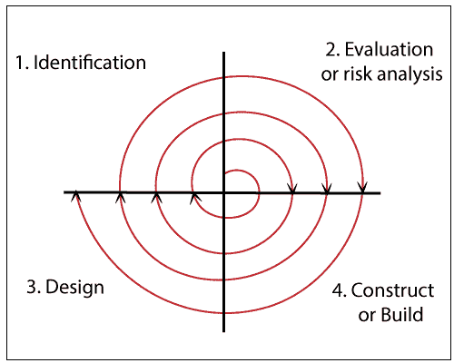

# 螺旋模型

> 原文：<https://www.tutorialandexample.com/spiral-model/>

传统软件过程模型的问题是它们不能充分处理软件项目固有的不确定性。主要的软件项目都失败了，因为项目风险被忽视了，当一些意想不到的事情发生时，没有人准备好。Barry bhm 认识到了这一点，并试图将“项目风险”因素整合到生命周期模型中。其结果是 1986 年提出的螺旋模型。

模型的径向维度表示模型的累积成本。螺旋周围的每一条路径都是成本增加的标志。角度表示每个循环完成的进度。从 x 轴开始的螺旋的每个循环代表一个阶段。一个阶段大致分为四个重要活动的主要部分:

### 螺旋模型设计

在螺旋模型中，软件项目重复地经历这些迭代，这被称为螺旋。螺旋模型有四个阶段。

### 识别

这个阶段从初始螺旋中业务需求的积累开始。产品成熟后，螺旋决定了这个阶段的系统需求、子系统需求、单元需求。

这个阶段还包括通过客户和系统分析员之间的持续交流来理解系统需求。在螺旋的末端，产品被投放到市场。

### 设计

设计阶段从基本螺旋的概念设计开始，涉及建筑设计、组件的逻辑设计、材料的物理设计以及相应螺旋的最终设计。

### 建造或建造

构建阶段是指在每一个螺旋上生产真实世界的软件产品。在基线螺旋中，当产品被概念化，设计被开发，POC(概念验证)在这个时候被开发以接收客户反馈。

随后的螺旋是更清晰地定义设计需求和规范，一个叫做 build 的软件包被生成并带有一个版本号。这些构建被发送给最终用户以获得反馈。

### 评估和风险分析

风险分析包括识别、测量和监控技术和管理问题，如时间管理和成本超支。在测试构建之后，在初始迭代的末尾，客户评审软件并提供反馈。

基于客户的输入，项目的实现开始下一阶段的分析，并根据客户的反馈采取战略性的方法。可持续发展信息流程贯穿于项目的整个生命周期。

### 螺旋模型的优点是

1.  可以适应需求的变化。
2.  它允许原型的广泛使用。
3.  需求可以更清楚地记录下来。
4.  开发可以分解成更小的部分，风险区域可以更早地开发，这有助于更好地管理风险。

### 螺旋模型的缺点是

1.  项目结束可能不会很快知道。
2.  管理比较复杂。
3.  价格昂贵。
4.  不适合小项目。
5.  这种螺旋可能会无限期地继续下去。
6.  大量的中间阶段需要过多的文档。