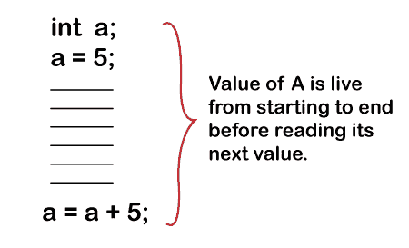
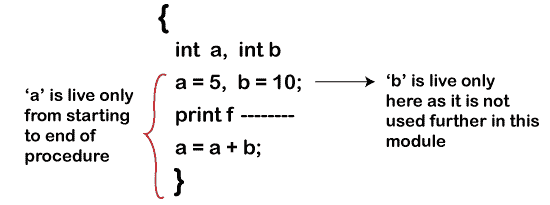
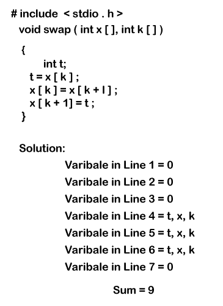
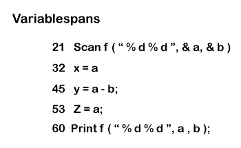
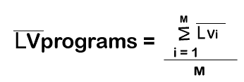
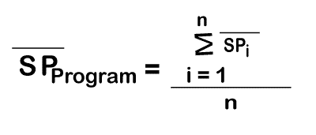
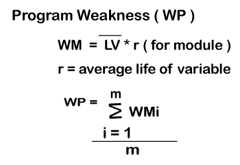

# 数据结构度量

> 原文：<https://www.tutorialandexample.com/data-structure-metrics-in-software-engineering>

在规模度量中，我们已经学会了通过各种软件度量来测量/确定程序的规模，例如代码行数、函数数和令牌数。

程序也是由数据组成的，因此有必要测量程序的数据。科学家们引入了数据结构度量来测量程序的数据。

数据结构度量基于预先存储的数据(**输入、内部和输出数据**)。

比如——软件是基于软件规划器来设计的。软件计划者计划制作软件需要多少团队、多少努力和多少成本。软件规划器提供以下数据:

## **软件策划**

| **输入数据** | **内部数据** | **数据输出** |
| 程序尺寸 | 每个开发人员的费用 | 项目工作 |
| 开发人员数量 | 其他因素 | 项目完成持续时间 |
| 软件持续时间 |   | 开发商的预计成本 |

都是关于数据的；我们必须找出“如何以最好的方式安排(链接)哪些数据”，假设有两个软件规划者(A 和 B)拥有输入、内部和输出数据，并找到 VARS(变量计数)。

VARS =变量计数

n 2 = VARS +唯一常数+标签

**N2= N1V1+N2V+N3V3+N4C1+N5C2+N6L.....**

n 个 2 个和 n 个 2 个参数是稳健的和最好的，总而言之，所有的计算都在软件中进行。

甚至算法和计算的变化都可以用它们毫不费力地计算出来。

定义- ***“作为输入，在软件中处理并产生输出的数据总量称为数据结构度量。”*T3】**

大多数数据度量关注的是每个模块中的变量和常数，而不是输入/输出相关性。

很少有指标只关注输入/输出情况。

在数据结构中，我们将讨论以下与数据相关的要点。

*   测量的数据量
*   模块内数据的使用
*   模块之间共享数据的程度。

**模块内数据的使用**

在这里，我们了解了数据在模块本身中是如何使用的。

> *活变量——“如果某个变量保存了将来需要的值，或者该值可能在下一次写入变量之前被读取，则该变量在某个点上是活的。”*

> ***“一个变量在一个模块或过程或程序中从它的第一次引用到它的最后一次引用都是活的。*T3】**

例如:假设在一个程序中变量被声明为类似' **x 【T1 . '的名字分配给 **x** 变量的值将保持有效，直到添加另一个值。**

关于活变量一些误解是:-

*   一个变量从开始到程序结束都是活的。

例如:在这个程序中，声明了两个变量(

int a，int b 其中 a = 5，b= 10)。

我们可以从头到尾读取变量' a '，但是变量' b '在程序中只活一次(在声明的时候)。

所以这种说法是错误的；从过程开始到过程结束，变量不需要保持生命。

*   当一个变量在语句之前或之后被赋予一个特定的数字时，那么在这个特定的语句中它被认为是一个活变量。**例如**，假设我们必须在像 print f(....).我们跟踪变量 above 和 below 语句来打印 f，所以这个语句也是错误的。

 **求活变量的平均数？

**LV =每条语句活变量的计数之和/可执行语句的计数。**

举例:求一个活变量的平均数？

## **可变跨度**

变量跨度是一个捕捉“一个变量在一个程序中使用的频率”的指标程序或程序模块的生命周期称为它的跨度(SP)。

跨度的大小表示在连续使用变量之间传递的几个语句。

**N 个语句← n-1 个跨度。**

**例如:**

这是一个程序代码，从第 21 行到第 60 行，包含了活动变量 a 和 b。在第 21 行到第 60 行之间的语句不处理 a 和 b 变量。

“a”变量的引用数= 5

“b”变量的引用数= 3

因此，变量“a”使用得更多。

**平均跨度(SP)**

**平均跨度=有活变量的行之间的差异/行的总数。**

平均跨度 a = 10，12，7，6 = 35/4

“b”的平均跨度= 23，14 = 37/2 = 18.7

### **将知识(公式)应用于程序**

 

### **程序弱点**

## 如何跟踪软件度量？

众所周知，软件度量在软件开发过程中起着骨干作用。

他们帮助软件开发团队跟踪软件开发，设定新的目标，并测量软件的性能。

尽管有这些优点，软件度量会分散软件开发人员对目标的注意力，例如交付有用的软件和提高客户满意度。

软件度量的数据收集更加重要，因为软件工作是基于收集的数据完成的。

软件度量工作应该精确地完成，以便软件开发团队可以更好地为软件工作，并且不会在创建代码/源代码时产生任何问题。因此，软件度量应该有一些特征，如:-

*   准确可靠
*   适应性和校准
*   必须是可计算的和简单的
*   一致(因为它使用一致的测量单位)和明确
*   度量必须独立于编程语言
*   轻松、经济地获得高质量的软件产品

软件度量中这些特征的存在可以保证向客户交付高质量的软件。

正因为如此，自动测量和跟踪指标的软件开发平台是必不可少的。

但是对于软件开发团队来说，有太多数据用于度量的重大风险会导致错误。

因此，从技术上讲，了解如何收集、计算和报告软件度量数据变得至关重要。一些要点描述了如何跟踪或者适当地使用软件度量。

**1。软件度量与目标相关联**

为了达到软件的标准质量，软件开发团队要实现特定的目标。

因此，像减少代码行、消除一些报告的错误、增加任务完成时间和一些软件迭代这样的软件度量与诸如提高软件有用性和用户体验这样的目标相关联。

例如，LOC(代码行)度量是基于大小的软件度量，指示编码复杂性或软件效率。

LOC 用于度量源代码行数，使开发人员降低复杂度，简化功能。

因此，为了降低复杂性，软件开发人员用很少的代码编写更多的功能来实现目标。

因此，它指出，为了实现一个特定的目标，软件开发团队选择软件度量并使度量与这些目标一致。

**2。跟踪趋势，而不是数字。**

软件度量的结果是简单的数字，很容易比较。这些结果数字对于管理层来说是必不可少的，因为它们使得宣布成功获得度量软件目标变得容易。

当软件开发团队没有达到这些设定的数字时，它声明它没有达到目标。这些明确的目标并不反映软件度量的趋势。

趋势线在特定方向上的移动表明了该过程在特定方向上的进展。趋势告诉我们过程中的任何变化对进度的影响。

**3。设置较短的测量周期。**

当软件开发团队立刻度量软件时，可能会导致无法达到目标。

为了解决这个问题，软件开发团队将度量周期分成更小的时间框架，以确定软件度量工作得有多好。

通过设置更短的管理周期，提供更具体的数据点，这些数据点不仅可以提前达到度量软件目标，还可以提前达到软件开发目标。

**4。不要使用这种不会带来进步的衡量标准。**

使用软件度量的主要焦点应该是软件的改进，但是当重复的行为没有导致解决错误的变化时，那么目标就没有实现。

如果软件开发人员一直做同样的事情，而这并没有让他们更接近目标，这反映出他们关注的是不会导致任何变化的软件度量。

因此，软件开发和管理团队必须关注这些朝着目标和改进前进的度量标准。**