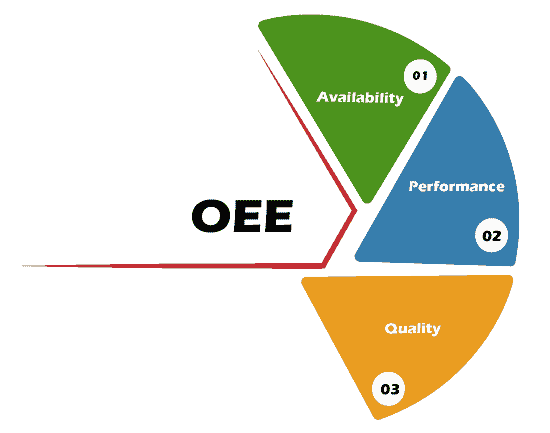
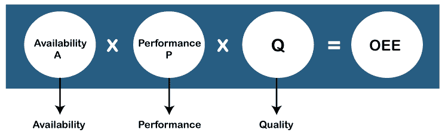

# 整体设备效率

> 原文：<https://www.tutorialandexample.com/overall-equipment-effectiveness>

## 总体设备效率(OEE)

总体设备效率是一种软件开发度量，用于诊断产品或机器的生产效率和效能。

OEE 这个术语是由 **Seiichi Nakajima San** 在**20 世纪 60 年代**引入的，用来评估制造业务(这些业务的利用效率)。

OEE 不是一种测量工具，但它是一种诊断工具，用于监控和改进制造流程的有效性，包括装配线、制造单元和机器。

OEE 是精益制造计划和全面生产维护( **TPM** )中的关键指标。它还有助于实现“零缺陷生产”，并为持续改进提供必要的输入。

## **OEE 的关键因素**

*   有效性
*   表演
*   质量

**可用性**–可用性是操作时间与计划生产时间的比率。它说明了总可用机器中用于生产的机器的实际可用性。

**可用性=运行时间/计划生产时间**

 **运行时间=计划生产时间-停工时间

**可用性=可用时间-停机时间/可用时间**

 **停机时间=损失时间、故障、维修、转换和设置调整等。

例如，机器班次为 12 小时，其中 1 小时为计划停工，1 小时为非计划停工，因此实际生产时间为 10 小时，因此

**可用性:实际运行时间/总可用时间= 12/ 10 = 0.83**

 ****性能** :-性能是净运行时间与运行时间的比值。性能完全取决于机器的速度。

**性能=(理想周期时间*总件数)/运行时间**

 ****或**

 ****性能效率=运行时间-性能损失/运行时间。**

 ****损失=空转或小幅度停止和减速**

 **例如:-对于 10 小时的实际生产时间，按照标准周期时间，机器可以生产 1000 件，但它只生产 800 件，因此

绩效:实际生产数量/计划产量

**800/1000 = 0.80**T2】

**质量** :-质量是生产的好件与生产的总件数的比率。它回答，“在生产过程中生产出多少质量好的材料？”.

**质量=生产的良好单位/生产的总单位**

 ****或**

 ****质量=生产时间-质量损失时间/生产时间**

 ****或**

 **质量=总数量。生产–缺陷数量/生产总量

 ****损失-启动不合格品和生产不合格品**

 **例如:在实际生产的 800 件中，760 件质量良好(客户可接受)，20 件不合格，20 件返工

质量=合格件数/总生产数量

质量= 760/ 800 = 0.95

因此，机器可用率为 83%，性能为 80%，质量为 95%，但现在设备的总体效率是多少？

## **如何计算 OEE？**

**OEE =可用性*性能*质量**

**OEE = 0.83 * 0.80 * 0.95**

 ****OEE = 0.63 = 63%**T2】

## **设备整体效能的目的和益处**

*   确定六大损失

OEE 的主要目的或目标是识别和减少全员生产性维护(TPM)的六大损失

制造业中基于设备的生产率损失的最常见原因是 SSSMCB (6 大损失)

| 质量 | 英语字母表的第 19 个字母 | 废料损失 |
| 质量 | 英语字母表的第 19 个字母 | 启动损失 |
| 表演 | 英语字母表的第 19 个字母 | 速度损失 |
| 表演 | 英语字母表中第十三个字母 | 小规模停工 |
| 有效性 | 英语字母表中第三个字母 | 转换 |
| 有效性 | 英语字母表的第 2 个字母 | 故障 |

通过这六个重大损失，我们可以了解我们机器中当前的重大损失。这些损失对机器有重大影响；因此，有了这个，我们就可以测量它们，控制它们，并且很快地把它们降下来。

.

*   它有助于降低质量成本
*   提高工厂生产率
*   停机成本降低
*   成为市场上最高效的制造商
*   提高劳动效率
*   降低了维修成本

## **用于提高 OEE 的方法**

 **数据收集是提高 OEE 的基础，这分为三个阶段。

1.  **收集机器上所有停机时间和损失的数据。**

 **机器中发生的所有变化都集中在这个:

*   因维修引起的变化
*   转换调整
*   工具更换
*   小规模停工
*   报废、返工
*   **数据分析和可视测量**

 **在这种情况下，将对数据进行分析并划分优先级。确定贡献最大的因素，并对该因素采取行动。我们还可以监控整体设备效率的趋势。

*   **让改进看得见，并实施**

 **在这种情况下，动作被实现并且是可见的。动作可以是这样的:-

*   标准化
*   改善
*   标准化工具
*   转换还原
*   预防性维修
*   自主维护
*   提高机器可靠性************************************