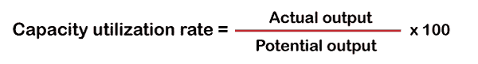
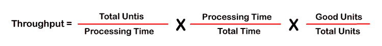
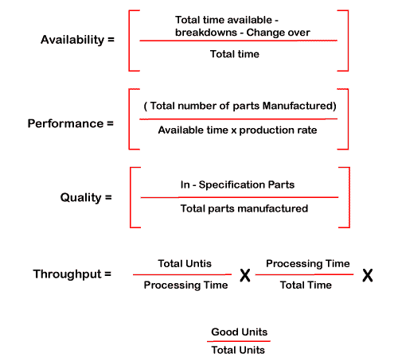
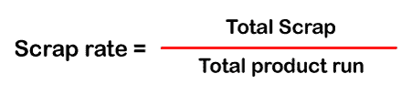
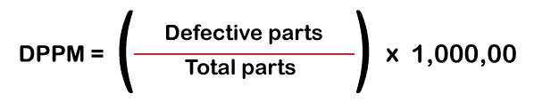
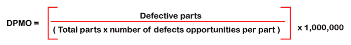
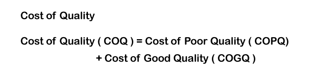

# 一些重要的质量指标

> 原文：<https://www.tutorialandexample.com/some-important-quality-metrics>

## 重要的质量指标

最好的软件质量必须通过各种软件质量度量才能达到质量标准。质量主管应该考虑这些度量来监控软件质量，达到质量目标并尽可能地提高质量。

**1)软件动态效率**

动态效率是执行软件所需的 CPU 周期总数。它还测量 CPU 的速度和准确性。

**2)静态效率**

静态效率=执行任务所需的字节数。字节与 RAM 和 ROM 的大小有关。"变量和程序代码使用了多少字节."

随机存取存储器决定全局变量和运行时堆栈。

只读存储器决定了程序代码的固定常数。

**3)功耗:**测量嵌入式系统中软件消耗的功率。

**4)正确性**

正确性度量度量嵌入式系统中程序源代码的准确性和正确性。

**5)通俗易懂**

这衡量软件(在微控制器上使用)易于理解或与嵌入式系统兼容的程度。

**6)易于更换**

软件必须是灵活的，并且在嵌入式系统中具有可维护性特征，因为它在软件中快速地做出改变。

> **注**:动态、静态和功耗是衡量嵌入式应用软件质量的重要参数。

**7)** **维护指标**

这是软件质量维护的一个度量。用于维护的度量标准被命名为 SMI –{软件成熟度指数},由 IEEE std。1988 年 982.1。它是产品稳定性的指标。稳定性是指软件在新版本更新前后在市场上的运行状况。用于维护的软件指数说明了市场上软件的稳定性。

计算 SMI 的标准公式为:

**SMI =[MT–(Fa+Fc+Fd)]/MT**

**MTT3】=当前版本的模块总数(软件更新后的模块数)**

**FcT3】=模块更新后变更的模块数。**

**FaT3】=更新后新增模块数。**

**F d**

> 注意:该值达到 1.0 时，产品的稳定性增加。

例如，让我们假设，

M T = 100，Fa+Fc+Fd= 30

SMI = 100–30/100 = 70/100 = 0.7 < 1.0

因此软件质量很好，更新后非常稳定。如果该值小于 0.1，那么软件对于维护来说是不稳定的。还有许多其他指标属于维护指标，如:

*   通用维护指标
*   资产绩效指标
*   运营指标
*   库存指标

最常见的维护 KPI 围绕关键要素，如停机时间、成本、支出、安全和合规性、库存管理、效率、工作订单管理等。因此，维护度量量化了管理的日常活动，并对市场上的软件质量进行评分，因为它可视化了资产和人员对产品的工作情况。

**8)** **产能利用率**

产能利用率有助于战略规划，并表明产品的市场需求。它计算任何给定点已用总输出容量的百分比。

**9)交付指标**

交付指标基于两个衡量客户满意度和效率百分比的指标。

*   POM(完美订单指标)–该指标衡量准时到达/无损坏的订单的百分比。完全正确的发票。

很难实现良好的完美顺序度量的范围。

*   OTD(准时交货)-它告诉多少百分比的单位交付在准时交货。

**10)供应商质量指标**

供应商在质量成本中起着重要的作用。一些供应商质量指标是:-

*   **供应商退款**–这些是向供应商收取的不合格材料的费用，包括延迟交付和工资成本。
*   **供应商不良率**–供应商方的不良材料不符合客户方的产品质量。
*   **来料供应商质量**–符合质量要求的物料的百分比。

**11)吞吐量**

吞吐量是给定时期内生产的产品数量的结果。它可以针对每台机器、生产线和整个工厂进行测量。

**12)整体设备效率(OEE)**

整体设备效率是衡量产品可用性、质量和性能的标准。

**OEE =可用性 x 质量 x 性能**

OEE 是监控和提高流程效率的有效方法。它是一个诊断工具，因为它只是诊断问题，而不是提供解决方案。这是一个 KPI，用于衡量机器的效率以及与有效机器性能的偏差。

OEE 的目标是减少六大设备损失。

*   设备故障
*   设备设置和调整
*   轻微停工
*   减速的问题
*   启动废料
*   生产废料

这些目标分为几类:-可用性损失、性能损失和质量损失。

**13)废品率**

废品率是永远不会成为成品一部分的材料的结果。各种软件唯恐当成废品。它还计算制造一件产品所浪费的时间。

**14)顾客投诉和退货**

客户投诉和退货指标设定了一个基准数据点，并专注于现有产品的持续改进。它还有助于为新产品设定新目标。

收集和解决客户投诉有多种方法，如电子邮件、客户服务中心、现场服务团队、电话或直接投诉。如今，社交媒体是一个收集关于产品的负面和正面评论的蓬勃发展的平台。

通过衡量客户服务绩效来解决客户投诉。

用于衡量客户服务绩效的指标。

1.  客户保持率
2.  首次响应时间
3.  客户满意度得分(CSAT)
4.  客户努力得分(CES)
5.  客户服务放弃率
6.  平均解决时间
7.  情感分析
8.  分辨率
9.  净推介值(NPS)

客户退货指标计算为退货率。

回报率=退货数量/售出数量。

**15)缺陷**

缺陷可以用两种方法计算

*   **百万分之几的缺陷零件(DPPM)**

例如:-假设 1000 件货物中有 25 件有缺陷。所以，25 /1000 = 0.25 有缺陷。

DPPM = 0.025 x 1000000 = 25000 PPM

*   **每百万机会中的缺陷(DPMO)**

DPMO 是对流程绩效和流程出错率的长期衡量。它也被称为每百万次机会中的不符合项(NPMO)。

**例如，对于 DPMO，乘以 100 万**

缺陷数量= 7

单位数量= 50

每单位的缺陷机会数= 4

DPMO = 7/ 50 * 4 *1000000 = 35000

在这里，当生产 100 万个订单时，通过犯缺陷或错误产生 35，000 个机会。

DPMO = 0(可能的最佳工艺)

DPMO = 100 万(最糟糕的过程)

**16)质量成本**

这是一个最重要的衡量标准，它反映了质量的实际成本，即质量好的成本和质量差的成本的组合。

软件，质量差的成本(SCOP)是由于内部或外部故障，如报废、缺陷到达客户、产品责任、返工、重新检验、保修、更正或删除、品牌声誉损失、产品责任。

高质量软件成本(SCOG)包括评估成本和预防成本，如质量审计、校准、检查和测试、质量规划、培训和统计过程控制。

