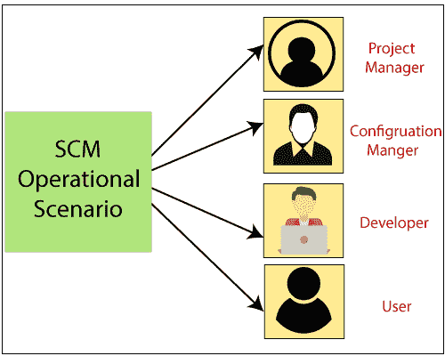

# 软件配置管理

> 原文：<https://www.tutorialandexample.com/software-configuration-management/>

**软件配置管理**

软件配置管理的过程包含诸如在软件开发生命周期中控制、管理和组织源代码、文档和其他基本组件的操作。SCM 对于所有的项目管理活动都是必不可少的。供应链管理的目标是以更少的错误提高生产率。

**配置管理的需求**

软件开发是一个涉及许多人和分支的过程，工作根据团队分配给个人。

*   SCM 需要改变用户需求、政策、预算和进度。
*   软件应该是独立于平台的。
*   供应链管理有助于保持利益相关者之间的沟通。

**SCM 流程的成员**

以下是供应链管理的参与者:

*   配置管理器
*   开发者
*   听者
*   项目管理人
*   用户

**配置经理** -配置经理，是软件项目的负责人，负责识别配置项。配置经理确保团队是否遵循 SCM 过程。

**开发人员-** 开发人员编写代码，并根据客户的要求对代码进行修改。维护代码的配置是开发人员的责任。开发人员还会监控更改并解决错误。

 **审核员- 审核员是负责 SCM 审核和评审的人。审计员在软件发布前确保软件的一致性和完整性。

 ****项目经理—****项目经理在软件处于开发阶段时监控软件的进度，并观察 SCM 过程中的问题。项目经理创建一份软件进度报告。他确保团队成员在开发和测试软件时遵循所有的过程。项目经理确保软件在给定的时间内开发出来。**

 ****用户-** 用户必须理解 SCM 术语，以知道他拥有最新版本的软件。

**软件配置管理流程**

供应链管理的流程如下

**配置识别-** 配置识别有助于制定在软件开发过程中有用的指南，以及检查软件文档和设计所需的指南。

**软件配置控制-** 软件配置控制负责管理软件开发生命周期中的变更。关于项目所必需的变更或修改的决定，由配置控制委员会(CCB)做出。大多数时候，CCB 会听取软件开发过程成员的建议。

**软件配置状态统计-** 软件配置状态统计(SCSA)包括信息的记录和报告，是配置管理所必需的。

 ****软件配置审计-** 软件配置审计是一个对工作产品进行分析的过程，用于确定具有适当规格的性能，包括某些标准、合同协议和其他因素。它决定了元素满足必要的物理和功能特性的程度。审核过程中涉及的项目有

*   所有操作都由软件正确执行。
*   文件流程是否完成。

**报告-** 它在管理指南、用户指南、安装指南、配置指南等的帮助下，向开发人员、测试人员、最终用户、客户和利益相关者提供关于当前状态和配置数据的信息。********