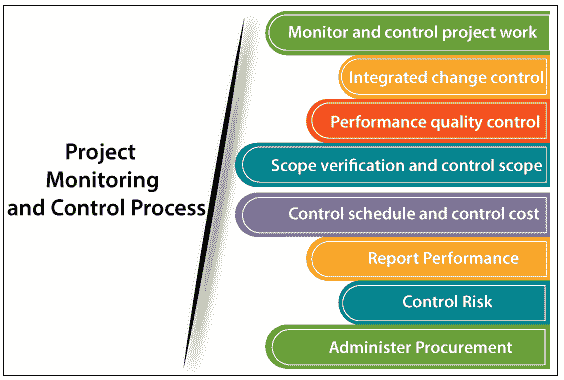

# 项目监测和控制

> 原文：<https://www.tutorialandexample.com/project-monitoring-and-control/>

**项目监控**

项目监测和控制过程包括观察项目绩效的程序，以便识别潜在的问题，并采取适当的措施满足项目的预期绩效。项目监测和控制活动与项目开发过程并行。

项目监控(PMC)的目标是确保项目是否按照计划的活动进行。它有助于发展对项目进展的理解，这有助于采取适当的行动来控制计划的偏差。

**项目监控过程**

**项目监控有以下几个过程:-**

**监控项目工作-** 有助于检查团队是否按照计划工作，是否能够按时完成项目。项目经理在项目开发过程中定期制定绩效衡量标准或使用以前的绩效衡量标准来分析项目绩效。

**集成变更控制-** 项目经理，总是尽量避免变更，如果发生变更就控制。变革是必须的，但不是强制性的。如果需要变更，项目经理会与顾问、高级管理人员或其他利益相关者(包括客户)进行讨论，并尝试找出解决方案。

**范围验证和控制范围-** 项目经理在整个开发阶段控制范围。客户将验证范围，以检查开发的产品是否满足客户的所有要求。如果它满足需求，那么它就被交付到客户的站点，如果不满足，那么它应该再次回到开发阶段。

**控制进度和控制成本-** 在挣值管理(EVM)的帮助下，项目经理控制项目的进度和成本。在挣值管理(EVM)的帮助下，项目经理控制项目的时间和成本，并根据 CPI(成本绩效指数)和 SPI(进度绩效指数)的结果监控项目。

**执行质量控制-** 在将产品交付给客户之前，对开发的产品进行再次验证，以检查我们交付给客户的产品是否达到了要求的质量。有很多质量工具和过程来检查产品的质量，如根本原因分析、排列图、控制图、直方图等。

**报告绩效–**大型项目会有许多利益相关者。项目经理将向利益相关者更新项目绩效。此流程收集绩效信息，如状态报告、进度报告和预测。

**控制风险–**项目经理还监控项目涉及的风险。项目可能有不同类型的风险，包括过程、人员(内部、客户、供应商)、工具和技术。

**管理采购-** 如果任何流程被移交给第三方，他们的表现也应受到监控。根据他们的表现，决定项目的结果。项目经理还需要监控第三方的角色和责任。

**过程监控的好处**

*   它有助于更好地控制项目
*   它提供了对项目进度的深入了解。
*   它有助于保持团队成员之间的协调。
*   它有助于监控和管理项目过程。