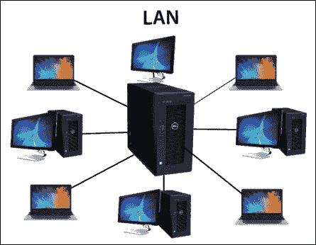
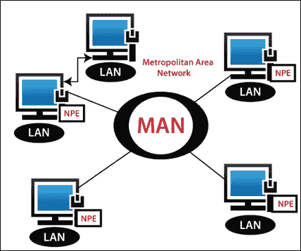
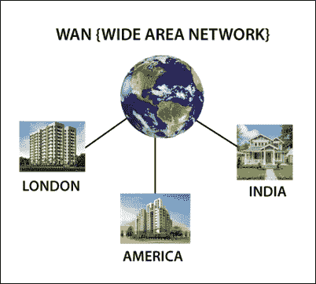

# 计算机网络类型:局域网、城域网、广域网和广域网

> 原文：<https://www.tutorialandexample.com/types-of-computer-network/>

### 潘:**个人局域网**

PAN 代表**个人局域网**。它是为非常短的距离( **1 到 10 米**)设计的，比如一个单间。这种类型的网络也可以无线连接到互联网。PAN 网络最好的例子是**移动热点**和**蓝牙。**如下图所示。

### PAN 网络的优势

1.  它降低了硬件成本。
2.  它可以非常快速地连接设备。
3.  它非常安全。

### PAN 网络的缺点

1.  在 PAN 网络中，传输速度很慢至中等。
2.  PAN 网络具有有限的范围。

### 局域网:**局域网**

LAN 代表**局域网**。局域网是私有网络。它是为小范围的区域设计的，如**大楼、办公室和工厂**。局域网被广泛用于共享资源，如**打印机、数据、**等。设计和解决问题很简单。下图所示。

工作站和个人电脑通过局域网连接。它可以使用不同类型的拓扑，如**星形、树形、总线形、环形、**等。

### 局域网的优势

1.  它提供了更高的安全性。
2.  它具有成本效益。
3.  它很容易转换成数据和消息。
4.  它提供高数据传输速率。

### 局域网的缺点

1.  必须打开电源才能使局域网有效工作。
2.  安全性并不总是 100%得到保证。
3.  建立网络更费时间。

### 城域网

MAN 代表**城域网**。城域网是局域网的延伸。它被设计用于扩展地理区域(**通常是一个城市或城镇**)。这种类型的网络比局域网大，比广域网小。它使用与局域网相似的技术。单一的私营公司和上市公司主要经营城域网。城域网最好的例子是**电视网**。下图所示。

### 城域网的优势

1.  与 LAN 网络相比，MAN 网络覆盖的区域范围更大，例如整个城市或城镇。
2.  城域网中使用的双总线有助于双向传输数据。

### 城域网的缺点

1.  从一个位置到另一个位置建立一个 MAN 网络需要更多电缆。
2.  安全地管理系统并不容易。

### 万:**广域网**

WAN 代表**广域网**。它被设计用于扩展地理区域，例如覆盖州或国家。它的设计和维护非常复杂。广域网使用的通信媒介是 PSTN ( **公共交换电话网**)或**卫星链路**。广域网最好的例子是互联网。下图所示。

### 广域网的优势

1.  它覆盖了更大的地理区域，比如国家。
2.  它被用来随时随地发送快速信息。
3.  它允许您连接工作站以共享资源和软件。

### 广域网的缺点

1.  它是昂贵的。
2.  安全性低(黑客或其他外部威胁带来的不安全)
3.  管理和维护 WAN 网络是一项非常复杂的任务。
4.  它需要投资一个好的防火墙系统来避免黑客的干扰。