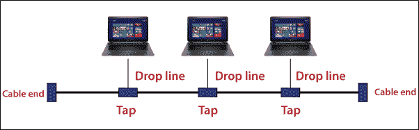
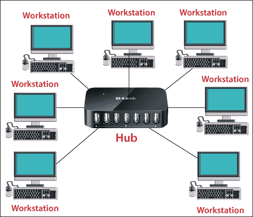
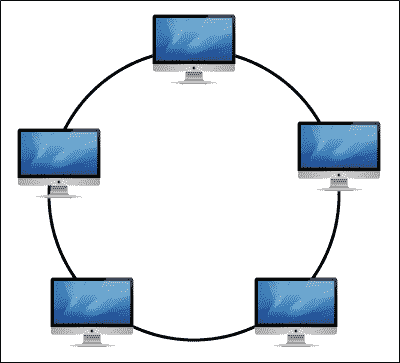
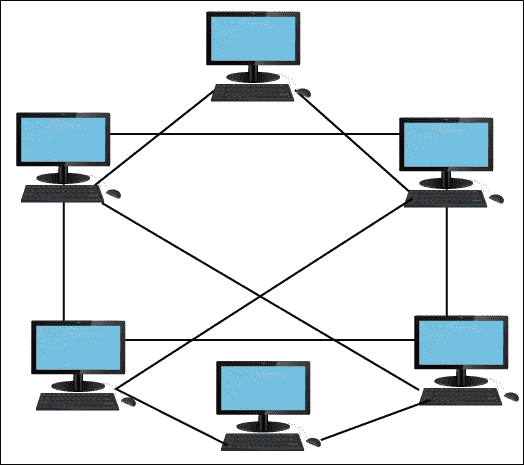
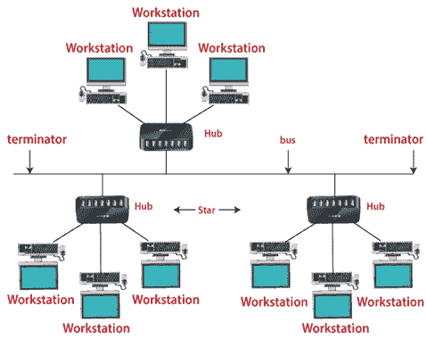
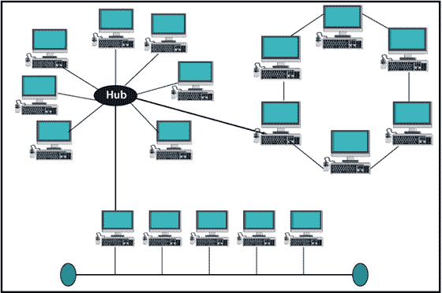

# 计算机网络拓扑结构:总线、星形、环形、树形和混合式

> 原文：<https://www.tutorialandexample.com/network-topology/>

**网络拓扑**:计算机网络拓扑是指网络上相连设备的布局。网络拓扑是计算机或网络设备互连到另一设备的组合。

**网络拓扑的重要类型。**

*   总线拓扑
*   星形布局
*   环形拓扑
*   网状拓扑
*   树形布局
*   混合拓扑

### 总线拓扑

在总线拓扑中，所有计算机设备都通过一根称为主干电缆的电缆连接。每台设备都直接与主干电缆互连。与其他拓扑相比，总线拓扑易于安装。它只向一个方向发送数据。下图所示。

**总线拓扑的优势**

1.  安装非常简单。
2.  与其他拓扑相比，连接设备所需的电缆更少。
3.  性价比很高。

**总线拓扑的缺点**

1.  复杂的重新配置和故障检测。
2.  如果主干电缆出现任何故障，所有传输都会停止。

### 星形布局

在星型拓扑中，网络中的所有设备都连接到一个中心设备，称为**交换机**或**集线器**或**主机**。主机直接连接到每台设备。主机控制所有设备。它使用点对点连接。下图所示。

如果一台设备希望向另一台设备发送数据，它必须先将数据发送到主机，然后主机再将数据发送到另一台设备。主机充当数据流的中继器。

**星型拓扑的优势**

1.  在星型拓扑中，需要的电缆较少，因为每台设备只需连接到主机或集线器。
2.  排除故障很简单。
3.  如果一台设备出现故障，那么只有该设备会受到影响，其余所有设备都处于活动状态。
4.  易于检测故障设备，因为设备易于识别。

**星型拓扑的缺点**

1.  整个系统依赖于主机。如果主机出现故障，那么整个网络都会出现故障。
2.  使用起来很贵。

### 环形拓扑

在环形拓扑中，没有主机或控制计算机。所有设备以环形网络结构连接；每台计算机都与其附属设备相连。它也被称为环形拓扑。下图所示。

如果一台设备希望向另一台设备发送数据，它会向一个方向发送数据，环形拓扑中的每台设备都有一个中继器，如果接收到的数据是给另一台设备的，中继器会发送该数据，直到该设备接收到该数据。

**环形拓扑的优势**

1.  易于安装。
2.  由于没有主机或控制计算机，这种拓扑结构的工作效率更高、更可靠。
3.  易于检测故障设备，因为设备易于识别。

**环形拓扑的缺点**

1.  一台设备可能导致整个网络出现故障。
2.  它的速度取决于网络中安装的计算机。如果计算机数量较少，则速度较高，如果计算机数量较多，则速度较低。

### 网状拓扑

每台计算机设备都通过网状拓扑中的专用点对点连接与网络上的所有其他设备相连。如果路由中的电缆损坏，节点将无法通信。一个设备必须与 **(n-1)** 设备连接。

在网状拓扑中，如果我们必须连接 n 台计算机，我们需要 **(n*(n-1) / 2)** 电缆或连接。下图所示。

**网状拓扑的优势**

1.  它非常健壮。如果任何人的联系被破坏，他们不能影响其他人。
2.  它提供了更多的隐私和安全性。
3.  它提供了设备之间的专用连接。
4.  检测故障很简单。

**网状拓扑的缺点**

1.  所需的导线数量和 I/O 端口数量非常大。
2.  网状拓扑比其他拓扑昂贵得多。
3.  很难安装和配置。

### 树形布局

树形拓扑结合了**星形和总线拓扑**的特点。它有一台类似星形拓扑的主机，一根电缆像总线拓扑一样连接所有设备。这种拓扑将网络分为多个级别。它也被称为**层次拓扑。**下图所示。

 **

**树形拓扑的优势**

1.  如果子设备出现故障，只有该设备受到影响，所有其他设备保持活动状态。
2.  在树形拓扑中，扩展网络很容易。
3.  它为单个设备提供点对点布线。
4.  纠错和检错都很容易。

**树形拓扑的缺点**

1.  树形拓扑比其他拓扑更昂贵。
2.  如果一个节点出现故障，那么故障排除就变得很困难。
3.  树状拓扑中使用了大量的导线。

### 混合拓扑

当两个或多个拓扑用于创建新拓扑时，称为混合拓扑。混合拓扑综合了各种拓扑的优点和缺点。下图所示。

**混合拓扑的优势**

1.  如果网络出现任何故障，很容易找到其故障设备。
2.  这是一种可扩展的拓扑结构，很容易扩展。
3.  混合拓扑对大型企业很有用。
4.  它比其他拓扑更可靠，但同时也是一种昂贵的拓扑。

**混合拓扑的缺点**

1.  安装和配置比其他拓扑复杂。
2.  这是一种非常昂贵的拓扑结构。
3.  设计混合拓扑的架构具有挑战性。**