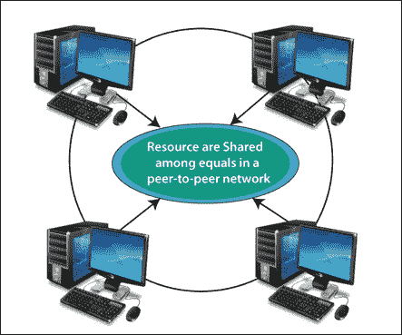
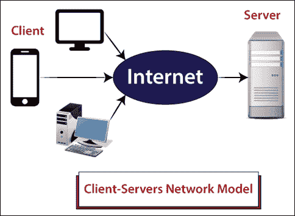

# 计算机网络体系结构

> 原文：<https://www.tutorialandexample.com/computer-network-architecture/>

**计算机网络架构**:计算机网络架构是将所有计算机组织在一个计算机网络中的设计。该体系结构定义了计算机必须如何相互通信，以从计算机网络中获得最大利益，例如更好的响应时间、安全性、可扩展性、传输数据速率、连接性等。

有两种最流行的计算机网络体系结构。

1.  **对等网络**
2.  **客户端-服务器网络**

### 对等网络

在对等网络中，每台计算机充当其客户端和服务器，即，它可以执行请求和响应。对等网络没有专用服务器，但是所有计算机都充当存储在其中的数据的服务器。

对等网络是这样一种网络，所有计算机都使用与其他计算机相同的资源和权限。其网络主要是为小的本地区域设计的。

下图描述了一个对等网络，每个计算机网络都充当客户端和服务器。

**对等网络的优势**

1.  **成本更低:**没有专用服务器，因此网络成本更低。
2.  **简单设置&维护:**设置和维护简单。
3.  不需要网络管理员。

**点对点网络的缺点**

1.  安全是这个网络上的另一个问题，因为恶意软件可以很容易地通过网络传播。
2.  对于超过“10”个用户来说，它通常不能很好地工作。
3.  一旦电脑崩溃或自动关机，我们就无法访问共享数据。

### 客户端-服务器网络

在客户机-服务器网络中，一台中央计算机充当集线器，称为服务器，所有其它计算机称为客户机。客户端-服务器网络有专门的服务器提供商。所有共享数据都存储在服务器中，当客户端计算机发出请求时，服务器将与客户端计算机共享这些数据。服务器负责管理所有数据，如文件、目录、打印机等。所有客户端都通过服务器连接。

下图描述了客户端-服务器网络。

### 客户机-服务器网络的优势

1.  客户端-服务器网络的安全性更好，因为服务器管理共享资源。
2.  客户机-服务器网络在专用服务器的帮助下提高了系统的整体性能。
3.  数据备份是安全的，因为不是每台计算机都需要管理备份。

### 客户机-服务器网络的缺点

1.  如果服务器出现故障，整个网络都会瘫痪。
2.  很难设置和维护。
3.  客户机-服务器网络是昂贵的，因为它需要一个大的存储服务器。

### 对等网络和客户机-服务器网络的区别？

| **对等网络** | **客户端-服务器网络** |
| 它用于计算机数量少于“10”台的小型网络。 | 它通常用于小型和大型网络。 |
| 在对等网络中，每台计算机都用来存储自己的数据。 | 集中式服务器用于在客户端-服务器网络中存储数据。 |
| 对等网络比客户机-服务器网络便宜。 | 客户机-服务器网络比对等网络更昂贵。 |
| 对等网络不如客户机-服务器稳定和安全。 | 客户端-服务器网络比对等网络更加稳定和安全。 |
| 点对点不需要服务器。 | 充当服务器的强大计算机。 |

