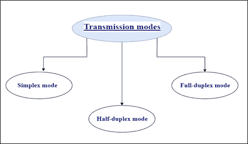
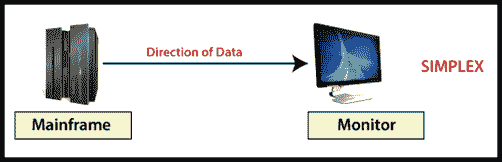
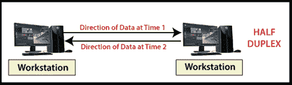
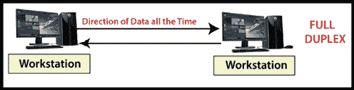

# 传输模式(数据流)

> 原文：<https://www.tutorialandexample.com/transmission-mode-data-flow/>

**传输模式(数据流)**:传输模式是指数据通过网络从一个设备传输到另一个设备。[传输](https://www.tutorialandexample.com/transmission-control-protocol)模式决定数据的方向。

众所周知，数据被转换成比特格式并以比特形式传输。这些比特通过不同的传输模式传输。

这些是以下三种类型的传输模式。

1.  **单工模式**
2.  **半双工模式**
3.  **全双工模式**

### 单工模式

在单工[传输](https://www.tutorialandexample.com/transmission-media)模式下，发送方和接收方之间的通信只能是单向的；即，这种模式是单向的。发送方只能发送数据，接收方只能接收数据。在这种模式下，接收方无法回复发送方的消息。下图所示。

单工模式是单向道路，只有一个方向的交通，不允许任何车辆从另一个方向进入。

我们可以举一个键盘和显示器的例子来更好地理解传输模式。键盘只能向显示器发送数据，显示器只能接收数据并显示在屏幕上。显示器无法向键盘发送任何数据返回。

单工模式的另一个例子是扬声器、电视广播、电视遥控器等。

单工模式的主要优点是利用信道的全部容量单向发送数据。

### 半双工模式

在这种传输模式下，通信在两个方向上进行，但一次只能在一个方向上进行。信道的全部容量可用于两个方向。下图所示。

半双工模式是单行道，在这种模式下，反向行驶的车辆必须等待道路变空。

对讲机是半双工的最好例子。在**对讲机**的末端，两人都可以说话但是一次只能一个人说话，两人不能一起说话。

### 全双工模式

在全双工传输模式下，发送方和接收方之间的通信可以一起进行。发送方和接收方可以同时发送或接收数据。下图所示。

全双工传输模式是双向的，流量可以同时双向传输。

以电话为例可以更好地理解全双工。当两个人在电话上交谈时，双方都可以自由地同时说话和听。

**单工传输模式、半双工传输模式、全双工传输模式的区别？**

| **基本对比** | **单工模式** | **半双工模式** | **全双工模式** |
| **通信方向的类型** | 单工模式下的通信是单向的。 | 半双工模式下的通信是双向的，但是一次一个。 | 全双工模式下的通信是双向的，并且是同时进行的。 |
| **发送者/接收者** | 发送方可以发送数据，接收方只能接收数据，接收方无法回复发送方。 | 发送方和接收方可以发送和接收数据，但只能在一个时间内。 | 发送方和接收方可以同时一起发送和接收数据。 |
| **性能** | 单工模式提供的性能低于其他传输模式。 | 半双工模式提供的性能比全双工模式低，但比单工模式好。 | 全双工模式比其他传输模式提供更好的性能。 |
| **例子** | 单工模式的例子有键盘、显示器、扬声器、电视广播、电视遥控器等。 | 步话机就是半双工的一个例子。 | 半双工的一个例子是电话。 |

