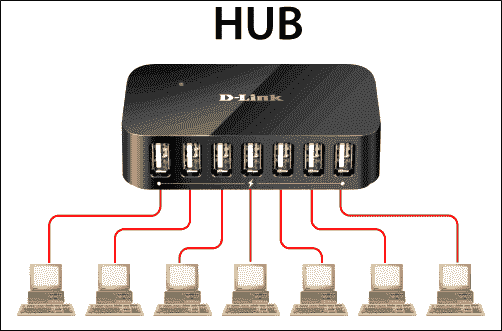
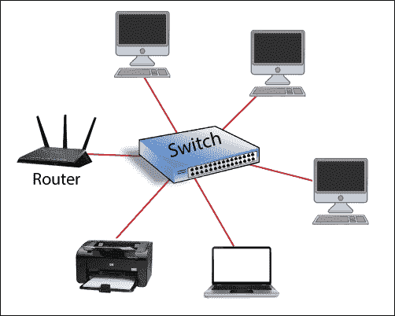
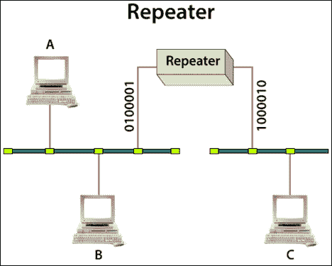
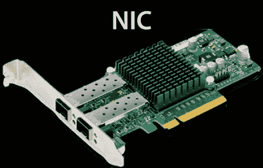

# 基本网络设备

> 原文：<https://www.tutorialandexample.com/basic-networking-devices/>

### 中心

集线器是最常见的网络设备，用于连接许多计算机或网络设备。它工作在 OSI 模型的物理层。它用于增加网络的规模。下图所示的集线器中有多个端口。

当我们将数据从一台设备发送到另一台设备时，集线器不会检查目的地。集线器将该数据发送到所有连接的设备，然后接收器接收数据，其他设备丢弃该数据。它用于连接星型拓扑中的设备。如轮毂下方所示。

### 有两种类型的集线器。

1.  活动集线器
2.  无源集线器

**主动集线器:**在主动集线器中，它再生信号，同时增强信号。它确实需要电源。这些也被称为多端口中继器。

**无源集线器:**无源集线器中，不再生信号。因此，它不需要电源。

### 集线器的优势

*   集线器提高了性能，特别是对于分布式流量和大文件传输。
*   它使 PCI 计算机发挥最佳性能。

### 集线器的缺点

*   它不适合大型网络，因为它们的端口有限。
*   集线器无法控制数据流量。

**<u>切换</u>**

交换机非常类似于集线器。它是一个有多个端口的设备。交换机接受来自网络的以太网连接。交换机比集线器更智能，因为交换机用于存储与其相连的物理地址。在交换机的表中，物理地址称为 MAC 地址。如下面开关所示。

在交换机中，数据包借助 MAC 地址直接发送到目的地。

### 中继器

中继器是一种只在物理层工作的电子设备。

它接收数据信号，并以更高的功率重新生成信号，并将其向前发送。中继器然后发送刷新的信号。它可以复制和再生数字和模拟信号。

### 有两种类型的中继器

1.  模拟中继器
2.  数字中继器

模拟中继器仅放大信号，而数字中继器通过消除误差来重构信号并转发。

### 国民保险分担

NIC 代表网络接口卡，它是一种计算机硬件。它用于将计算机连接到计算机网络。它允许用户通过有线或无线连接。它也被称为网络接口控制器、网络适配器、局域网适配器和物理网络接口。下图显示了网卡的示意图。

### 布里奇斯

网桥是一种计算机网络设备，用于连接相同类型的协议。它运行在 OSI 模型的物理层和数据链路层。在物理层，它重新生成接收到的信号。在数据链路层，网桥检查帧中“源和目的地”的 MAC 地址。网桥具有过滤能力。网桥检查帧的目的地址，并决定帧应该从哪个输出端口发送出去。

### 桥的优点

*   可靠性
*   易处理
*   可量测性

### 这座桥的缺点

*   网桥不能过滤掉广播流量。
*   一个网桥只能连接两个网络。

### 路由器

路由器是将两个或多个网络连接在一起的网络设备。它在计算机网络之间传输数据包。它决定数据包传输目的地的最佳方式。它在 OSI 模型的三层(物理层、数据链路层和网络层)上工作。通常，路由器用于连接各种类型的网络。