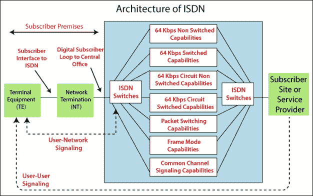

# 综合业务数字网(ISDN)

> 原文：<https://www.tutorialandexample.com/integrated-services-digital-network-isdn/>

**综合业务数字网(ISDN)** : ISDN 指综合业务数字网。ISDN 是由 ITU-T 在 20 世纪 80 年代开发的。这些是由地区电话运营商提供的数字电话和数据传输服务。ISDN 包括 [OSI 模型](https://www.tutorialandexample.com/osi-model)的物理层、[数据链路层](https://www.tutorialandexample.com/data-link-layer-protocols)和[网络层](https://www.tutorialandexample.com/network-layer-protocols)。

ISDN 的主要目标是向用户提供完全集成的数字服务。ISDN 实际上是由电话公司提供的一套通信协议。这些包括电话网络的数字服务。ISDN 允许数据通过现有的电话电缆发送，这些数据以视频、音频、文本和文件的形式出现。ISDN 的主要目标是在广域网中提供端到端的连接。ISDN 的另一个目标也是提供语音和非语音服务的组合。

窄带 ISDN 是第一代 ISDN。窄带 ISDN 是基于交换的基本单位，这个单位是 64 kbps。帧中继是窄带 ISDN 的主要设备。宽带 ISDN (B-ISDN)是第二代 ISDN。第二代 ISDN 支持非常高的数据速率，通常是数百 Mbps。[异步传输模式(ATM)](https://www.tutorialandexample.com/full-form-of-atm) 是 B-ISDN 的主要技术贡献，也被称为信元中继。

ISDN 的体系结构如下所示:

**ISDN 的优势**

1.ISDN 可以同时处理视频、语音、文本和数据。

2.ISDN 的呼叫建立比模拟调制解调器快。

3.它提供更高的数据速率。

4.ISDN 提供全数字服务，所以出错的概率很低。

**ISDN 提供三种类型的数字业务:**

1.  **承载服务:**承载服务提供了在用户之间传输数据的路径，而不需要网络来处理数据内容。承载服务与 OSI 模型的物理层、数据链路层和网络层相关。承载业务可以在分组交换、小区交换、电路交换和帧交换网络的帮助下使用。
2.  **电信服务:**电信服务依赖于承载服务的设施。它是为复杂用户的需求而设计的。远程服务提供各种类型的服务，如电话、电传、传真和视频会议。
3.  **补充服务:**补充服务为承载服务和电信服务提供额外的特征。补充服务的例子是呼叫等待、消息处理、反向计费等。

有两种类型的接口与 ISDN 相关联:

1.  BRI(基本费率接口)
2.  主要速率接口

**BRI:** BRI 代表基本费率接口。在 ISDN 中，BRI 提供两个 B 信道和一个 D 信道来启动连接，即(2B + D)。B 通道以 64 Kbps 的速率工作，而 D 通道以 16 Kbps 的速率工作。

**PRI:** PRI 代表主速率接口。在 ISDN 中，PRI 提供 23 个 B 信道和 1 个 D 信道。PRI 提供 1.544 Mbps 的总数据速率。PRI 服务非常昂贵，它用于大规模连接许多计算机和设备。

**ISDN 信道表如下所示，每种传输数据速率:**

| **频道** | **传输数据速率** |
| **答** | a 信道运行 4 KHz 模拟电话数据速率。 |
| **B** | b 信道以 64 Kbps 的数字 PCM 信道数据速率传输语音和数据。 |
| **C** | C-channel 采用 8 或 16 Kbps 数字通道数据速率。 |
| **D** | D-channel 操作 16 Kbps 数字信道，用于带外信令。 |
| **E** | E-channel 以 64 Kbps 的数字信道数据速率运行互联网 ISDN 信令。 |
| **H** | H-channel 支持 384、1536 或 1920 Kbps 数字通道数据速率。 |

