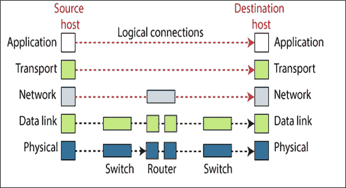

# 计算机网络中的 TCP/IP 模型

> 原文：<https://www.tutorialandexample.com/tcp-ip-model-computer-network/>

**TCP/IP 模型**

TCP/IP 模型是由 DARPA(国防高级研究计划局)在 20 世纪 70 年代开发的。因此，TCP/IP 模型不同于 OSI 模型。最初的 TCP/IP 模型定义了四层:主机到网络层、互联网层、传输层和应用层。但现在它包含五层物理层、数据链路层、网络层、传输层和应用层。

**物理层**

物理层是 TCP/IP 的第一层。在物理层，是两个节点或跳之间的通信。TCP/IP 的物理层支持所有标准和已建立的协议。在这一层，通信层的单位是一位。

**数据链路层**

数据链路层是 TCP/IP 的第二层。在数据链路层，是两个节点或跳之间的通信。TCP/IP 的数据链路层支持所有标准和已建立的协议。在这一层，通信的单位是帧。

**网络层**

网络层是 TCP/IP 的第三层。这一层充当 OSI 模型的网络层。这一层的主要特征是提供给网络中的无连接通信。TCP/IP 模型的网络层遵循网络互联协议。通常被定义为网络层被称为互联网层。

**网络协议中使用的通用协议**

*   **网间协议:**网间协议(IP)是 TCP / IP 用于通信的一种机制。对于尽力传送服务来说，网间协议是一种不可靠的协议。术语“尽力而为”意味着 IP 不提供跟踪或错误检查。这是一个无连接协议。在网间协议中，数据以数据包的形式传输，这种形式称为数据报。每个数据包都是单独传输的。

*   **ARP** (地址解析协议):地址解析协议用于连接逻辑地址和物理地址。ARP 协议用于检测被认为具有 IP 地址的节点的物理地址。

*   **RARP** **(反向地址解析协议):** RARP 是 ARP 的反义词。当主机只知道其物理地址时，RARP 允许主机检测其 IP 地址。当一台计算机连接到一个新的网络或任何无盘计算机启动时，使用 RARP。

*   **ICMP** **(互联网控制消息协议):**ICMP 是一种向发送方发送有关查询和错误报告的消息的机制。主机和网关使用它将有关数据报问题的信息传回发送方。

*   ****(互联网群组消息协议):**IGMP 用于方便消息同时传递到接收方的群组。**

 ****传输层**

传输层是 TCP/IP 的第四层。TCP/IP 模型的传输层负责管理端到端的通信。传输层提供三种协议:UDP、TCP 和 SCTP。UDP 和 TCP 负责将消息从一个进程传递到另一个进程。后来开发了 SCTP 协议，以满足新应用的需求。

*   **UDP(用户数据报协议** ): UDP 是一种简单的传输层通信协议。这是一个无连接协议。当数据传输发生时，该协议不会在发送方和接收方之间建立连接。UDP 是一种不可靠的协议。

*   **TCP** **(传输控制协议):** TCP 是面向连接的协议。当数据传输发生时，该协议在发送方和接收方之间建立连接。TCP 是一种可靠的协议。

*   **SCTP** **(流控制传输协议):** SCTP 是 TCP 和 UDP 协议最佳特性的结合。引入 SCTP 是为了支持因特网上的新应用，如视频通话和语音信息。

**应用层**

在 TCP/IP 模型中，应用层相当于 OSI 模型中会话层、表示层和应用层的组合。应用层与向应用程序提供网络服务有关。

应用层中使用的常见协议有 Telnet、FTP、HTTP、SMTP、POP3 和 NFS。**